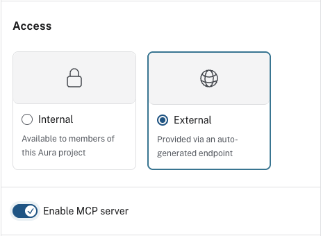

= Connect your agent to Cursor
:order: 2
:type: challenge
:optional: true

In this challenge, you will enable external access for your agent, connect it to Cursor using the MCP endpoint, and test it with real prompts.

== Enable external access

Changing access settings requires the **Project Admin** role.

. Select your agent and click the **...** menu, then select **Configure**.
+
image::images/configure-agent-menu.png[Agent menu showing Configure, Copy External endpoint, and Copy MCP server endpoint options]
. Under **Access**, select **External**.
. Enable the **MCP server** toggle.
+

. Click **Update agent** to save your changes.

Your agent now has an MCP endpoint and the full tool list is visible in the configuration.

image::images/agent-tools-with-mcp.png[Complete agent configuration showing the Enable MCP server toggle on alongside the full list of agent tools]

== Connect to Cursor

. In the Agents list, open the **...** menu next to your agent and choose **Copy MCP server endpoint**.
+
image::images/agent-menu-mcp-endpoint.png[Agent menu showing Configure, Copy External endpoint, and Copy MCP server endpoint options]
. Open the **Cursor** menu from the top-left, then **Settings...**, then **Cursor Settings**.
+
image::images/cursor-settings-menu.png[Cursor menu with Settings and Cursor Settings highlighted]
. In the left sidebar, select **Tools & MCP**.
. Under **Installed MCP Servers**, click **+ New MCP Server**.
+
image::images/cursor-tools-mcp-settings.jpeg[Tools & MCP settings showing Installed MCP Servers and New MCP Server option]
. A new file `mcp.json` will be created (typically at `~/.cursor/mcp.json`) and opened in the editor. Add your agent's MCP endpoint to the file. If you edit `mcp.json` directly, replace `<your-mcp-url>` with the endpoint from the agent menu:
+
[source,json]
----
{
  "mcpServers": {
    "neo4j-graphacademy-agent": {
      "url": "<your-mcp-url>",
      "transport": "http"
    }
  }
}
----
. Save and reload Cursor.
. Your agent appears in the **Tools & MCP** list with a **Needs authentication** status. Click **Connect**.
+
image::images/cursor-agent-needs-authentication.png[Tools and MCP panel showing neo4j-graphacademy-agent with Needs authentication status and a Connect button]
. Cursor asks permission to open the Aura MCP authentication website. Click **Open**.
+
image::images/cursor-open-aura-mcp-website.png[macOS dialog asking whether to open the aura-mcp.eu.auth0.com authorization URL in a browser]
. The login page opens in your browser. Click **Continue with Neo4j Aura**.
+
image::images/aura-mcp-login.png[Login page for aura-mcp showing a Continue with Neo4j Aura button]
. On the authorization screen, click **Accept** to grant Cursor access to your Aura MCP account.
+
image::images/cursor-authorize-aura-mcp.png[Authorize App screen showing Cursor requesting access to the aura-mcp account with Accept and Decline buttons]
. Return to Cursor. Your agent is now connected and available as a tool.

For connecting other MCP clients such as Claude Desktop, see link:https://neo4j.com/docs/aura/aura-agent/[Aura Agent documentation^].

== Test your agent in Cursor

. Open a new Cursor chat in **Agent** mode.
. Address the agent by its MCP server name and ask a question that matches one of your Cypher Template tools.
. Ask a follow-up question that requires your Text2Cypher tool.
. Check that each response is accurate and that the reasoning panel shows the correct tool being selected.

[IMPORTANT]
.Restart Cursor before testing
====
Restarting Cursor after adding the MCP endpoint is mandatory. If your agent is not working, a missed restart is likely the reason.
====

read::Mark as completed[]

[.summary]
== Summary

You connected your agent to Cursor using the MCP endpoint and tested it with real prompts.
In the next lesson, you will see suggested next steps and mark the course as completed.
