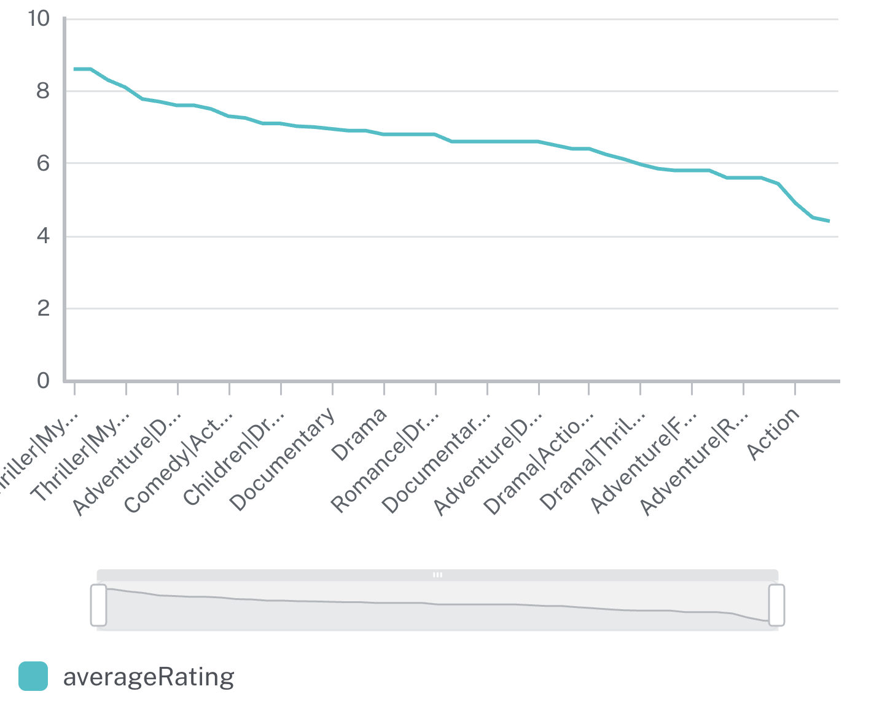

= Understanding Neo4j Dashboards
:type: lesson
:order: 1
// Image note: use current Dashboards UI screenshots (not NeoDash). Optional: add a short intro video.

[.slide.discrete]
== What are Neo4j Dashboards?

In this lesson you will learn:

* What Neo4j Dashboards are and when to use them
* What you need to run Dashboards
* What a dashboard looks like (example chart and natural language)

== What you need

You need a Neo4j instance: Aura or Desktop. New to Neo4j? See link:/courses/neo4j-fundamentals/[Neo4j Fundamentals^], link:/courses/aura-fundamentals/[Aura Fundamentals^], or link:/courses/cypher-fundamentals/[Cypher Fundamentals^].

== Introducing Neo4j Dashboards

Neo4j Dashboards is a tool for visualizing and exploring your graph data. Using the Movies dataset, you will learn to build dashboards that visualize insights about movies, actors, ratings, and relationships.

Dashboards help you:

* Visualize patterns in ratings and movie popularity
* Monitor trends in genre preferences and actor collaborations
* Share insights with stakeholders (content teams, marketing, executives)
* Explore data interactively without writing complex queries
* Make data-driven decisions based on visual insights

Use the **Natural Language** feature in the card editor to ask questions about your movie data (for example, "Show average rating by genre" or "Visualize actor relationships"), and Neo4j Dashboards will generate the Cypher queries and visualizations for you.

**The Movies dataset:** Throughout this course you will work with the same Movies dataset used in the Neo4j Fundamentals, Graph Data Modeling Fundamentals, and Aura Fundamentals courses. This dataset contains information about movies, actors, directors, genres, and ratings, which is what you need for building dashboards.

In this course, you will learn how to build dashboards similar to the one below using the Movies dataset:

image::images/dashboards.png[Neo4j Dashboards example,width=600,align=center]

The image below shows a sample chart (average rating by genre) that you can create as a card in a dashboard:

Below is an example of a card created with natural language:

video::https://cdn.graphacademy.neo4j.com/courses/aura-dashboards-videos/movies-by-decade-natural-language.mp4["Average rating by genre",role="cdn", width=100%]

[.quiz]
== Check your understanding

include::questions/1-purpose.adoc[leveloffset=+1]

[.summary]
== Summary

You saw what Neo4j Dashboards is, what you need to run it, and how a card can be created from natural language. In the next lesson you will open Dashboards and connect to your instance.
