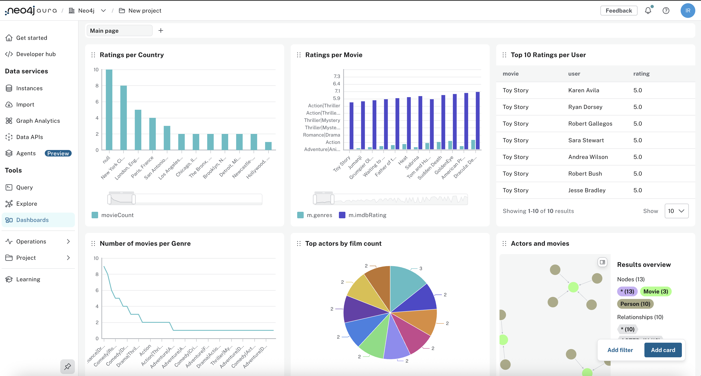

= Understanding Neo4j Dashboards
:order: 1
:type: lesson
// TODO: Screenshot — Aura Console left nav with **Dashboards** highlighted (current Neo4j Dashboards UI, not legacy NeoDash).

[.slide.discrete]
== What are Neo4j Dashboards?

In this lesson you will learn:

* What Neo4j Dashboards are and when to use them
* What a dashboard card can look like (example chart and natural language)

== Introducing Neo4j Dashboards

Neo4j Dashboards is a tool for visualizing and exploring your graph data. You build your own dashboards against the data in your AuraDB instance.

Dashboards help you:

* Visualize patterns and relationships in your domain
* Monitor trends and compare categories or entities
* Share insights with stakeholders
* Explore data interactively without writing every query from scratch
* Support decisions using charts tied to your graph

Use the **Natural Language** feature in the card editor to describe what you want to see (for example, "Show average rating by genre" or "Visualize actor relationships" when you use the sample data), and Neo4j Dashboards will generate Cypher and visualizations for you.

The examples that follow use the Movies recommendations graph in queries and screenshots. When you use your own labels and relationships, substitute your schema and adapt the prompts and Cypher.

You can build dashboards similar to the one below (Movies example):

The image below shows a sample chart (average rating by genre) that you can create as a card in a dashboard:

image::images/average-rating-by-genre.png[Average rating by genre chart,width=600,align=center]

Below is an example of a card created with natural language:

video::https://cdn.graphacademy.neo4j.com/courses/aura-dashboards-videos/movies-by-decade-natural-language.mp4["Average rating by genre",role="cdn", width=100%]

== Before you load data

You need a Neo4j AuraDB instance with **graph data** before you can build meaningful cards. The next lesson shows how to restore the **Movies recommendations** dataset if your database is empty. If you already loaded data, you can skip that lesson and go straight to **Dashboards** after link:/courses/aura-dashboards/1-getting-started/2-load-sample-data/[Load the Movies recommendations dataset^].

New to Neo4j or Aura? Open link:/courses/aura-dashboards/#_prerequisites[the prerequisites for this course^] and complete the courses listed there. They cover graph concepts, Cypher, and the Console.

== Before you connect

Quick checks:

. Log in to link:https://console.neo4j.io/[Neo4j Aura^]. If you need an account or database, follow link:https://neo4j.com/docs/aura/classic/auradb/getting-started/create-database/[Getting started with Aura^].
. Spot **Dashboards** in the left nav—you will use it next.
. If you want a sanity check, open **Query**, connect to your instance, and run `RETURN 1 AS ready`.

[.quiz]
== Check your understanding

include::questions/1-purpose.adoc[leveloffset=+1]

[.summary]
== Summary

You know what Neo4j Dashboards is for and what an AI-generated card looks like. Next, load the recommendations dataset (or confirm your own graph), then open Dashboards and connect.
