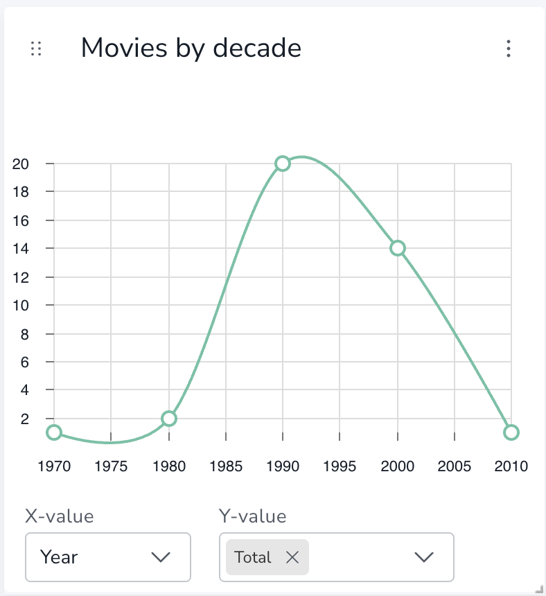

= Understanding Neo4j Dashboards
:type: lesson
:order: 1

// TODO: Consider restructuring this lesson to focus only on what dashboards are and when to use them.
// Currently includes course overview (lines 7-21) and prerequisites (lines 28-46) that could be moved to course.adoc.
// This would make the lesson more focused and under 5 minutes to read.

== Understanding Data Visualization 

Welcome to the Building Dashboards in Neo4j course on GraphAcademy!

Ever wondered how movie recommendation systems work, or how studios track which genres are trending? 

Representing data in a visual format can help uncover patterns that might be missed otherwise.

Data visualization transforms your graph into actionable insights that anyone can understand.

// TODO: These are course objectives, not lesson objectives. Consider adding lesson-specific objectives like:
// "In this lesson, you will learn: What Neo4j Dashboards are, When to use dashboards, How dashboards fit into your workflow"

By the end of this course, you will be confident in:

* What Neo4j Dashboards are and when to use them
* Accessing Dashboards by importing sample data
* Creating interactive dashboards using the AI assistant and natural language
* Building dashboard cards with Cypher queries
* Adding filters to make dashboards dynamic

// Aura provides a fully managed Neo4j database service, that allows you to run multiple instances in the cloud, while handling the underlying infrastructure, maintenance, and operations.
// You can deploy Neo4j instances in the cloud and scale them as needed without the hassle of managing servers, backups, or updates. 

// Given the ease of use and management that Aura provides, it is an excellent choice for developers and organizations looking to leverage the power of graph databases without the operational overhead, and that includes analyzing and visualizing data with Dashboards.

== What you will need

To follow along with this course, you will need:

* Access to a Neo4j database with Dashboards enabled:
  ** **Neo4j Aura** (recommended for this course) - Free tier available. If you don't have an account, the next lesson will guide you through creating one.
  ** **Neo4j Enterprise Edition on-premises** - If you already have access to an on-premises installation with Dashboards enabled
* Basic understanding of graph databases (optional but helpful)
* Basic knowledge of Cypher query language (optional but helpful)

If you are new to Neo4j, you can familiarize yourself with the database using the link:/courses/neo4j-fundamentals/[Neo4j Fundamentals course^].

Recommended additional courses:

* link:/courses/aura-fundamentals/[Aura Fundamentals^] - If using Neo4j Aura
* link:/courses/modeling-fundamentals/[Data Modeling Fundamentals^]
* link:/courses/importing-fundamentals/[Importing Fundamentals^]
* link:/courses/cypher-fundamentals/[Cypher Fundamentals^]

== Introducing Neo4j Dashboards

Neo4j Dashboards is a visualization tool available in both Neo4j Aura and Neo4j Enterprise Edition on-premises.

Dashboards let you create interactive visualizations to explore your graph data and share insights with others.

// TODO: Add informal spoken phrase here, e.g., "Think of it as a window into your graph - it turns nodes and relationships into charts anyone can understand." 

For example, if you are running a streaming service, you might want to track metrics such as ratings per country, genre, and actors to understand user engagement and preferences.

The picture below shows a sample dashboard that visualizes movie data from the popular movie graph dataset, sorted by decade, represented as a line chart:

To do this, you can use natural language to ask questions about your data, and Neo4j Dashboards will generate the necessary visualizations for you. 
Writing Cypher queries is not required, although you can use them if you prefer for more advanced customizations. 

Use dashboards when you need: 

* Visual representation of patterns and trends
* Real-time data monitoring vs. static reports comparisons
* Different stakeholders' perspectives on the same data
* Easy sharing of insights across teams
* Interactive exploration of data without writing code

// TODO: Add concrete example from course context. E.g., "For example, in the movie dataset you'll work with, 
// you might create a dashboard showing: top-rated films by decade (line chart), genre distribution (pie chart), 
// and actor collaboration networks (graph visualization)."

You do not need to set up any additional infrastructure or tools, as Dashboards are integrated directly into Neo4j. 

In this course, you will learn how to build dashboards similar to the one below:

image::images/dashboards.png[Aura dashboards][dashboards,width=600,align=center]

[TIP]
.Discussion question
====
If you ran a streaming service, what 3 metrics would you track on a dashboard to understand user engagement?
====

[.quiz]
== Check your understanding

include::questions/1-purpose.adoc[leveloffset=+1]

[.summary]
== Summary

In this lesson, you learned what Neo4j Dashboards are and the benefits of using them for data visualization and exploration.

In the next lesson, you will learn how to access Dashboards. If you're using Neo4j Aura, you'll learn how to create an account and navigate the interface. If you're using on-premises Neo4j, you'll learn how to access the Dashboards feature.
