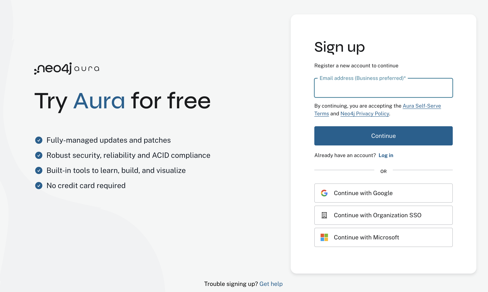
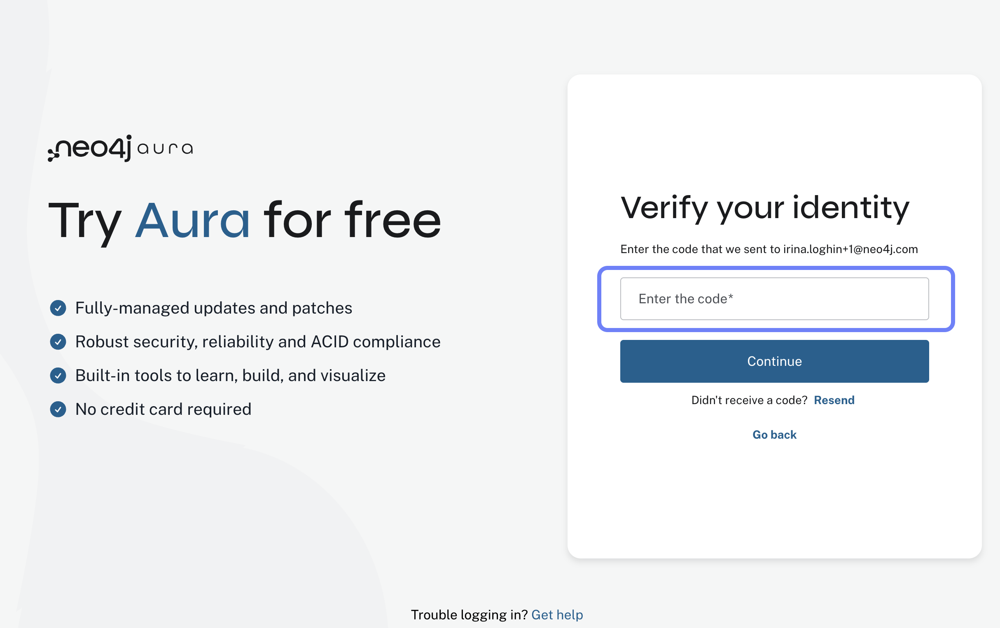
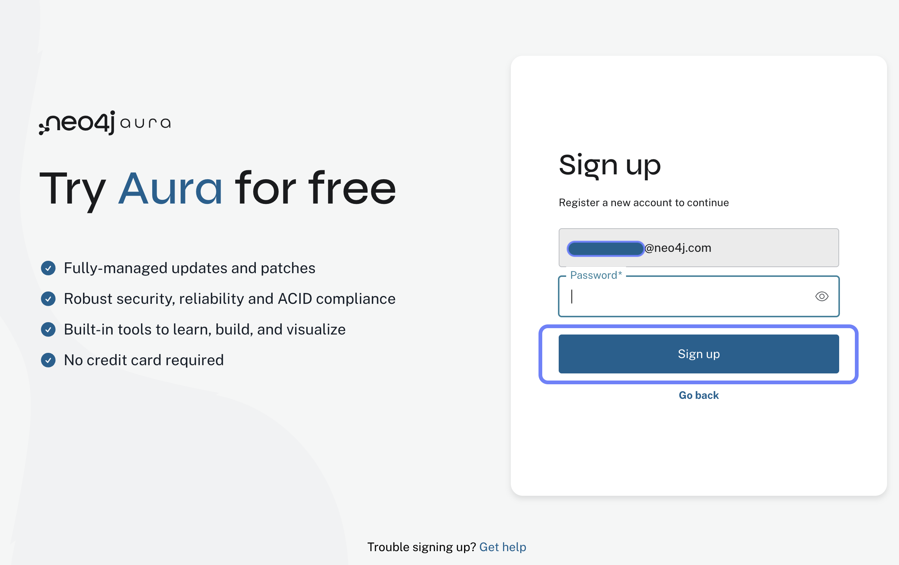
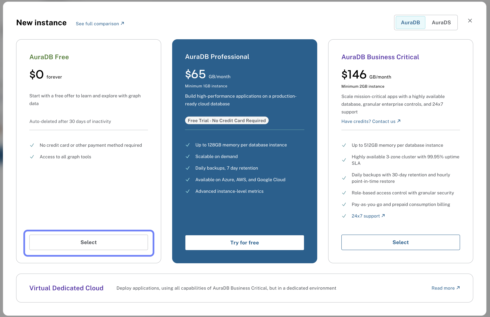

= Accessing Neo4j Dashboards
:type: lesson
:order: 2

== Lesson Overview

In the previous lesson, you learned about the purpose of Neo4j Dashboards and the benefits of using them for data visualization.

In this lesson, you will learn how to access Dashboards. For ease of access in this course, we'll use Neo4j Aura. If you already have access to an on-premises Neo4j Enterprise Edition installation with Dashboards enabled, you can skip to **Step 4** and connect to your database.

     
== Getting Access to Dashboards

To follow along with this course, you have two options:

* **Neo4j Aura** (recommended for this course) - Free tier available, quick setup
* **Neo4j Enterprise Edition on-premises** - If you already have access

The rest of this lesson focuses on setting up Neo4j Aura. If you're using on-premises, skip to **Step 4** to learn how to connect.

[NOTE]
.Skip if you already have an account
====
If you already have a Neo4j Aura account and instance, you can skip to **Step 4.**
====

== Step 1: Visit the Neo4j Aura Website

Go to link:https://console.neo4j.io[the Neo4j Aura Console^] in your web browser. This is the official portal for managing Neo4j Aura databases.

On this page, you will see options to sign up for a new account or log in if you already have one.

Use the **Sign Up** button to create a new account.

For more information, see link:https://neo4j.com/docs/aura/classic/auradb/getting-started/create-database/[Create Database documentation^].

== Step 2: Create Your Account

After clicking the **Sign Up** button, you will be directed to the registration form. After filling in your email address, you have to confirm your identity before proceeding to make sure it is a valid email address and not a bot or impersonation.

== Step 2b: Create a password
Once your email is verified, you will be prompted to create a password:

== Step 3: Create an Aura Instance

(Optional) Once you have an account, *create a new Aura instance* by selecting the desired tier (Free, Professional, Business Critical, or Virtual Dedicated Cloud) based on your requirements. 

In this course, you will only need the **Free tier** to explore and learn about Neo4j Dashboards.

== Dashboard page limits

The number of dashboard pages you can create depends on your platform:

**For Neo4j Aura users:**

* **Free tier:** 3 dashboard pages available. You can upgrade at any time to access more dashboards.

image::images/free-tier-dashboards.png[Free tier dashboards,width=600,align=center]

* **Professional, Business Critical, and Virtual Dedicated Cloud:** 25 dashboard pages available.

image::images/ee-dashboards.png[Enterprise tier dashboards,width=600,align=center]

**For on-premises Enterprise Edition users:**

* Dashboard page limits depend on your license agreement. Consult your Neo4j representative for details.

== Step 4: Connect to Dashboards

=== For Neo4j Aura users:

. *Log in* to your Aura account and go to the *Dashboards* menu. From there, you can create new dashboards, access existing ones, and manage your dashboard settings.
. *Connect to your instance* by selecting it from the list of available instances.

image::images/dashboards-ui.png[Dashboards UI,width=600,align=center]

After you click on **Connect to instance**, you will be prompted to enter the connection details:

image::images/connect-from-dashboards.png[Connect to instance dialog,width=600,align=center]

You can find your Aura instance connection details by clicking the **...** menu next to your instance name and selecting **Inspect**, or by using the downloaded connection details file.

For more information, see link:https://neo4j.com/docs/aura/auradb/[AuraDB documentation^].

=== For on-premises users:

. Access Dashboards through your Neo4j Enterprise Edition installation
. Navigate to the Dashboards interface
. Connect using your local database credentials

The Dashboards interface and features work identically in both Aura and on-premises installations.

[.quiz]
== Check your understanding

include::questions/2-empty-dashboards-canvas.adoc[leveloffset=+1]

[.summary]
== Summary

In this lesson, you learned how to access Neo4j Dashboards. For Aura users, you learned how to create an account, select a tier, and navigate the interface. For on-premises users, you learned how to access Dashboards through your Enterprise Edition installation.

In the next lesson, you will learn how to load data into your Neo4j database and generate a demo dashboard using AI.
