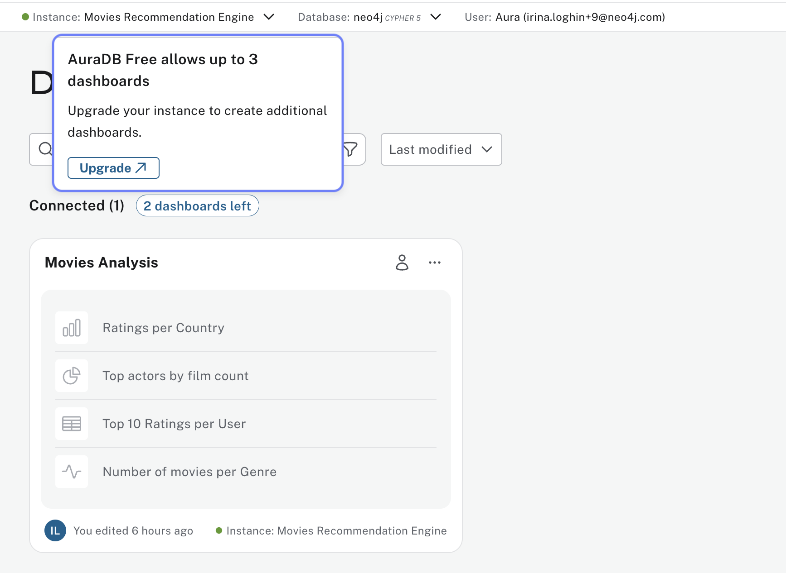
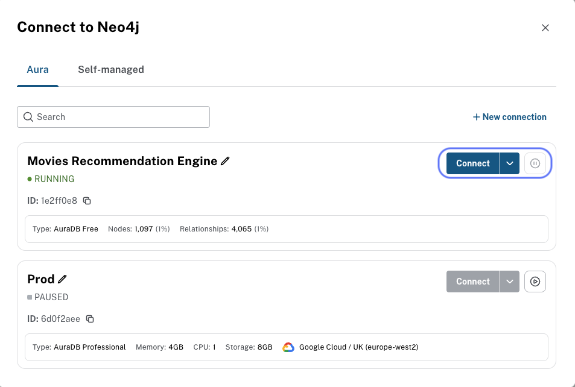

= Accessing Neo4j Dashboards
:order: 3
:type: lesson

In the previous lesson you loaded the Movies recommendations dataset (or confirmed your own graph). In this lesson you will learn:

* How to access Neo4j Dashboards from Aura
* Dashboard limits per tier
* How to connect to your instance from the Dashboards UI

== Getting Access to Neo4j Dashboards

To explore the Dashboards UI, you need a Neo4j instance to connect to.

**If you already have an instance**, skip to <<Step 1: Connect to an instance>>.

**If you need to create an account and instance**, follow link:https://neo4j.com/docs/aura/classic/auradb/getting-started/create-database/[Getting started with Aura^] in the Neo4j documentation.

[NOTE]
.Using the Professional tier
====
This course recommends starting with **AuraDB Professional** to access the full feature set. Professional includes a free trial period of 7 days, extendable by an additional 7 days, so you can explore all capabilities without upfront costs.
====

== Dashboard limits per tier

The number of dashboards available depends on your tier:

The number of dashboards you can create depends on your Aura tier. See link:https://neo4j.com/docs/aura/dashboards/managing-dashboards/[Managing dashboards^] for the current limits.

[cols="1,1"]
|===
|Tier |Dashboards

|AuraDB Free
|3

|AuraDB Professional
|25

|AuraDB Business Critical
|Unlimited

|AuraDB Virtual Dedicated Cloud
|Unlimited
|===

Upgrade your tier at any time to access more dashboards.

image::images/ee-dashboards.png[Paid tier dashboards,width=600,align=center]

[[step-1]]
== Step 1: Connect to an instance

// TODO: Screenshot — **Connect to instance** flow if the existing `dashboards-ui.png` / `connect-from-dashboards.png` pair drifts from current UI; re-capture both.

To connect to your instance from the Dashboards UI:

. Log in to your account and go to the **Dashboards** menu
. Click **Connect to instance** and select your instance from the list
+
image::images/dashboards-ui.png[Dashboards UI,width=600,align=center]

. Enter the connection details for your instance
+

[NOTE]
.Finding your connection details
====
Retrieve your connection URI, username, and password from the Aura Console: open the **...** menu next to your instance and select **Inspect**, or use the credentials file from when you created the instance. See link:https://neo4j.com/docs/aura/classic/auradb/connecting-applications/[Connecting to Aura^] in the documentation for details.
====

For more information on connecting to Dashboards, see link:https://neo4j.com/docs/aura/dashboards/[Neo4j Dashboards documentation^].

== Check that Dashboards sees your instance

. Open **Dashboards** in the left menu.
. Use **Connect to instance** with the same database you use in **Query**.
. You should land on an empty or welcome screen—fine; you have not built pages yet.
. Glance at the tier table above so you know how many dashboards your plan allows (Free caps at three).

[.quiz]
== Check your understanding

include::questions/1-choosing.adoc[leveloffset=+1]

[.summary]
== Summary

In this lesson you created an instance if you needed one and connected Dashboards to it.

In the next lesson, you will create your first dashboard using AI and explore the Dashboards interface.
