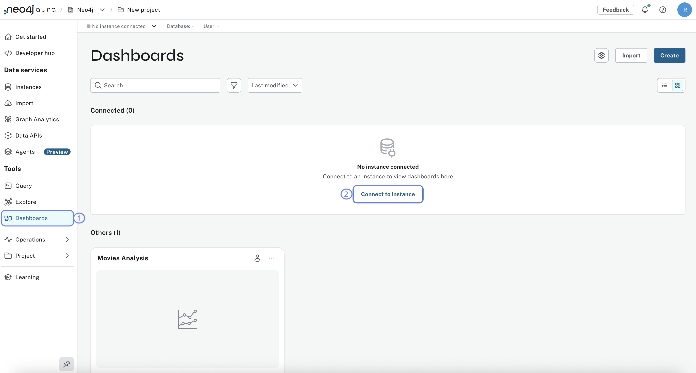
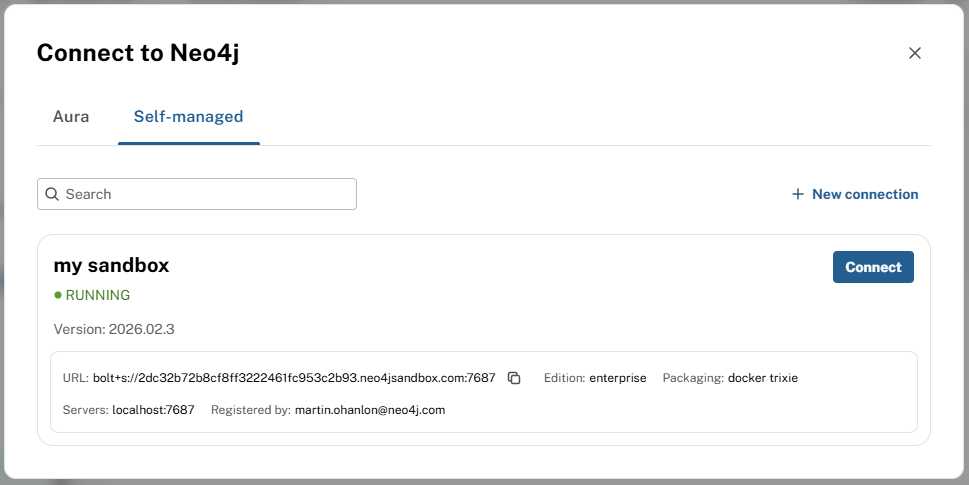
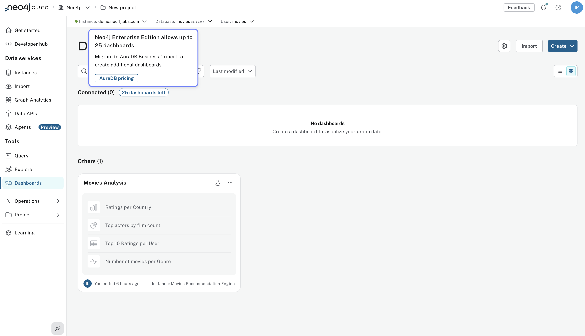

= Accessing Neo4j Dashboards
:order: 3
:type: lesson

In the previous lesson you connected to the Movies recommendations dataset. In this lesson you will learn:

* How to access Neo4j Dashboards from Aura
* Dashboard limits per tier
* How to connect to your instance from the Dashboards UI

== Connect to an instance

To use Dashboards you need a Neo4j instance.
You can use the GraphAcademy instance you link:../2-load-sample-data[added as a self-managed instance^].

To connect to your instance:

. Goto **Dashboards** menu

. Click **Connect to instance** and select your instance from the list
+

. Enter the connection details for your instance
+

+
Your GraphAcademy sandbox instance connection details are:
+
Connection URL:: bolt+s://{instance-host}:{instance-boltPort}
Username:: [copy]#{instance-username}#
Password:: [copy]#{instance-password}#

[TIP]
.Dashboard limits
====
The number of dashboards you can create depends on your Aura tier. See link:https://neo4j.com/docs/aura/dashboards/managing-dashboards/[Managing dashboards^] for the current limits.

[cols="1,1"]
|===
|Tier |Dashboards

|AuraDB Free
|3

|AuraDB Professional
|25

|AuraDB Business Critical
|Unlimited

|AuraDB Virtual Dedicated Cloud
|Unlimited
|===

image::images/free-tier-dashboards.png[AuraDB Free dashboards,width=600,align=center]

Upgrade your tier at any time to access more dashboards.

====

[.quiz]
== Check your understanding

include::questions/1-choosing.adoc[leveloffset=+1]

[.summary]
== Summary

In this lesson you connected Dashboards to your Neo4j Aura instance.

In the next lesson, you will create your first dashboard using AI and explore the Dashboards interface.
