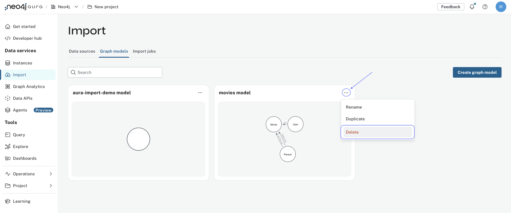
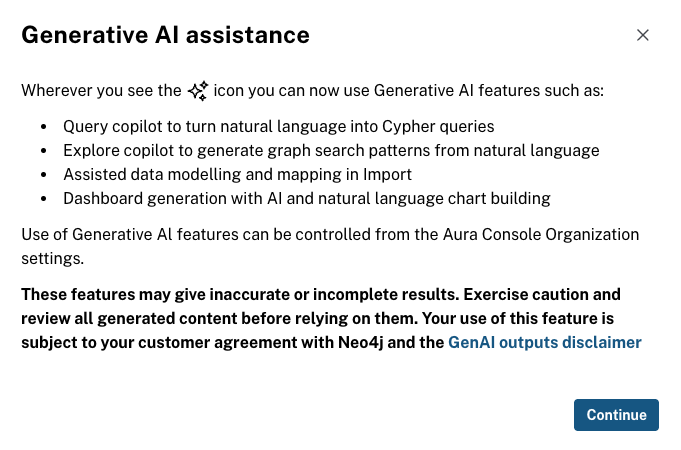
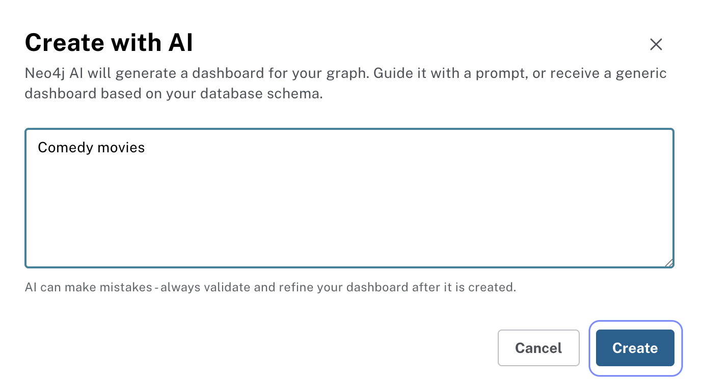
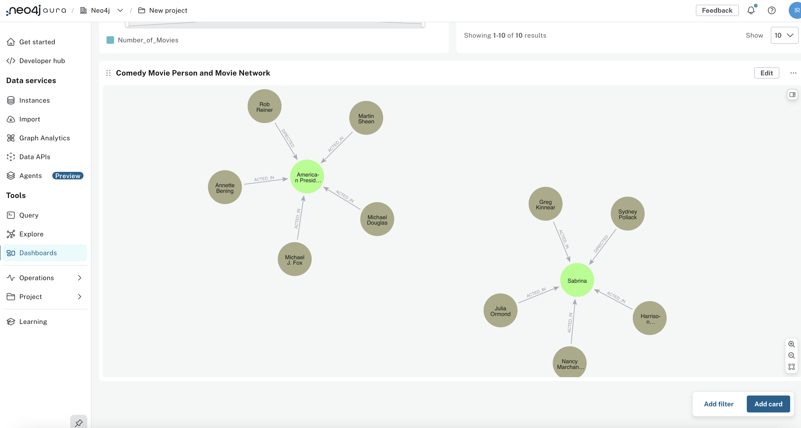

= Exploring Dashboards
:type: lesson
:order: 3

== Load data into your Aura instance

To create dashboards in Neo4j Aura, you will need to:

* Connect to a Neo4j database - either an Aura instance or local instance.
* Either upload a CSV file - from local system or from Cloud storage, this requires knowledge of how to Import data.
* OR Run the *import-recommendations.cypher* script provided in this lesson, this will load all the necessary Movies Recommendation dataset nodes and relationships.
* Map properties from the CSV file to the node
* Run the import

=== Step 1: Connect to your database
To import data using the _Import_ data service in the console, follow these steps:
* Select a data source, either from other cloud storage or local CSV files.
* Select a model, either create/generate one, or use an existing one.
* Map files to the model.
* Select the instance to import into.
* Enter credentials.

Use the connection details of your Aura instance to connect.

image::images/05-inspect-details.png[Inspecting connection details of an Aura instance]

If you have any existing on-prem Neo4j database, you can also connect to it by entering the connection details.

If you have an existing data importer model, you can clear it by selecting the `Clear all` option from the menu `...`.

Any data import you run will be against the connected Neo4j database.

=== Step 2: Navigate to the Query Editor
image::images/query-menu.png[The query menu in the Aura console]
After connecting to your Aura instance, you will need to navigate to the Query Editor in order to load data using Cypher.

At this point, you do not need to understand Cypher in detail; you will only run the script that loads the data.

image::images/query-menu.png[The query menu in the Aura Console]

=== Step 3: Import the Movies Recommendation dataset

Use the following Cypher script to create the Movies Recommendation dataset in your Aura instance:

link:https://github.com/neo4j-graphacademy/recommendations-extend/blob/main/recommendations-extended/data/cypher/import-recommendations.cypher[Download the import-recommendations.cypher script^]

You can copy and paste the script into the Query Editor, and click the **Run** button to execute it.

An easier way to quickly see the imported data is to run the following command in the Query Editor:

[source,cypher]
----
CALL db.schema.visualization
----

This will display a visualization of the database schema, showing the nodes and relationships that have been created.

In the Explore tab, you need to search for a node label or use the _Show a graph snippet_ button in the empty state to view part of the graph.
image::images/run-query.png[The import-recommendations.cypher script in the Query Editor]

Once the script has finished running, you will see a summary of the nodes and relationships created in your Aura instance. 

Go to the Explore tab to visualize and explore the data you have just loaded: 

image::images/explore-check.png[The Explore tab showing the loaded data graph]

//TO-DO: Use this content later when we have cloud import credential rotation available

// == Importing data from cloud

// Importing data from cloud storage services is a convenient way to manage large datasets, and to ensure data security and accessibility.

// When you go to the Import menu, you will see an option to add a new data source: 

// image::images/import-menu.png[The data source importing UI]

// In this example, you will learn how to import data from an S3 bucket. If you have other cloud storage services, the steps are similar:

// * Set up access credentials: You might need to create an access key and secret key to authenticate your access to the cloud storage service. If you are using AWS S3, you can create an IAM user with the necessary permissions to access the S3 bucket.
// * Configure the data source in Data Importer: In the Data Importer interface, select the option to add a new data source and choose the cloud storage service you are using.

// image::images/new-data-source.png[The data source importing options]

// * You will need to provide the access credentials and the path to the data files, and make sure the bucket and files are accessible from Data Importer.

// To import data from an S3 bucket, you will need to provide the following information:

// * Access Key: Your AWS access key ID.
// * Secret Key: Your AWS secret access key.

// image:://images/import-aws.png[The AWS S3 import configuration dialog]

// * Bucket Name: The name of the S3 bucket containing the data files.
// * File Path: The path to the data files within the S3 bucket.

If this is your first time using Dashboards, you will see an empty state with options to **Create with AI**, **Create from scratch**, or **Import**. You do not need to use the dropdown menu in this case.
// image:://images/import-aws-2.png[The AWS S3 import configuration dialog continued]

== Generating a demo dashboard using AI

Once you have successfully loaded the data into your Aura instance, you can generate a demo dashboard using the AI tool.

You will learn more about creating and managing dashboards in the next lessons, but for now, let's see how to quickly generate a dashboard using AI. 

Prior to using the AI tool, ensure that you have read the AI disclaimer available in the Aura Dashboards interface: 

From the Dashboards menu, click on the **Create dashboard** dropdown, and select **Create with AI**.

Use the graph visualization to explore the relationships between users, movies, and genres interactively: 

In the prompt dialog, enter a description of the insights you want to visualize. For example, you can enter a description like "Visualize movie recommendations based on user ratings and genres.", or simply "Comedy movies": 

After you run the prompt, the AI will generate a dashboard based on your description: 

image::images/ai-dashboard.png[AI generated dashboard,width=600,align=center]

In this dashboard, you can see various visualizations such as single values, bar charts, pie charts, and graph visualizations that provide insights into movie recommendations based on user ratings and genres. You will learn more about each type of chart in the following lessons.

Use the graph visualisation to explore the relationships between users, movies, and genres interactively: 

Before moving to the next lesson, take your time to explore the different cards and visualisations generated by the AI tool.

[.quiz]
== Check your understanding

include::questions/1-requirements.adoc[leveloffset=+1]

include::questions/2-empty-dashboards-canvas.adoc[leveloffset=+1]

[.summary]
== Summary

In this lesson, you learned how to load data into your Aura instance using a Cypher script and generate a demo dashboard using the AI tool.

In the next lesson, you will learn how to describe your movie data model and design dashboards that align with stakeholder requirements.
