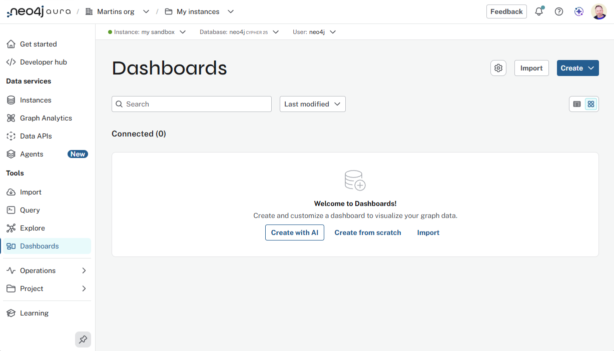
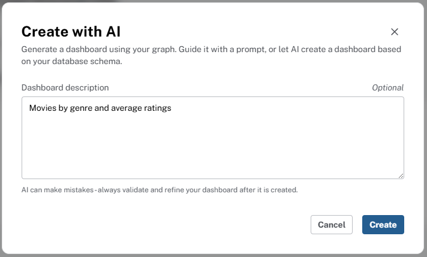

= Exploring Dashboards
:order: 4
:type: lesson

In this lesson you will:

* Create your first dashboard with AI
* Explore the Dashboards interface

Throughout the course, you will build on the dashboard you create, take some time to explore the interface, and your dashboard.

== Creating your first dashboard with AI

Dashboards includes a **Create with AI** feature that generates dashboards based on natural language prompts. It is a great way to get started with Dashboards and explore your data:

. Open to **Dashboards** using the left menu.

. Click **Create with AI**.
+

. Enter a dashboard description stating what you want to see, such as [copy]#Movies by genre and average ratings# or [copy]#Comedy movies and their ratings#.
+

. Click **Create** - the dashboard will take a little while to generate.

video::https://cdn.graphacademy.neo4j.com/courses/aura-dashboards-videos/create-dashboard-with-AI.mp4["Create Dashboard with AI",role="cdn", width=100%]

Take time to explore the different cards and visualizations before continuing to the next lesson.

[IMPORTANT]
.Create with AI in Aura
====
The **Create with AI** feature is only available in the Neo4j Aura Console, and not available in Neo4j Desktop.
====

== Create from Scratch

You can also create a dashboard from scratch, without AI. This is a good option if you have a specific dashboard design in mind, or if you want to build your dashboard iteratively, adding cards one at a time.

video::https://cdn.graphacademy.neo4j.com/courses/aura-dashboards-videos/create-from-scratch.mp4["Create from Scratch",role="cdn", width=100%]

[.quiz]
== Check your understanding

include::questions/1-requirements.adoc[leveloffset=+1]

[.summary]
== Summary

You got a first dashboard running with AI and explored the interface. Next module: map the model to questions, then add cards with AI and Cypher and tidy the layout.
