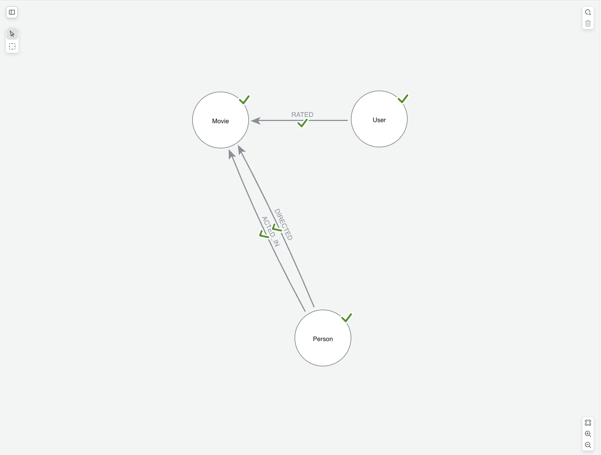

= Describe your data model
:order: 1
:type: lesson

Dashboards are built on a graph data model.
Understanding your graph model and reporting requirements will help you build better dashboards.

In this lesson you will learn explore how to analyze your graph data model and use it to design effective dashboards.

== Understanding requirements

You should ask:

* What are the main node labels and relationship types?
* What properties do nodes and relationships carry? (For example, ratings live on `RATED` in the recommendations graph.)
* What questions do you want to answer with your dashboard?
* Can you map those questions to the data in the graph?
* What type of visualization will best answer those questions?

The movie recommendations data has the following graph model: 

* **Labels:** `Movie`, `Person` (with `Actor` / `Director`), `Genre`, `User`
* **Types:** `ACTED_IN`, `DIRECTED`, `RATED`, `IN_GENRE`
* **Properties:** vary by node — `title`, `year`, `imdbRating` on `Movie`; `rating` on `RATED`; and so on.

== From questions to queries

When creating your dashboard, you will need to translate questions into Cypher queries. 

If you were building a dashboard for a movie streaming service, you may already have some questions in mind that your dashboards should answer. Those questions can help you to define your graph data model. For example, you might want to answer:

* Which genres have the highest average movie ratings?
* Which genres are most popular among various demographics?
* Which users contribute the most ratings for a given genre?
* Which movies have the highest average ratings?
 
Each question hints at the underlying data model. To answer the questions above, you would use the following nodes and relationships = `(User)-[:RATED]->(Movie)-[:IN_GENRE]->(Genre)`.

To find the top user rated movies, you could write this Cypher query:

[source,cypher]
----
MATCH (u:User)-[r:RATED]->(m:Movie)
RETURN m.title AS movie, avg(r.rating AS rating) as avgRating
ORDER BY avgRating DESC
LIMIT 10
----

[TIP]
.Use Natural language to find the right query
====
You can used natural language to find the right query pattern. For example, you could ask: `Which genres have the highest average movie ratings?` and use the generated Cypher as a starting point for your dashboard card.
====

Some best practices for dashboard design:

* Analyze your data model before adding many cards
* Tie metrics to stakeholder goals
* Be specific about labels and relationship types in prompts and Cypher

[.quiz]
== Check your understanding

include::questions/1-structure.adoc[leveloffset=+1]

[.summary]
== Summary

In this lesson, you explored effective dashboard design process and how your graph data model can inform your questions.
