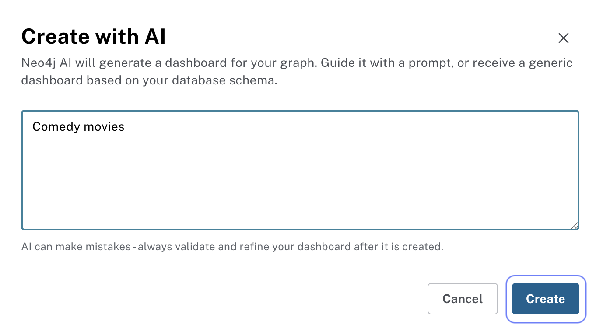
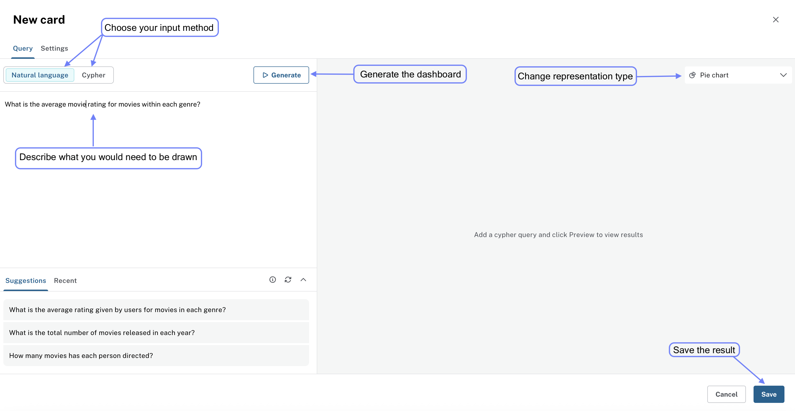
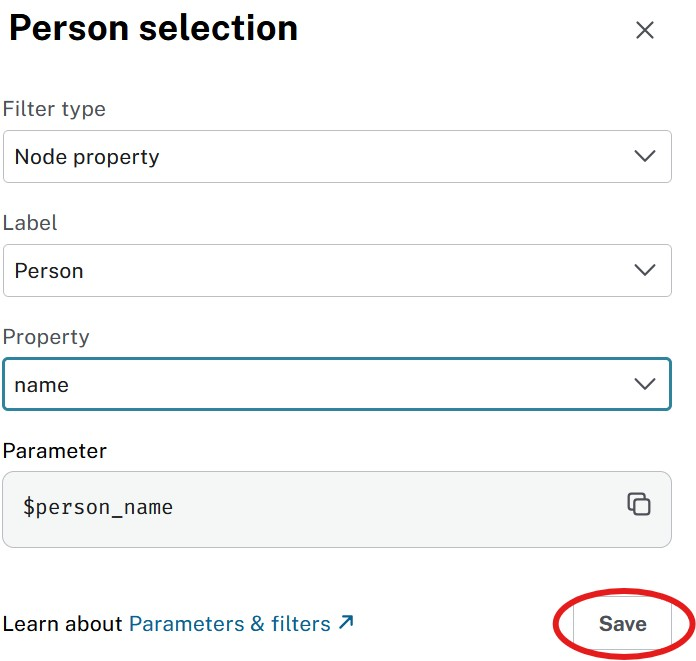
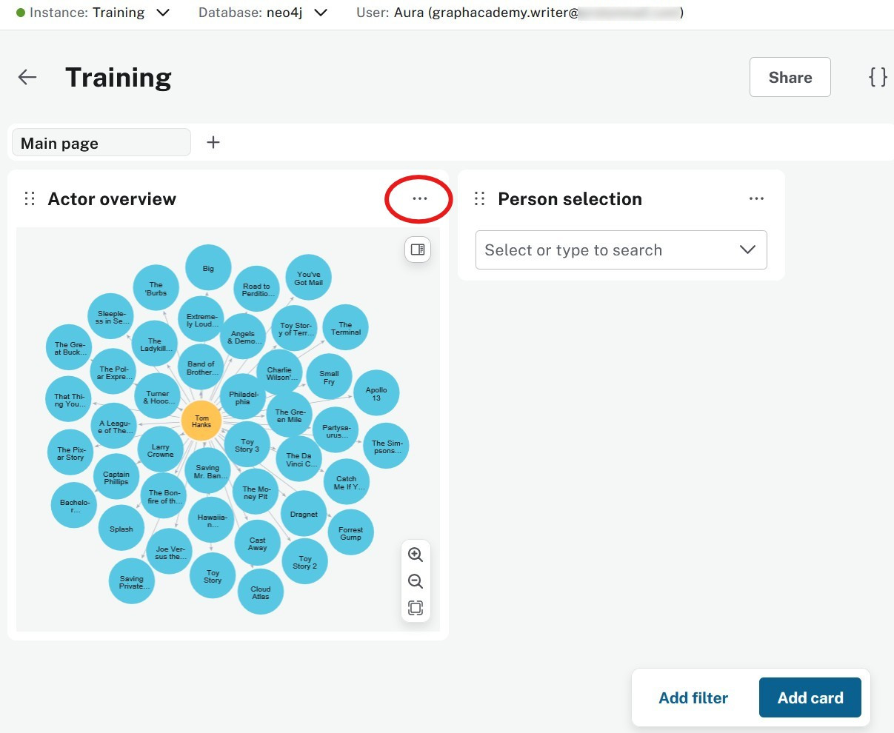
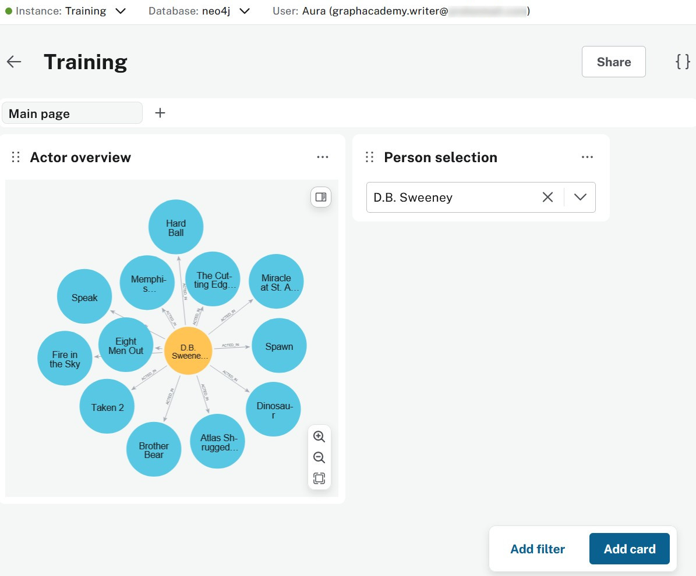

= Add cards and filters
:order: 2
:type: lesson

In the previous lesson you described the graph model and mapped stakeholder questions to the data (Movies examples). Use the dashboard you created in link:/courses/aura-dashboards/1-getting-started/3-exploring-dashboards/[Exploring Dashboards^]. If you have not connected data or created a dashboard yet, complete that lesson first.

In this lesson you will learn:

* How to add cards to your existing dashboard using AI prompts
* How to add a card with a Cypher query for precise control
* How to edit cards and add a filter so viewers can change what is displayed

== Open your dashboard and add a card

Open your dashboard from the **Dashboards** menu. You will add new cards and a filter to it.

image::images/connect-from-dashboards.png[dashboard_connect,width=500,align=center]

Before adding cards, make sure your instance contains graph data. If you are following the Movies track and have not loaded the sample yet, go back to link:/courses/aura-dashboards/1-getting-started/1-what-are-dashboards/#sample-graph-data[Sample graph data^] in the first lesson and restore the recommendations dataset. If you use your own graph, confirm your schema in the Query tool and adapt the examples.

Go to the **Dashboards** tool and click **Create with AI** to begin.

Enter a description of the insights you want to visualize. For example, you can enter a description like "Visualize actor relationships in movies." or simply "Actor relationships":

[TIP]
.Be specific
====
Be specific about the node labels and relationship types to ensure accurate results.
====

Create a new AI generated dashboard by clicking the "Generate with AI" button, which will prompt you to enter a description of the insights you want to visualize. The AI will then generate a dashboard based on your description:

video::https://cdn.graphacademy.neo4j.com/courses/aura-dashboards-videos/create-dashboard-with-AI.mp4["Generate Dashboard with AI",role="cdn", width=100%]

// TODO: Screenshot — AI-generated dashboard canvas after **Generate** (this sentence currently has no figure).

You should have a dashboard that looks similar to this:

== Adding more cards

Dashboard cards are individual components that display specific data visualizations.

Click **Add a card** to create your next visualization:

You can create cards using AI prompts or Cypher queries. To create a card with AI, use the natural language feature in the card editor:

video::https://cdn.graphacademy.neo4j.com/courses/aura-fundamentals/new-card-ai.mp4["Create New Card with AI",role="cdn", width=100%]

== Adding a card with Cypher

For precise control over the result, add a card that runs a Cypher query. Click **Add a card**, then in the card editor:

* Change the card title from "New card" to something descriptive like "Actor Overview"
* Select **Graph** from the visualization type dropdown
* Paste your Cypher query into the Query field

For example, create a card that shows which movies Tom Hanks has acted in:

[source,cypher]
----
MATCH (p:Person)-[r:ACTED_IN]->(m:Movie)
WHERE p.name = 'Tom Hanks'
RETURN p,r,m
----

video::https://cdn.graphacademy.neo4j.com/courses/aura-dashboards-videos/first-card-cypher-tom-hanks.mp4["First Card with Cypher - Tom Hanks",role="cdn", width=100%]

Your dashboard will display a graph visualization showing Tom Hanks and his movie connections.

[TIP]
.Repositioning cards
====
Move cards by dragging them using the six-dot handle that appears when you hover over a card.
====

== Editing a card

Change a card by clicking the three-dot menu on the card and selecting **Edit card**.

video::https://cdn.graphacademy.neo4j.com/courses/aura-fundamentals/edit-card.mp4["Edit Card",role="cdn", width=100%]

Make the changes you want, then click **Save changes** to update the card.

video::https://cdn.graphacademy.neo4j.com/courses/aura-fundamentals/save-card.mp4["Save Card",role="cdn", width=100%]

== Adding a filter

Filters allow users to dynamically change what data is displayed without modifying queries. The **parameters** drawer (`{}` in the dashboard editor) lists named parameters you can use in Cypher as `$parameter_name`. You can add a filter and link it to a parameter automatically, or define parameters first and then link a filter—see link:https://neo4j.com/docs/aura/dashboards/parameters-and-filters/[Filters and parameters^] in the Neo4j Aura documentation for filter types and the full workflow.

To add a filter to your dashboard, go to the dashboard view and select **Add filter**:

For example, create a "Person selection" filter that will control which actor's data is displayed.

Now update your Actor Overview card query to use the filter parameter:

[source,cypher]
----
MATCH (p:Person)-[r:ACTED_IN]->(m:Movie)
WHERE p.name = $person_name
RETURN p,r,m
----

Save your changes and test the filter:

Your dashboard now responds dynamically to filter selections:

== Try it on your dashboard before the quiz

Back in **Dashboards**, on the dashboard you have been using:

. Add a fresh card with **natural language**—anything that makes sense for your graph.
. Add a **Cypher** card: the Tom Hanks pattern from this lesson, or your own `MATCH` if the labels differ.
. Wire **Add filter** to whatever parameter you set up (`$person_name` or your rename) and flip the value a couple of times so you see the graph change.
. Edit a card title, save, and make sure the canvas updates.
. Drag a card with the **six-dot** handle so nothing sits awkwardly on the grid.

== Where dashboards fit in your workflow

The dashboard tool enables:

* Quick data exploration and validation
* Creating presentations
* Building operational monitoring dashboards
* Prototyping before investing in custom applications

[.quiz]
== Check your understanding

include::questions/1-dashboards-canvas.adoc[leveloffset=+1]

[.summary]
== Summary

You added cards with AI and Cypher, edited them, and hooked up a filter so viewers can switch context without rewriting queries.

In the next lesson, you will learn how to:

* Organize dashboard structure and create dashboard pages
* Customize card styling
* Visualize aggregated metrics
