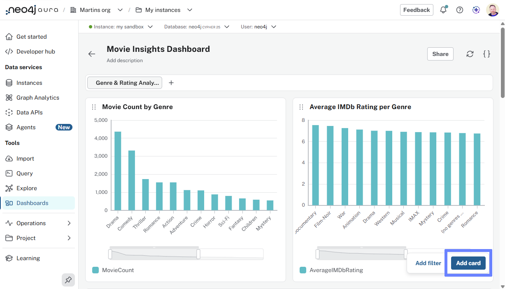
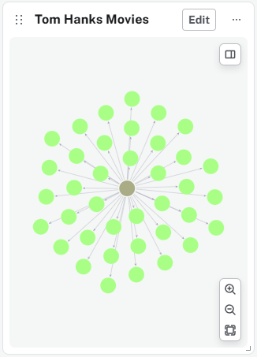
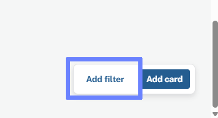
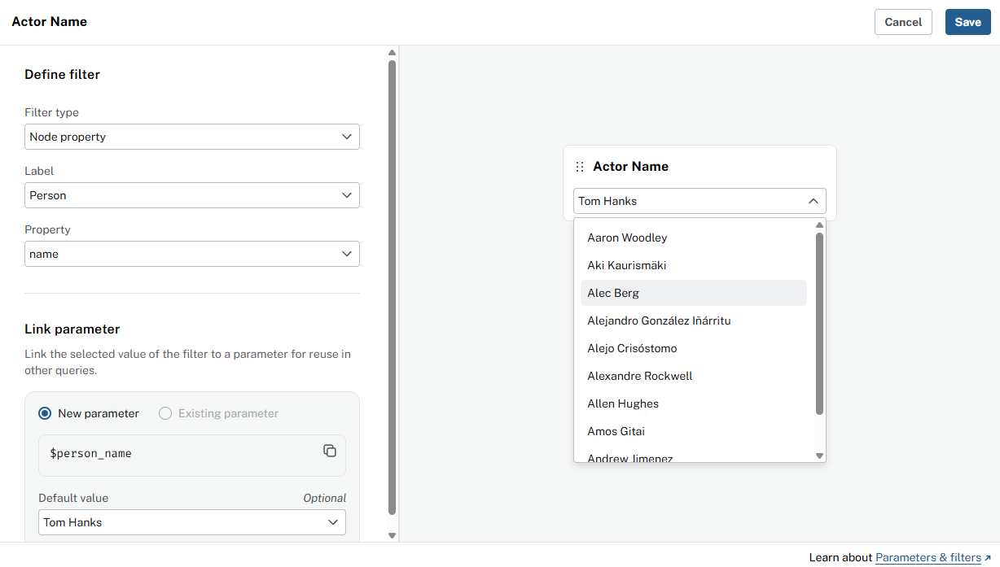
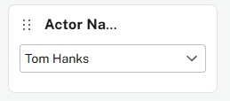
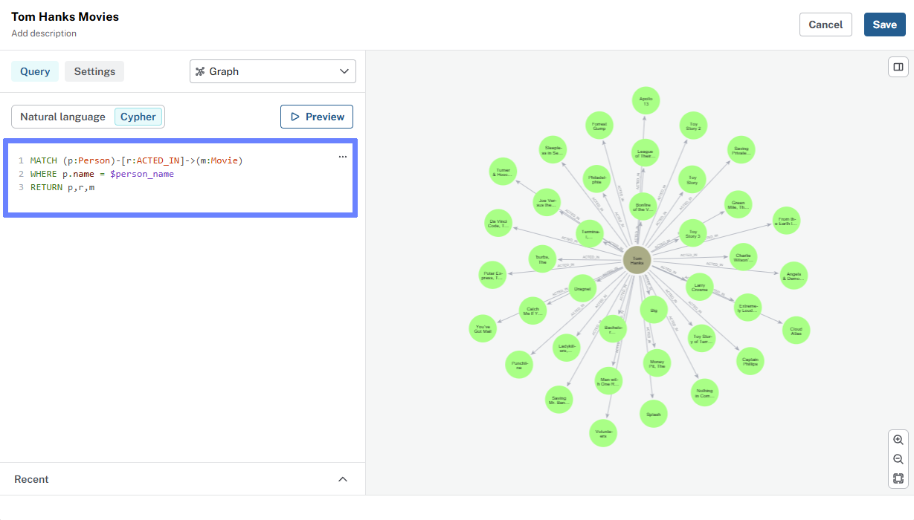

= Add cards and filters
:order: 2
:type: lesson

In this lesson, you will learn how to add a new card to your dashboard and connect it to a filter.

== AI-generated cards

You can use natural language to add a card to your dashboard. 
Dashboards will use AI to generate a query based on your description and create a card for you.

. Click **Add a card** 
+

. Use natural language to describe the card you want to add. 
For example, [copy]#Top 10 user rated movies#.
+
image::images/create-natural-leanguage-card.png[dashboard_editor,width=600,align=center]

. Generate the card, review the results, and *Save* it to your dashboard.

video::https://cdn.graphacademy.neo4j.com/courses/aura-fundamentals/new-card-ai.mp4["Create New Card with AI",role="cdn", width=100%]

The new card will be added to the *bottom* of your dashboard. 
You can drag it to a different position using the **six-dot** handle.

== Cypher-driven graph card

You can have greater control over a cards data by writing your own Cypher query. 

. Add a card, set **Visualization type** to **Graph**. 

. Add the Cypher statement that returns a graph of movies 'Tom Hanks' has acted in:

[source,cypher]
----
MATCH (p:Person)-[r:ACTED_IN]->(m:Movie)
WHERE p.name = 'Tom Hanks'
RETURN p,r,m
----

video::https://cdn.graphacademy.neo4j.com/courses/aura-dashboards-videos/first-card-cypher-tom-hanks.mp4["First Card with Cypher - Tom Hanks",role="cdn", width=100%]

Graph cards will display the nodes and relationships returned by your query.

[TIP]
.Editing cards
====
You can edit any card by hovering over it and using the **edit** option.

You can modify any aspect of the card, including the title, query, and visualization type.
====

== Add a filter

The graph card you just created can be connected to a filter, allowing you to change the actor name and see their movies.

. Add a filter to your dashboard.
+

. Create a new filter:
+
** Name: `Actor name`
** Type: `Node property`
** Label: `Person`
** Property: `name`

+
A new parameter, that you can use in your Cypher queries, `$person_name`, will be created for you.

+

. The new filter will be added to your dashboard. You can move it using the **six-dot** handle.
+

To use the filter, you need to connect it to your graph card by using the `$person_name` parameter in your Cypher query:

. Edit the graph card you created earlier.

. Update the Cypher to use the new parameter:
+
[source,cypher]
----
MATCH (p:Person)-[r:ACTED_IN]->(m:Movie)
WHERE p.name = $person_name
RETURN p,r,m
----
+

Congratulations, you have added 2 cards to your dashboard, one with AI and one with Cypher, and connected a filter to a parameter in your card.

[.quiz]
== Check your understanding

include::questions/1-dashboards-canvas.adoc[leveloffset=+1]

[.summary]
== Summary

You added cards with AI and Cypher, edited them, and connected a filter to a parameter.

In the next lesson, you will learn how to:

* Organize dashboard structure and create dashboard pages
* Customize card styling
* Choose visualization types for metrics
