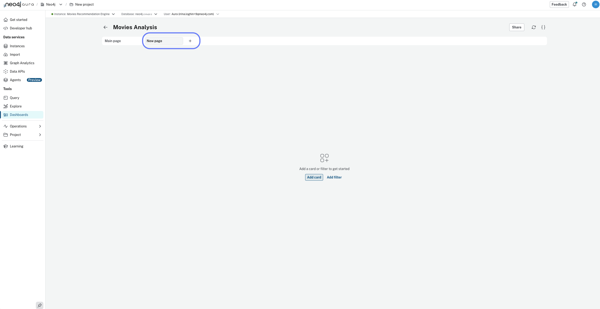
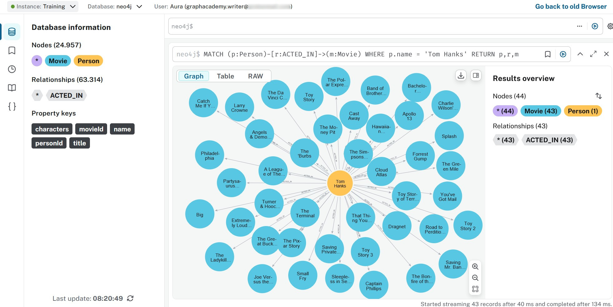

= Organize your dashboard structure
:type: lesson
:order: 3

In the previous lesson you added cards with AI and Cypher and a filter. Use that dashboard here. If you do not have a dashboard with cards yet, complete the previous lesson first.

In this lesson you will learn:

* How to add a new dashboard page and name it
* How to customize how cards look using the Results overview

Before you start, make sure you have completed the previous lesson and have a dashboard with at least one card.

== Creating a new dashboard page

If you have not created any dashboards yet, you need to select **Create from scratch** to start building your first dashboard page.

video::https://cdn.graphacademy.neo4j.com/courses/aura-dashboards-videos/create-from-scratch.mp4["Create from Scratch",role="cdn", width=100%]

[NOTE]
.Dashboard limit
====
If you have exceeded the dashboards limit for your tier, creating a new dashboard page will prompt you to upgrade your tier.
====

Either delete an existing dashboard or keep working on an existing dashboard.

To create a new dashboard page, go to the **Dashboards** menu and click on the **New page** button:

Give the page a clear name, such as "Stakeholders view", and click **Create**. You can rename it later by clicking the title in the dashboard editor.

video::https://cdn.graphacademy.neo4j.com/courses/aura-dashboards-videos/rename-dashboard-page.mp4["Rename Dashboard Page",role="cdn", width=100%]

== Styling cards

Change how graph results look by opening the **Results overview** for a card and adjusting colors, sizes, and captions for node labels and relationship types.

== Using Cypher queries for card creation

In the previous lesson you created cards using AI. For more control over data visualization, create cards using Cypher queries directly.

From your dashboard, click **Add a card** to open the card editor.

Use the card editor to define the card properties and paste your Cypher query into the Query field.

For example, create a card that shows which movies Tom Hanks has acted in:

[source,cypher]
----
MATCH (p:Person)-[r:ACTED_IN]->(m:Movie)
WHERE p.name = 'Tom Hanks'
RETURN p,r,m
----

video::https://cdn.graphacademy.neo4j.com/courses/aura-dashboards-videos/first-card-cypher-tom-hanks.mp4["First Card with Cypher - Tom Hanks",role="cdn", width=100%]

[.quiz]
== Check your understanding

include::questions/1-pages-and-cypher.adoc[leveloffset=+1]

[.summary]
== Summary

In this lesson you added a dashboard page, renamed it, and styled cards using the Results overview.

In the next lesson you will add aggregations such as counts and averages and choose chart types for ratings, genres, and actors.
