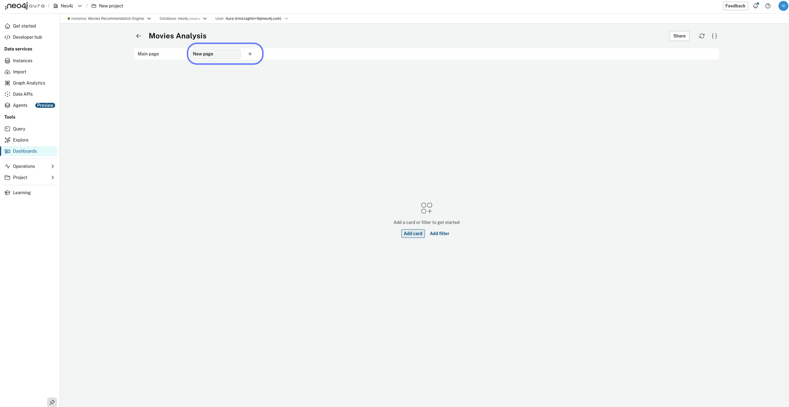
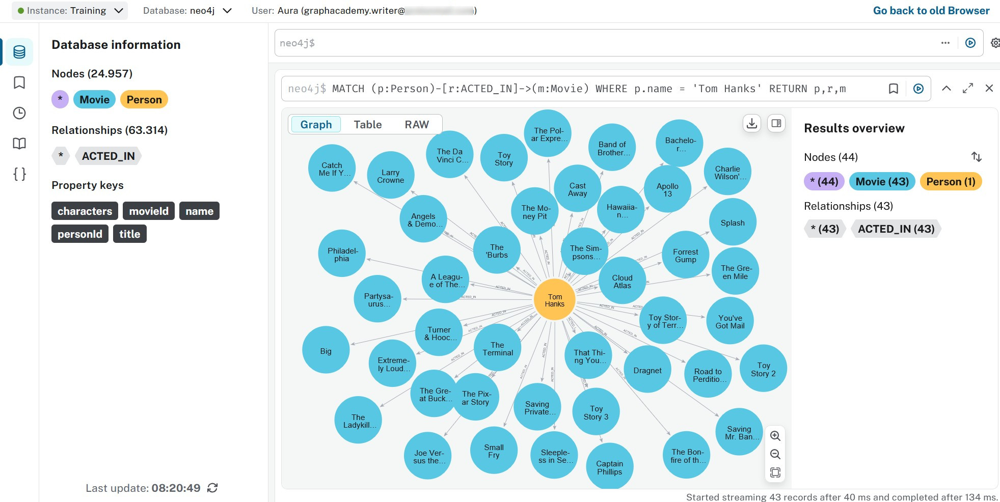

= Organize your dashboard structure
:order: 4
:type: lesson

In the previous lesson you added cards with AI and Cypher and a filter. Use that dashboard here. If you do not have a dashboard with cards yet, complete the previous lesson first.

In this lesson you will learn:

* How to add a new dashboard page and name it
* How to import, export, or copy a dashboard JSON definition
* How to customize how cards look using the Results overview

Before you start, make sure you have completed the previous lesson and have a dashboard with at least one card.

== Creating a new dashboard page

If you have not created any dashboards yet, you need to select **Create from scratch** to start building your first dashboard page.

video::https://cdn.graphacademy.neo4j.com/courses/aura-dashboards-videos/create-from-scratch.mp4["Create from Scratch",role="cdn", width=100%]

[NOTE]
.Dashboard limit
====
If you have exceeded the dashboards limit for your tier, creating a new dashboard page will prompt you to upgrade your tier.
====

Either delete an existing dashboard or keep working on an existing dashboard.

To create a new dashboard page, go to the **Dashboards** menu and click on the **New page** button:

Give the page a clear name, such as "Stakeholders view", and click **Create**. You can rename it later by clicking the title in the dashboard editor.

video::https://cdn.graphacademy.neo4j.com/courses/aura-dashboards-videos/rename-dashboard-page.mp4["Rename Dashboard Page",role="cdn", width=100%]

== Import and export dashboard definitions

// TODO: Screenshot — **Import** dashboard JSON dialog (browse / paste / source options called out in docs).
// TODO: Screenshot — Dashboard **tile** `...` menu with **Export file…** and **Copy to clipboard**.

When you **create** a dashboard, you can **Import** a JSON definition: browse for a file, paste JSON, import from NeoDash commercial or NeoDash Labs, or in some setups select JSON stored in the database. The import dialog shows a summary of pages, cards, parameters, and filters migrated or converted. See link:https://neo4j.com/docs/aura/dashboards/import/[Import and export^] for supported NeoDash report types and limitations.

From the **Dashboards** list (dashboard tiles, not inside the editor), open the more menu (`...`) on a dashboard tile. You can **Export file…** to download JSON, or **Copy to clipboard** to copy the same definition. Use these options to back up a layout, move a dashboard between instances, or share JSON with a teammate. The export file name format is `{dashboard title}_{YYYY-MM-DD}.json`. See link:https://neo4j.com/docs/aura/dashboards/managing-dashboards/[Managing dashboards^] for editing, pages, and deleting dashboards.

== Styling cards

Change how graph results look by opening the **Results overview** for a card and adjusting colors, sizes, and captions for node labels and relationship types.

== Using Cypher queries for card creation

In the previous lesson you created cards using AI. For more control over data visualization, create cards using Cypher queries directly.

From your dashboard, click **Add a card** to open the card editor.

// TODO: Screenshot — **Add a card** / card editor empty state with Query field (if not covered elsewhere).

Use the card editor to define the card properties and paste your Cypher query into the Query field.

For example, create a card that shows which movies Tom Hanks has acted in:

[source,cypher]
----
MATCH (p:Person)-[r:ACTED_IN]->(m:Movie)
WHERE p.name = 'Tom Hanks'
RETURN p,r,m
----

video::https://cdn.graphacademy.neo4j.com/courses/aura-dashboards-videos/first-card-cypher-tom-hanks.mp4["First Card with Cypher - Tom Hanks",role="cdn", width=100%]

== Pages, styling, and JSON—try it

. Add another **page** (tab). Name it for whoever would read it—``Marketing``, ``Exec``, or something honest for your case.
. On a **Graph** card, open **Results overview** and tweak **color** or **caption** for one label so the story reads clearer.
. From the **Dashboards** tile list, open ``…`` on this dashboard → **Copy to clipboard**, paste once into an editor if you want to see the JSON shape—you can delete it after.
. If you like files on disk, hit **Export file…** and check the downloaded ``.json`` name.

[.quiz]
== Check your understanding

include::questions/1-pages-and-cypher.adoc[leveloffset=+1]

[.summary]
== Summary

You split work across pages, nudged styling in **Results overview**, and saw how dashboard definitions move as JSON.

Next: match **Visualization type** to your query result shape.
