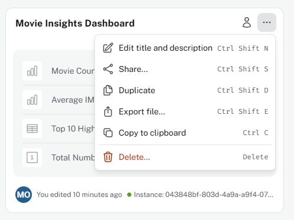
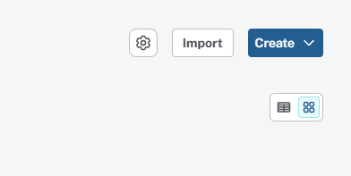
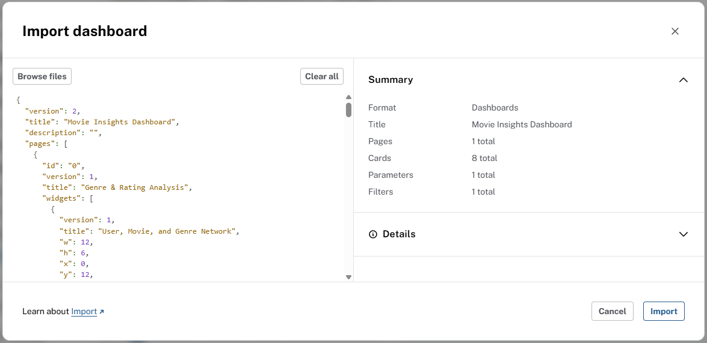

= Organize your dashboard structure
:order: 4
:type: lesson

In the previous lesson you added cards with AI and Cypher and a filter. 

In this lesson you will learn:

* How to add a new dashboard page and name it
* How to import, export, a dashboard

== Creating a new dashboard page

Dashboards can have multiple pages, allowing you to organize your dashboard into different sections. For example, you could have one page for executive stakeholders with high-level metrics and another page for data analysts with more detailed visualizations.

To create a new dashboard page, go to the **Dashboards** menu and click on the **New page** button:

image::images/new-page.png[New dashboard page dialog]

Give the page a clear name, such as "Stakeholders view", and click **Create**. You can rename it later by clicking the title in the dashboard editor.

video::https://cdn.graphacademy.neo4j.com/courses/aura-dashboards-videos/rename-dashboard-page.mp4["Rename Dashboard Page",role="cdn", width=100%]

Dashboard pages can be used just like any other dashboard, so you can add cards, filters, and style them as needed.

== Import and export dashboard definitions

Dashboards are linked to a specific Neo4j instance, but you can move them between instances or share them by exporting JSON definitions.

You can export a definition from the menu on the dashboard tile.
Use the *Export file* option to download a JSON file containing your dashboard.

Use the *Import* function to create a dashboard from a JSON definition. You can import from a file or paste the JSON directly.

The import dialog will show a summary of the dashboard being imported, including the number of pages, cards, parameters, and filters. 

[TIP]
.Importing from NeoDash
====
You can import dashboards created in NeoDash commercial or NeoDash Labs, but some features may not be supported. See link:https://neo4j.com/docs/aura/dashboards/import/[Import and export^] for details.
====

[.quiz]
== Check your understanding

include::questions/1-pages.adoc[leveloffset=+1]

[.summary]
== Summary

You explored dashboard pages and how to import and export dashboards. 

In the next lesson, you will learn about the different types of cards and visualizations, and how to choose the right one for your data.
