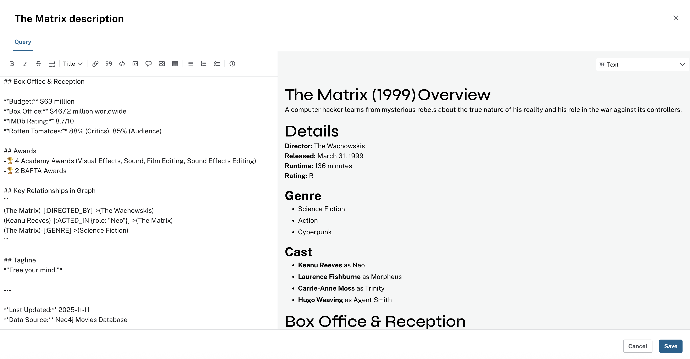

= Add aggregations and chart types
:type: lesson
:order: 4

In the previous lesson you organized pages and styled graph cards. In this lesson you will learn:

* How to add cards that show counts, averages, and distributions
* How to run Cypher queries that aggregate data
* How to choose the right visualization type for each card

== Visualization types

In the card editor, use the **Visualization type** dropdown to match the chart to your data: relationships, rows, trends over time, or a single number.

* **Graph** - Shows relationships between nodes
* **Table** - Displays detailed data in a structured format
* **Line Chart** - Tracks trends over time
* **Bar Chart** - Compares quantities across categories
* **Pie Chart** - Displays proportions of a whole
* **Single Value** - Highlights a key metric
* **Text** - Adds descriptive information or context

From the card editor, select the dropdown menu under **Visualization type** to choose the most appropriate visualization for your data:


image::images/change-card-type.png[Change card type dialog,width=600,align=center]


=== Graph card

Use a **Graph** card when your query returns nodes and relationships. For example, actors and the movies they acted in. You can ask the AI for a graph card or write Cypher that returns nodes and relationships.

Try a graph card that shows actors and movies:

image::images/ai-generated-graph.png[Graph card example,width=600,align=center]

=== Table card

Use a **Table** when you have rows and columns, such as movie, user, and rating. Add a card, paste the query below into the card editor, and run it.
[source,cypher ]
----
MATCH (u:User)-[r:RATED]->(m:Movie)
RETURN m.title AS movie, u.name AS user, r.rating AS rating
ORDER BY r.rating DESC
LIMIT 10
----

image::images/table-top10-ratings-per-user-cypher.png[Table card example,width=600,align=center]


=== Bar Chart card

Use a **Bar Chart** when you have categories, such as genre or country, and a value to compare, such as count or average rating. This matches the chart you saw in lesson 1: average rating by genre.

Add a card and run this query, then set the visualization type to **Bar Chart**:
[source,cypher ]
----
MATCH (m:Movie)-[:IN_GENRE]->(g:Genre)
WHERE m.rating IS NOT NULL
RETURN g.name AS genre, round(avg(toFloat(m.rating)), 2) AS avgRating
ORDER BY avgRating DESC
----

Your card should look like the average rating by genre chart from lesson 1:

image::images/average-rating-by-genre.png[Average rating by genre chart,width=600,align=center]

*Challenge:* Create another bar chart that shows the number of movies per genre, or movies directed per country.

=== Line chart card

Use a **Line Chart** when you have an ordered dimension (for example year) and a value to plot. It works well for trends over time.

Add a card and run this query, then set the visualization type to **Line Chart**:
[source,cypher ]
----
MATCH (m:Movie)
WHERE m.release_year IS NOT NULL
WITH m.release_year AS year, count(m) AS movieCount
RETURN year, movieCount
ORDER BY year
----

Your card will show movie count over time. Use a line chart whenever you want to show how a value changes across an ordered dimension (years, months, etc.).

=== Pie Chart card

Use a **Pie Chart** when you want to show how parts make up a whole, such as share of movies per genre or top directors by average rating.

You can ask the AI: "Create a pie chart showing directors with the highest average movie ratings." Or add a card and run this Cypher:

[source,cypher ]
----
/* Which directors have the highest average movie ratings? */

MATCH (d:Director)-[r:DIRECTED]->(m:Movie)<-[r2:RATED]-(u:User)
WITH d, avg(r2.rating) AS averageRating
ORDER BY averageRating DESC
RETURN d.name AS directorName, averageRating
LIMIT 10
----

video::https://cdn.graphacademy.neo4j.com/courses/aura-dashboards-videos/directors-with-highest-movie-ratings.mp4["Directors with Highest Movie Ratings",role="cdn", width=100%]

=== Single Value card

Use a **Single Value** card when your query returns one row and one number. For example, total count of movies.

Add a card and run this query:

[source,cypher ]
----
MATCH (n)
RETURN COUNT(n) as Total
----

Your card will show a single number. If your value is different, that is fine; it depends on what is in your instance.

image::images/single-card.png[Single Value card example,width=600,align=center]

=== Text card

Use a **Text** card to add titles, descriptions, or context so anyone viewing the dashboard knows what they're looking at. You can write plain text or use markdown.

Try a text card for a movie, such as __The Matrix__. Add a card, choose **Text** as the visualization type, and paste this markdown:

[source,markdown]
----
# The Matrix (1999)

## Overview
A computer hacker learns from mysterious rebels about the true nature of his reality and his role in the war against its controllers.

## Details

**Director:** The Wachowskis
**Released:** March 31, 1999
**Runtime:** 136 minutes
**Rating:** R

### Genre

- Science Fiction
- Action
- Cyberpunk

### Cast

- **Keanu Reeves** as Neo
- **Laurence Fishburne** as Morpheus
- **Carrie-Anne Moss** as Trinity
- **Hugo Weaving** as Agent Smith

## Box Office & Reception

**Budget:** $63 million
**Box Office:** $467.2 million worldwide
**IMDb Rating:** 8.7/10
**Rotten Tomatoes:** 88% (Critics), 85% (Audience)

## Awards

- 🏆 4 Academy Awards (Visual Effects, Sound, Film Editing, Sound Effects Editing)
- 🏆 2 BAFTA Awards

## Key Relationships in Graph

```
(The Matrix)-[:DIRECTED_BY]->(The Wachowskis)
(Keanu Reeves)-[:ACTED_IN {role: "Neo"}]->(The Matrix)
(The Matrix)-[:GENRE]->(Science Fiction)
```

## Tagline

*"Free your mind."*

---

**Last Updated:** 2025-11-11
**Data Source:** Neo4j Movies Database
----


The card editor renders the markdown. You can scroll to see the full content and use the menu to edit or switch back to raw markdown.



On the dashboard, the text card appears as a short overview:


*Challenge:* Add one or two more text cards to give context to the charts on your dashboard.

=== Putting it together

You have tried each chart type. When you build your own cards, choose the type that fits the data: use bar or pie for category counts, line for trends over time, table for row-by-row detail, and text to explain what the numbers mean.

*Hands-on challenge*

Create a dashboard or a new page for a "marketing team" view. Add cards that show:

* Total movies per genre
* Average rating by genre (like the chart in lesson 1)
* Top 5 directors by average movie rating

Pick the chart type that fits each one: for example, bar for genre counts and average rating by genre. Add a text card or two to explain what the numbers mean. Share your dashboard with a peer or on the link:https://community.neo4j.com[Neo4j Community forum^] and discuss why you chose each visualization.

=== Practice with aggregations

If you want more practice with counts and averages, try these queries. Add a separate card for each and choose the visualization type that fits.

* **Count:** How many movies?

[source,cypher]
----
MATCH (m:Movie)
RETURN count(m) AS total_movies
----

* **Average:** Average rating per genre and how many movies.

[source,cypher]
----
MATCH (m:Movie)-[:IN_GENRE]->(g:Genre)
RETURN g.name AS genre,
    avg(toFloat(m.rating)) AS average_rating,
    count(m) AS total_movies
ORDER BY average_rating DESC
----


video::https://cdn.graphacademy.neo4j.com/courses/aura-dashboards-videos/first-card-average-rating-by-genre.mp4["First Card - Average Rating by Genre",role="cdn", width=100%]

* **Distribution:** How many ratings at each rating value.

[source,cypher]
----
MATCH (m:Movie)
WHERE m.rating IS NOT NULL
RETURN m.rating AS rating,
    count(*) AS count
ORDER BY rating DESC
----

[TIP]
.Same query, different chart
====
You can use the same Cypher in more than one card and set a different visualization type, such as bar in one card and pie in another, to compare how each presents the data. Functions like `count()`, `avg()`, and `sum()` are what you need for aggregations.
====

[NOTE]
.Access and security
====
Dashboard viewers only see data they have permission to access. If a user's role does not allow viewing certain data, that data does not appear in the dashboard for them.
====


[.quiz]
== Check your understanding

include::questions/1-visualization-types.adoc[leveloffset=+1]


[.summary]
== Summary

You used aggregations such as COUNT and AVG and chart types such as bar, pie, table, and graph to visualize ratings, genres, and actors on your movies dashboard.

In the next module you will share your dashboard with others.
