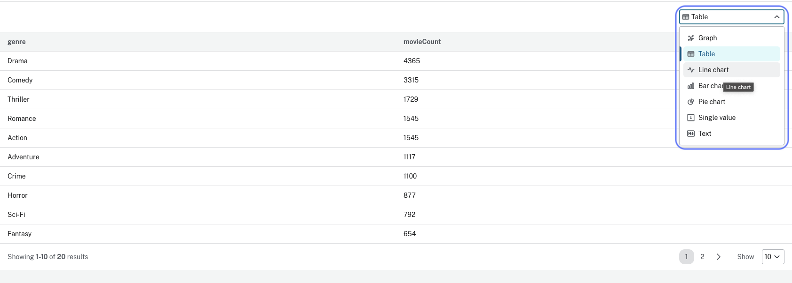
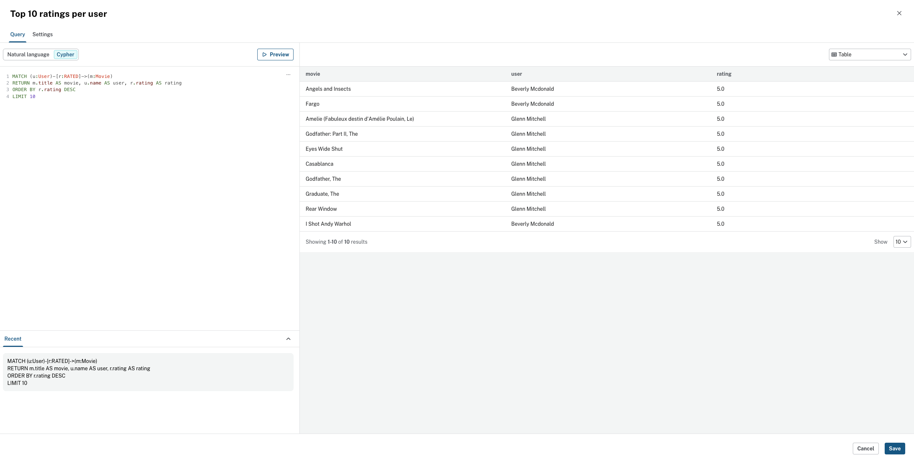
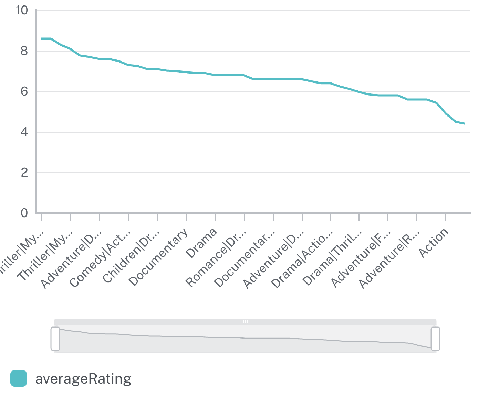
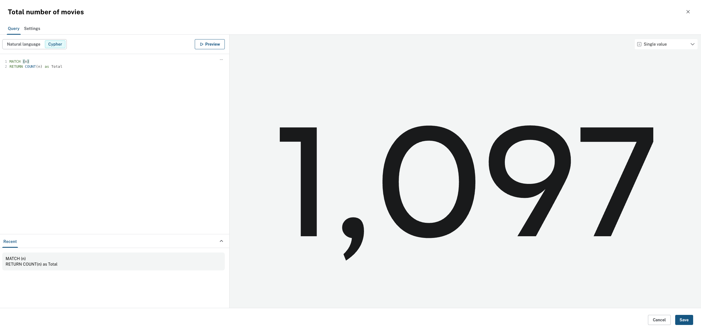
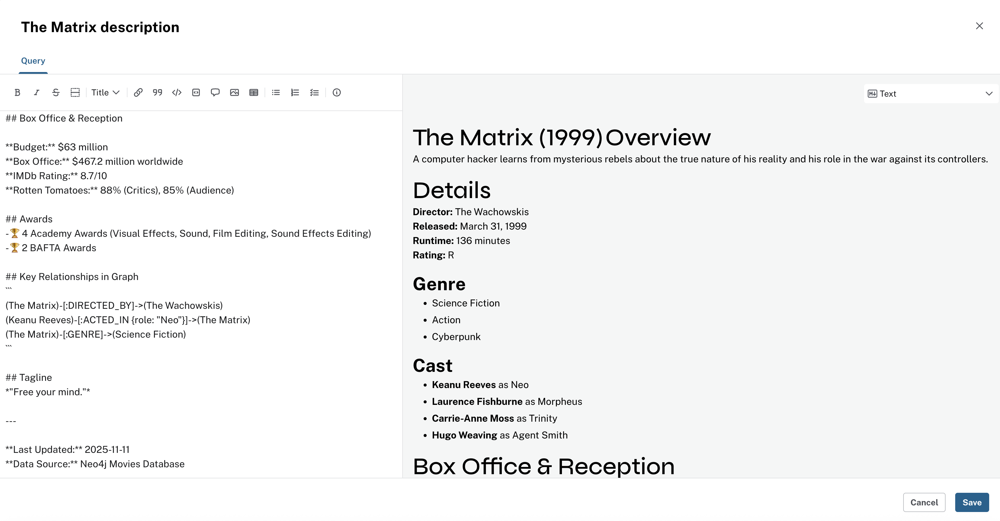

= Match chart types to your query
:order: 5
:type: lesson

In the previous lesson you organized pages and styled graph cards. **This lesson has one focus:** choose a **Visualization type** so the shape of the chart matches the shape of your query result—rows, categories, a trend, one number, or prose.

In this lesson you will learn:

* How to pick a visualization type for counts, averages, and distributions

Keep **Dashboards** open—most steps are: paste the query, set **Visualization type**, then **Save**.

== The Visualization type dropdown

In the card editor, use **Visualization type** to match the chart to your data. See link:https://neo4j.com/docs/aura/dashboards/[Neo4j Aura Dashboards documentation^] for the full list and settings.

| Use | When the query returns |
|----|----|
| **Graph** | Nodes and relationships |
| **Table** | Rows and columns |
| **Bar chart** | Categories and one numeric value per category |
| **Line chart** | An ordered dimension (for example year) and a value |
| **Pie chart** | Parts of a whole share |
| **Single value** | One row, one numeric column |
| **Text** | Markdown for context |

== Three patterns to try

=== Table: top ratings

[source,cypher]
----
MATCH (u:User)-[r:RATED]->(m:Movie)
RETURN m.title AS movie, u.name AS user, r.rating AS rating
ORDER BY r.rating DESC
LIMIT 10
----

Set **Visualization type** to **Table**.

=== Bar chart: average IMDb by genre

[source,cypher]
----
MATCH (m:Movie)-[:IN_GENRE]->(g:Genre)
WHERE m.imdbRating IS NOT NULL
RETURN g.name AS genre, round(avg(m.imdbRating), 2) AS avg_imdb
ORDER BY avg_imdb DESC
----

Set **Visualization type** to **Bar chart**.

=== Single value and text

**Count** nodes with a query that returns one number. Example:

[source,cypher]
----
MATCH (m:Movie)
RETURN count(m) AS total_movies
----

Set **Visualization type** to **Single value**.

For **Text**, choose **Text** and paste short markdown (title, bullets, data source). Use it to explain what the numbers on the page are for.

== Same query, different chart

Copy a simple `RETURN` into **two** cards and set **Visualization type** differently (for example **Single value** vs **Table**). The query is the same; only the presentation changes.

[TIP]
.Aggregations
====
`count()`, `avg()`, and `sum()` are what you need for totals and averages. Pair the aggregated `RETURN` with a chart type that fits: bar for categories, line for ordered dimensions, single value for one metric.
====

[NOTE]
.Access and security
====
Dashboard viewers only see data their role allows. If a role cannot read certain nodes, those rows do not appear in the card.
====

[.quiz]
== Check your understanding

include::questions/1-purpose.adoc[leveloffset=+1]

[.summary]
== Summary

You matched **Visualization type** to query result shape—table, bar, single value, and text—and saw why the same `RETURN` can power more than one card.

Next: who gets to see the dashboard, and how invites work in Aura.
