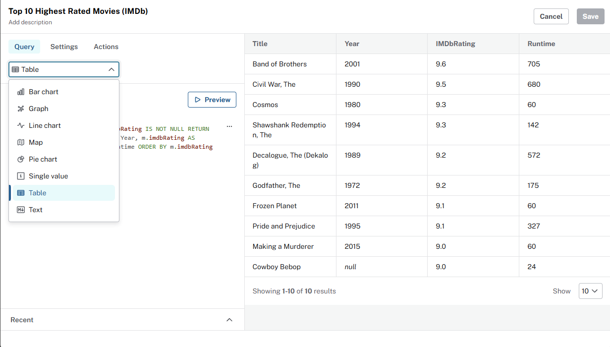
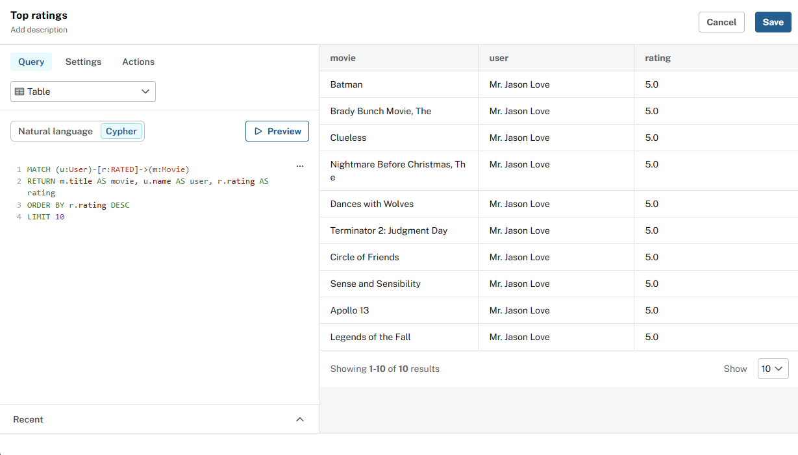
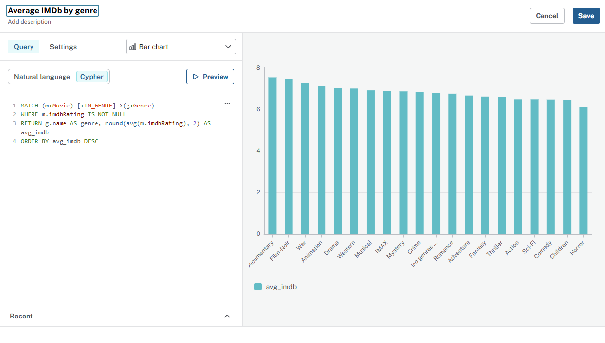
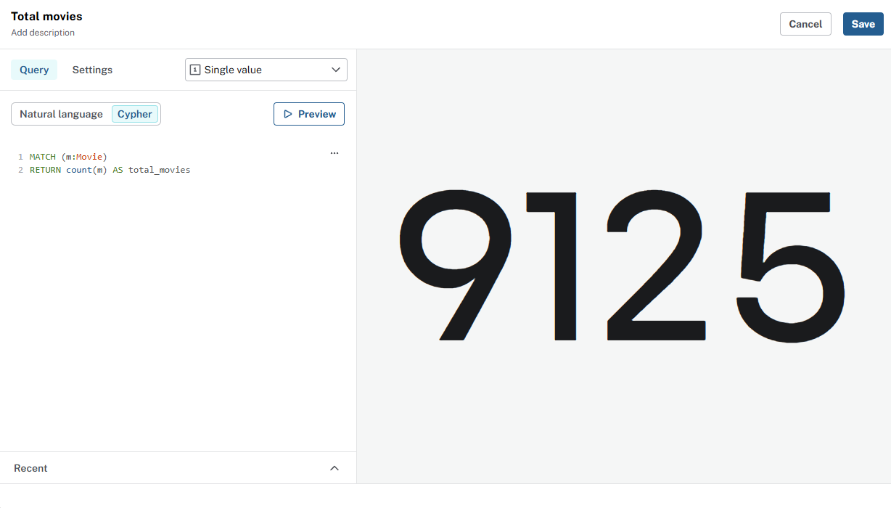
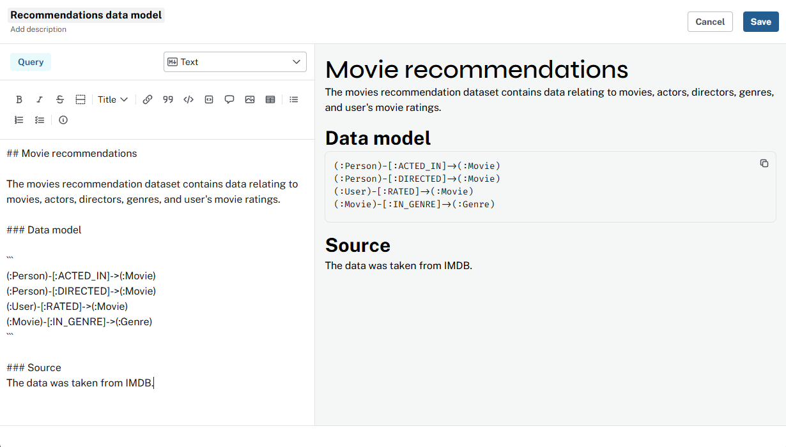

= Match visualizations to queries
:order: 5
:type: lesson

In this lesson you will:

* Explore visualization types in Aura Dashboards
* Learn how to pick a visualization type for counts, averages, and distributions

== The visualization type dropdown

You can change the **Visualization type** when adding or editing a card. 



The data returned by your query often indicate what visualization type to choose:

[options="header"]
|===
| Use | When the query returns
| *Graph* | Nodes and relationships
| *Table* | Rows and columns
| *Bar chart* | Categories and one numeric value per category
| *Line chart* | An ordered dimension (year, genre, country, etc) and a value
| *Pie chart* | Parts of a whole share
| *Single value* | One row, one numeric column
| *Text* | Markdown for context
|===


[TIP]
.Visualization types
====
See link:https://neo4j.com/docs/aura/dashboards/[Neo4j Aura Dashboards documentation^] for a complete list of visualization types and settings.
====

== Explore the visualization types

Explore the following examples that use different visualization types. For each example:

. Add a new card to your dashboard with an appropriate name.
. Set the **Visualization type** as shown.
. Update the query.
. Review the result.

=== Table: top user ratings

Visualization type - `Table`.

[source,cypher]
.Top ratings query
----
MATCH (u:User)-[r:RATED]->(m:Movie)
RETURN m.title AS movie, u.name AS user, r.rating AS rating
ORDER BY r.rating DESC
LIMIT 10
----



=== Bar chart: average IMDb by genre

Visualization type - `Bar chart`.

[source,cypher]
.Ratings by genre query
----
MATCH (m:Movie)-[:IN_GENRE]->(g:Genre)
WHERE m.imdbRating IS NOT NULL
RETURN g.name AS genre, round(avg(m.imdbRating), 2) AS avg_imdb
ORDER BY avg_imdb DESC
----



=== Single value: total movies

Visualization type - `Single value`.

Single value cards are ideal for totals and other aggregations that return one number.

[source,cypher]
.Total movies query
----
MATCH (m:Movie)
RETURN count(m) AS total_movies
----



[TIP]
.Aggregations
====
Experiment with the `count()`, `avg()`, and `sum()` aggregation functions in Cypher to return a single value.
====

=== Text: dashboard context

The **Text** visualization type is ideal for dashboard context and explanations. 
You can format text as markdown, adding titles, bullets, and links to the text.

Visualization type - `Text`.

[source, text]
.Dashboard context query
----
## Movie recommendations

The movies recommendation dataset contains data relating to movies, actors, directors, genres, and user's movie ratings.

### Data model

```
(:Person)-[:ACTED_IN]->(:Movie)
(:Person)-[:DIRECTED]->(:Movie)
(:User)-[:RATED]->(:Movie)
(:Movie)-[:IN_GENRE]->(:Genre)
```

### Source
The data was taken from [IMDB](https://www.imdb.com/).
----




[NOTE]
.Access and security
====
Dashboard viewers only see data their role allows. If a role cannot read certain nodes, those rows do not appear in the card.
====

Add new cards to your dashboard and explore the different visualization types.

[.quiz]
== Check your understanding

include::questions/1-purpose.adoc[leveloffset=+1]


[.summary]
== Summary

In this lesson, you matched **Visualization type** to query result and explored different visualizations.

Next: who gets to see the dashboard, and how invites work in Aura.
