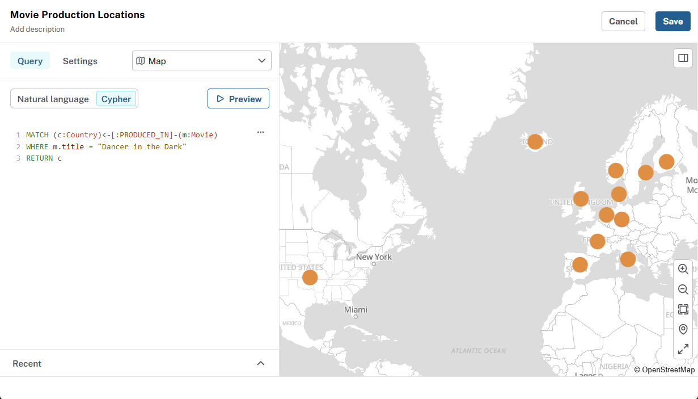

= Create a map card
:order: 7
:type: lesson

In this lesson, you will use the **Map** visualization to plot nodes with coordinates onto a map.

== Add coordinates to your data

The movie recommendations dataset includes the country of production for movies.

[source, cypher]
.Movies and their production countries
----
MATCH (m:Movie)
RETURN m.title as title, m.countries as countries
LIMIT 25
----

A **Map** visualization plots **nodes** that carry coordinates. 

You can add coordinates to the movies in Cypher by creating `Country` nodes with coordinates and linking them to the movies.

Run this query to create `Country` nodes and link them to movies:

[source,cypher]
.Create Country nodes
----
MATCH (movie:Movie)
UNWIND movie.countries as productionCountries
MERGE (country:Country {name: trim(productionCountries)})
MERGE (movie)-[:PRODUCED_IN]->(country)
----

The file link:https://data.neo4j.com/aura-dashboards/country-coords.csv[country-coords.csv] contains coordinates for the countries in the dataset. 

Run ths query to add the coordinates to the `Country` nodes:

[source,cypher]
.Load coordinates from CSV and add to Country nodes
----
LOAD CSV WITH HEADERS FROM "https://data.neo4j.com/aura-dashboards/country-coords.csv" as coords
MATCH (country:Country) WHERE lower(country.name) = lower(coords["Country"])
SET country.coord = point({latitude: toFloat(coords["latitude"]), longitude: toFloat(coords["longitude"])})
----

[NOTE]
.Point data type
====
You can use **`point({latitude: <degrees>, longitude: <degrees>})`** in Cypher to create coordinates. 

Latitudes are -90 to 90; longitudes -180 to 180. Use **decimal degrees**, not degree-minute-second strings.
====

View the `Country` nodes with their coordinates:

[source,cypher]
.Movie production countries with coordinates
----
MATCH (c:Country)<-[:PRODUCED_IN]-(m:Movie)
RETURN m.title as title, c.name AS country, c.coord AS coordinates
ORDER BY title
LIMIT 25
----

== Add a Map card

Your task is to add a new Map card to your dashboard that shows where movies were produced. 

This cypher query returns the production countries for a specific movie:

[source,cypher]
.Production countries for "Dancer in the Dark"
----
MATCH (c:Country)<-[:PRODUCED_IN]-(m:Movie)
WHERE m.title = "Dancer in the Dark"
RETURN c
----

[NOTE]
.Resolving coordinates
====
Dashboards resolve positions in this order on each node:

. A property of type **`Point`** (WGS 84), or
. Paired **`latitude`** and **`longitude`** properties, or
. Paired **`lat`** and **`long`** properties.
====

== Add a filter to the Map

The title of the movie is hardcoded in the query above. 

To make the map more interactive, add a filter that lets user choose which movie production countries to see on the map.

read::Continue[]

[.summary]
== Summary

You added countries and coordinates to dataset and created a Map card to visualize where movies were produced. You also added a filter to make the map interactive.

