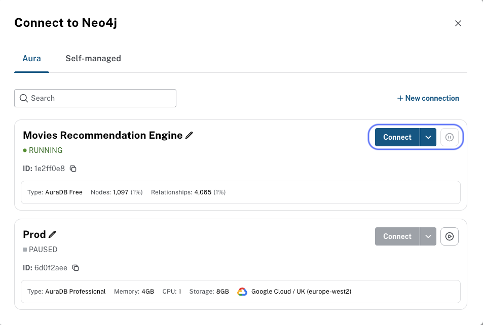
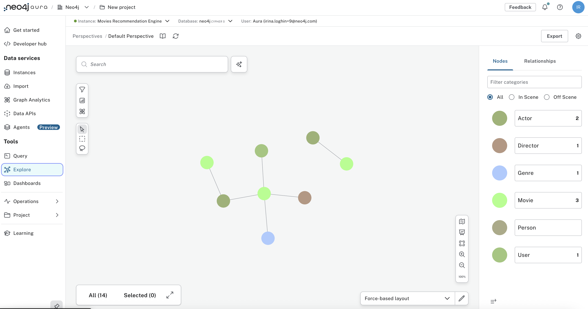
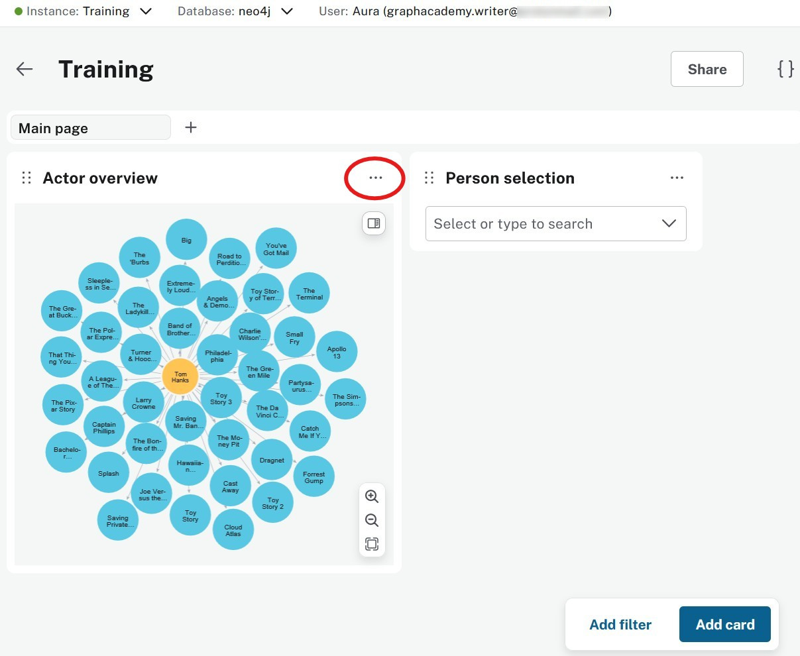

= Building dashboards with AI
:type: lesson
:order: 2

In the previous lessons, you learned how to execute Cypher queries using the Query tool and explored your data using the Explore tool.

In this lesson, you will learn how to:

* Create interactive dashboards using Aura's integrated dashboard tool
* Build dashboard cards using natural language AI prompts
* Add filters to make dashboards dynamic

 
== Understanding the Dashboards tool

A dashboard tool transforms raw data into visual representations that anyone can understand, regardless of their technical background.

Think of dashboards as the "storefront window" for your graph data - they display the most important insights in an accessible, visual format that business users can interact with without writing code.

In Aura Dashboards, you have access to an integrated AI tool that allows you to quickly prototype and build production-ready dashboards.

== Creating your first dashboard

You will learn how to build a dashboard that visualizes actor relationships in the movie database.

First, navigate to the Dashboards tool in your Aura console:

Before creating your dashboard, make sure your database contains the sample movie data. If you used the provided Cypher script, the **Explore** tab should display nodes and relationships from the movie dataset. If you imported your own data, ensure it is loaded and visible in the **Explore** tab before proceeding.

Go to the **Dashboards** tool and click **Create with AI** to begin:

image::images/create-with-ai-button.png[dashboard_start,width=500,align=center]

In the prompt dialog, enter a description of the insights you want to visualize. As a good practice, be specific about the node labels and relationship types to ensure accurate results. For example, you can enter a description like "Visualize actor relationships in movies." or simply "Actor relationships":

image::images/create-with-ai-prompt.png[create_with_ai_prompt,width=600,align=center]

In the dashboard editor, you can customize your dashboard by adding cards, filters, and arranging the layout: 

image::images/create-natural-leanguage-card.png[dashboard_editor,width=600,align=center]

Try to replicate the following steps to create another dashboard:

Rename your dashboard from "New dashboard" to something descriptive like "Movie Analytics Dashboard" by clicking on the title.

Create a new AI generated dashboard by clicking the "Generate with AI" button, which will prompt you to enter a description of the insights you want to visualize. The AI will then generate a dashboard based on your description:

video::https://cdn.graphacademy.neo4j.com/courses/aura-fundamentals/create-dashboard-with-ai.mp4["Generate Dashboard with AI",role="cdn", width=100%]

In the end, you should have a dashboard that looks similar to this:

video::https://cdn.graphacademy.neo4j.com/courses/aura-fundamentals/create-edit-dashboard.mp4["Create and Edit Dashboard",role="cdn",  width=100%]

== Adding more AI-generated cards

Dashboard cards are individual components that display specific data visualizations.

Click **Add a card** and create your next visualization:

video::https://cdn.graphacademy.neo4j.com/courses/aura-fundamentals/new-card-ai.mp4["Create New Card with AI",role="cdn", width=100%]

* Change the card title from "New card" to "Actor Overview"
* Select **Graph** from the visualization type dropdown
* Paste the following Cypher query in the Query field:

[source,cypher]
----
MATCH (p:Person)-[r:ACTED_IN]->(m:Movie)
WHERE p.name = 'Tom Hanks'
RETURN p,r,m
----

image::images/04_dashboard_tool_card.jpg[dashboard_card,width=500,align=center]

Your dashboard will display a graph visualization showing Tom Hanks' movie connections:

image::images/04_dashboard_tool_hanks.jpg[dashboard_hanks,width=500,align=center]

[TIP]
.Repositioning cards
====
You can move cards by dragging them using the six-dot handle that appears when you hover over a card.
====

== Editing cards

Production dashboards often require updates as data and requirements evolve. 

Once you have created a dashboard card, you can edit it at any time by clicking the three-dot menu on the card and selecting **Edit card**.

video::https://cdn.graphacademy.neo4j.com/courses/aura-fundamentals/edit-card.mp4["Edit Card",role="cdn", width=100%]

Make the changes you want, then click **Save changes** to update the card. 

video::https://cdn.graphacademy.neo4j.com/courses/aura-fundamentals/save-card.mp4["Save Card",role="cdn", width=100%] 

== Making dashboards interactive with filters

Use static dashboards to present fixed insights, or add interactivity to allow users to explore data dynamically.

Filters allow users to dynamically change what data is displayed without modifying queries.

To add a filter to your dashboard, go to the dashboard view and select **Add filter**:

image::images/04_dashboard_tool_filter.jpg[dashboard_filter,width=300,align=center]

For example, create a "Person selection" filter that will control which actor's data is displayed.

Now update your Actor Overview card query to use the filter parameter:

[source,cypher]
----
MATCH (p:Person)-[r:ACTED_IN]->(m:Movie)
WHERE p.name = $person_name
RETURN p,r,m
----

Save your changes and test the filter:

Your dashboard now responds dynamically to filter selections:

image::images/04_dashboard_tool_result.jpg[dashboard_result,width=500,align=center]

== Where dashboards fit in your workflow

Dashboards serve as the bridge between your graph database and business stakeholders.

They enable rapid prototyping of data visualizations and can often become production solutions for organizations that need quick insights without custom application development.

The integrated dashboard tool excels at:

* Quick data exploration and validation
* Creating stakeholder presentations
* Building operational monitoring dashboards
* Prototyping before investing in custom applications

video::https://cdn.graphacademy.neo4j.com/courses/aura-fundamentals/dashboards-long-version.mp4["Dashboard Prototyping",role="cdn", width=100%]

[.quiz]
== Check your understanding

include::questions/1-dashboards-canvas.adoc[leveloffset=+1]

[.summary]
== Summary

In this lesson, you learned how to create interactive dashboards in Aura, build dashboard cards with natural language AI prompts, and add filters to make your dashboards dynamic and user-friendly.

In the next lesson, you will learn how to create your first dashboard card using Cypher queries.
