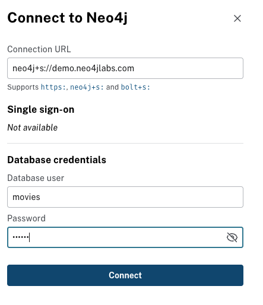
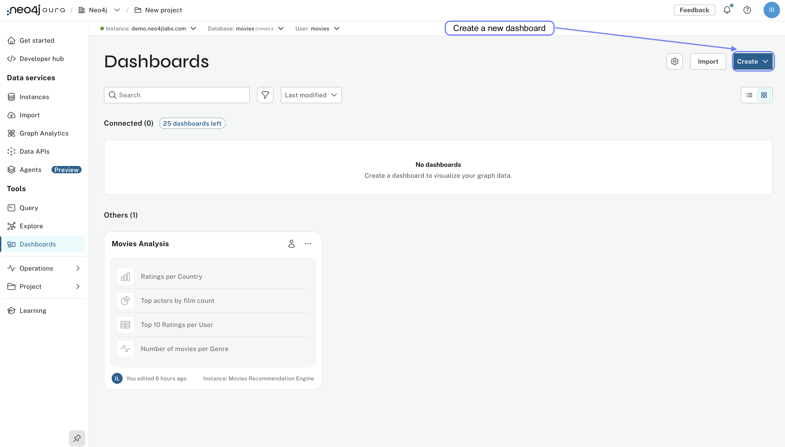
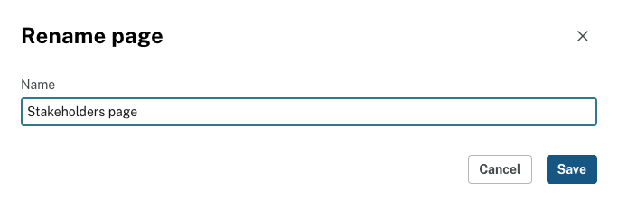
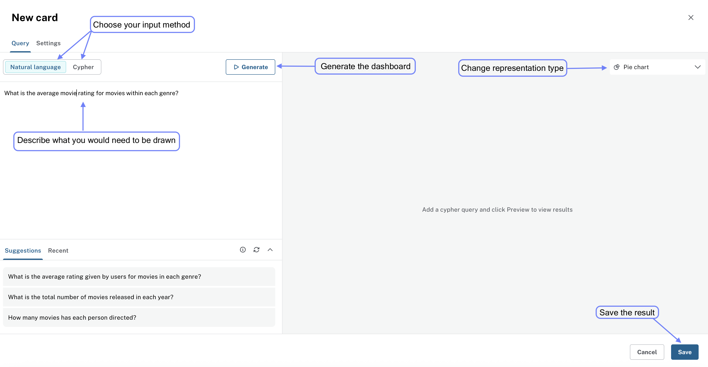

= Creating cards
:type: lesson
:order: 1

In this lesson, you will learn how to create your first card in Neo4j Aura Dashboards, using the natural language AI assistant or by writing Cypher queries.

You will learn how to:

* Connect to your Aura instance using the integrated Query tool.
* Create a new dashboard page.
* Create your first card using a Cypher query.

Optionally, you can dive into writing Cypher queries to fetch and visualize data, providing more control over the data displayed in your cards.

== Connecting

Before you start, make sure you have completed the previous lesson and imported the sample data into your Aura instance.
NOTE: The sample data should be _loaded_ into your Aura instance using the provided Cypher script, not the Import service.

If you haven't done that yet, go back to lesson 2 - Accessing Aura Dashboards and follow the steps to import the data.

Open the Aura console and select the instance you want to connect to. Make a note of the number of nodes and relationships in the database, as you might need to create advanced filters to work with larger datasets.

image::images/02_query_tool_connect.jpg[querytool_connect,width=500,align=center]

You can also connect to the instance directly from the Aura console by adding the credentials in the connection dialog: 

image::images/connect-instance-ui.png[Connect to instance dialog,width=600,align=center]

Before you select **Query**, check that you've loaded the data from the previous lesson.

image::images/02_query_tool_start.jpg[querytool_start,width=500,align=center]

== Querying

Start by exploring the database details.
Copy the following query into the Cypher editor:
Click on the labels and relationship types under **Database Information** to see the number of nodes and relationships in the database.

Copy the following Cypher query into the query editor:

[source,cypher]
----
MATCH (p:Person)-[r:ACTED_IN]->(m:Movie)
WHERE p.name = 'Tom Hanks'
RETURN p,r,m
----

image::images/02_query_tool_command.jpg[querytool_command,width=600,align=center]

Use the **Run** button or press `Ctrl+Enter` to execute the query.

image::images/02_query_tool_result.jpg[querytool_result,width=600,align=center]

If you want to change the styling of the results, click on the labels in the **Results overview** and make changes according to your preferences.

image::images/02_query_tool_styling.jpg[querytool_styling,width=600,align=center]

== Creating a new dashboard page

For this lesson, you will create a new dashboard page to add your first card. 

If you have not created any dashboards yet, you need to select **Create from scratch** to start building your first dashboard page:

image::images/create-from-scratch.png[Create dashboard from scratch dialog,width=600,align=center]

If you have already exceeded the dashboards limit for your tier, creating a new dashboard page will prompt you to upgrade your tier. 

You can either delete an existing dashboard or alternatively keep working on an existing dashboard.

To create a new dashboard page, go to the **Dashboards** menu and click on the **New page** button: 

image::images/new-page.png[New dashboard page dialog,width=600,align=center]

Give your dashboard a meaningful name, such as "Stakeholders view", or "Practice dashboard", and click **Create**.

You can also edit your dashboard's name later by clicking on the title in the dashboard editor: 

image::images/edit-page-name.png[Edit dashboard name dialog,width=600,align=center]

The name editor allows you to change the dashboard name at any time. Use a descriptive name that reflects the purpose of the dashboard for easier identification later on: 

== Creating your first card

In this section, you will create your first card using the integrated query tool.

From your newly created dashboard, click on the **Create from Scratch** and **Add a card** button to open the card editor:

image::images/add-card.png[Add card,width=600,align=center]

Use the card editor to describe the card properties:

Create a card that shows which movies Tom Hanks has acted in, using the following Cypher query. 

Copy and paste the query into the Query field:

[source,cypher]
----
MATCH (p:Person)-[r:ACTED_IN]->(m:Movie)
WHERE p.name = 'Tom Hanks'
RETURN p,r,m
----

[.quiz]
== Check your understanding

include::questions/1-purpose.adoc[leveloffset=+1]

[.summary]

== Summary
TIP: 
In this lesson you learned how to use the integrated Query tool in the Aura console to connect to your database instance, execute Cypher queries, and visualize the results.

In the next lesson, you will learn a different way to explore your data by analysing aggregated metrics.
