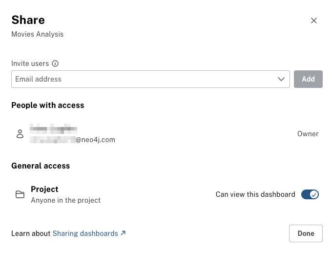
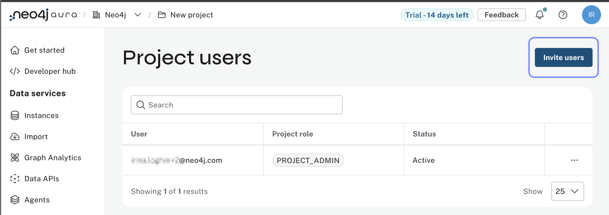
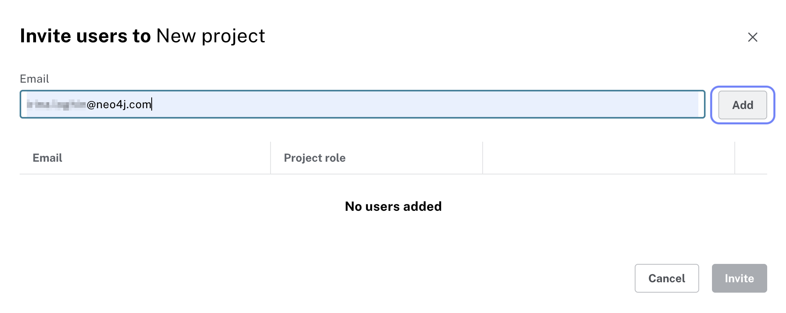
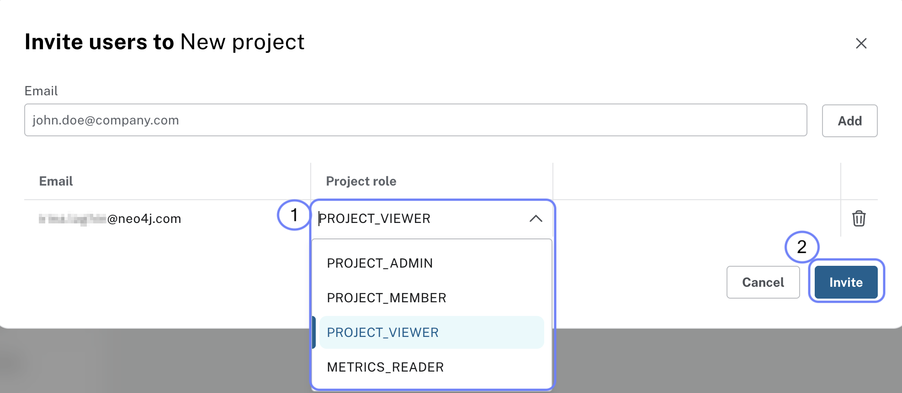
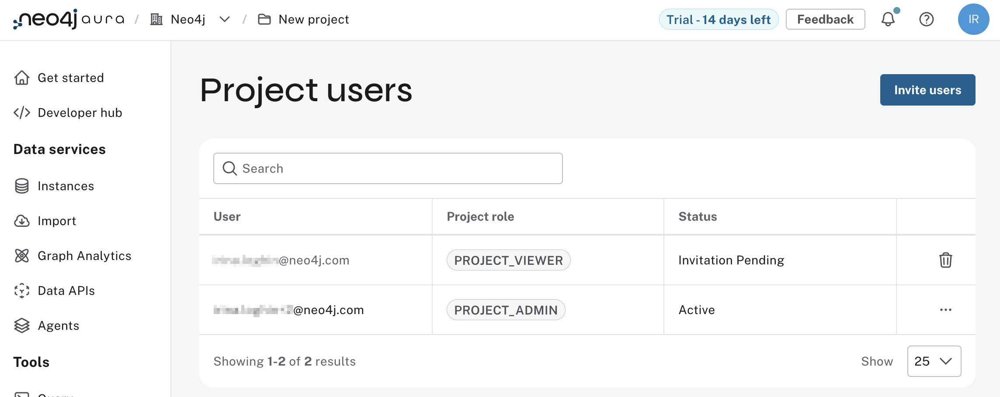
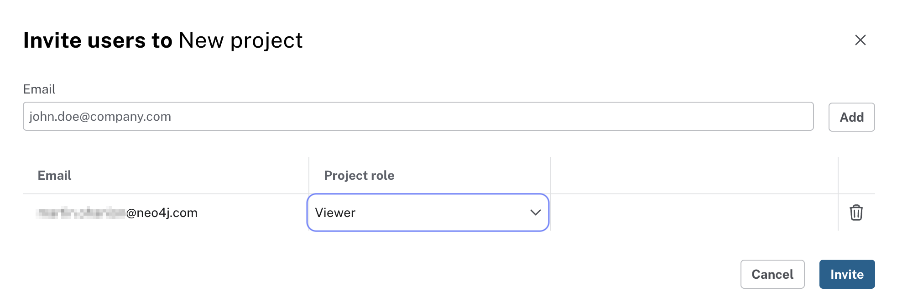
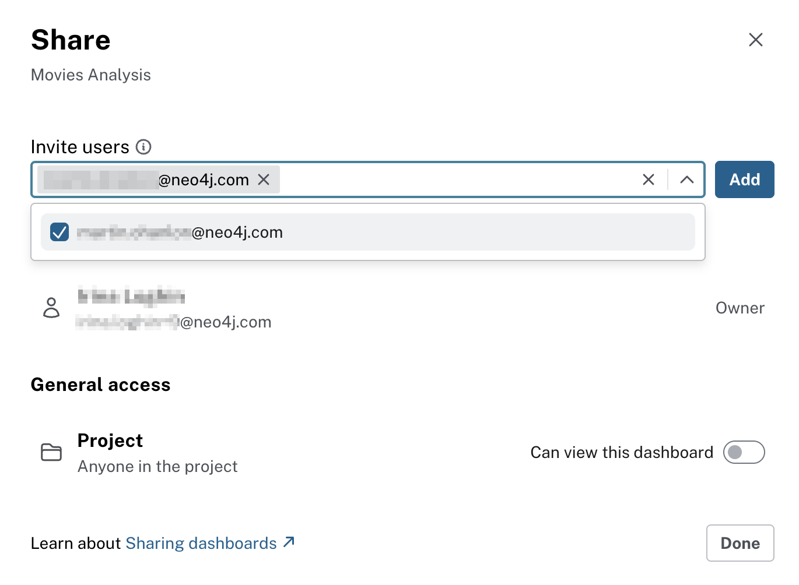
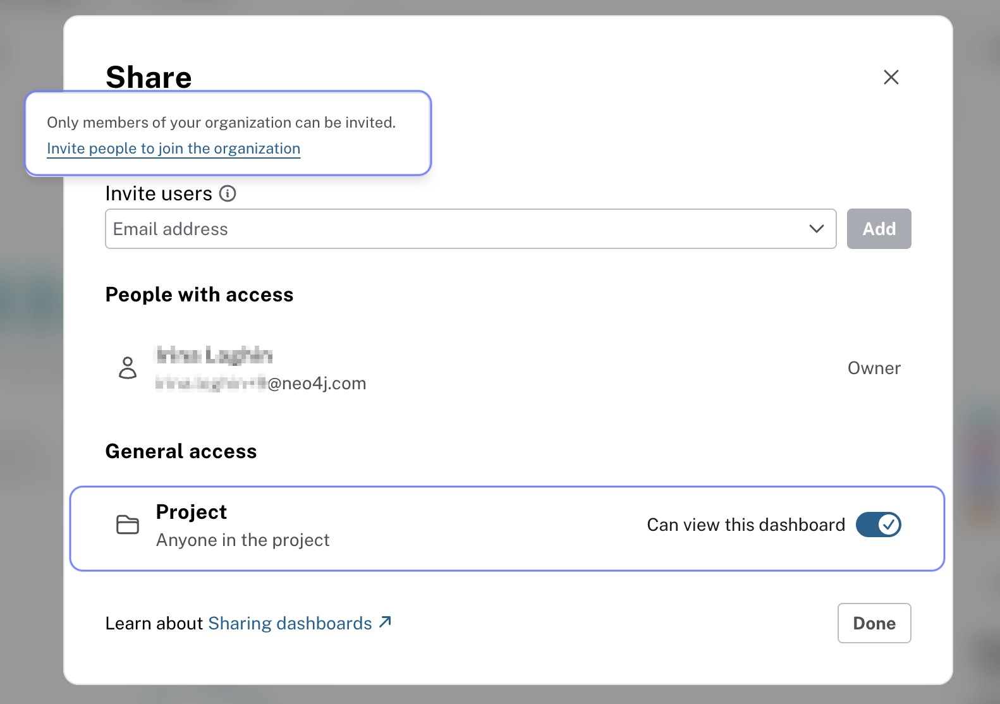

= Sharing Dashboards
:type: lesson
:order: 1

So far in this course you have created interactive dashboards with AI and Cypher. In this lesson you will learn:

* How to share your dashboards with specific stakeholders, such as content teams, marketing, or executives
* How to enable access to dashboards for everyone in your project

[NOTE]
.For Self-Managed users
====
The examples in this lesson focus on Neo4j Aura's sharing features. If you're using Self-Managed Enterprise Edition, work with your administrator to manage dashboard access using your organization's user management system.
====

== Sharing your dashboards

To share a dashboard:

. Open the dashboard you want to share.
. Click the **Share** button at the top right.
. In the **Share dashboard** dialog:
* **Invite specific users** by entering their email addresses.
* **Set project level access** to allow everyone in the project to access the dashboard.
* Click **Send Invites** to send the invitations.

To invite users to your project so they can access your dashboards, follow these steps:

. Go to the **Project Settings** page in the console
. Click on the **Users** menu
+
image::images/1-users.png[Project menu open, users is selected]

. Click on the **Invite Users** button
+

. Enter the email addresses of the users you want to invite
+

. Select the appropriate roles for the invited users
+

. Click **Send Invites** to send the invitations
. Review the full list of your project users by going to the **Users** menu in the **Project Settings** page, where their roles and statuses are displayed
+

== Understanding user roles

When sharing dashboards, it's important to understand the different user roles and what permissions they have:

* **Organization Admin**: Has full access to all projects and instances within the organization. Can manage users, billing, and organization settings.
* **Project Admin**: Has full access to all instances within a specific project. Can manage users and project settings.
* **Project Member**: Has read and write access to instances within a specific project but cannot manage users or settings.
* **Project Viewer**: Has read-only access to instances within a specific project. Cannot make any changes to the instance or settings.
* **Metrics Reader**: The only role that cannot view Dashboards. Metrics Reader has access to view performance metrics and monitoring data for instances within a specific project. Cannot make any changes to the instance or settings.

[NOTE]
.Console vs instance access
====
Access to the Aura Console lets users manage projects and instances. Dashboard sharing is controlled by project roles (Viewer, Member, Admin). In Aura, connection to an instance uses the credentials you set when creating the instance.
====

== Sharing dashboards via email invitation

Confirm that the users you have invited have accepted the invitation to join your project, and have the **Viewer** role for the project.

Once you have confirmed that the users have access to your project, share the dashboard with them by sending an email invitation:

After clicking the **Invite** button, the users will receive an email invitation to access the dashboard, and will be able to view all your pages created in that dashboard.

== Setting general project access

To allow everyone in your project to have access to the dashboards, set the project level access:

This scenario is useful when you want to share dashboards with a larger group of users without inviting them individually.

[.quiz]
== Check your understanding

include::questions/1-choosing.adoc[leveloffset=+1]

[.summary]
== Summary

In this lesson you learned how to share your dashboards with stakeholders by inviting users to your project and dashboards as Project Viewers. You also learned about different user roles and their permissions, ensuring the right people have access to make data-driven decisions.

In the next lesson, you will learn about additional resources and next steps to continue building dashboards with the Movies dataset.
