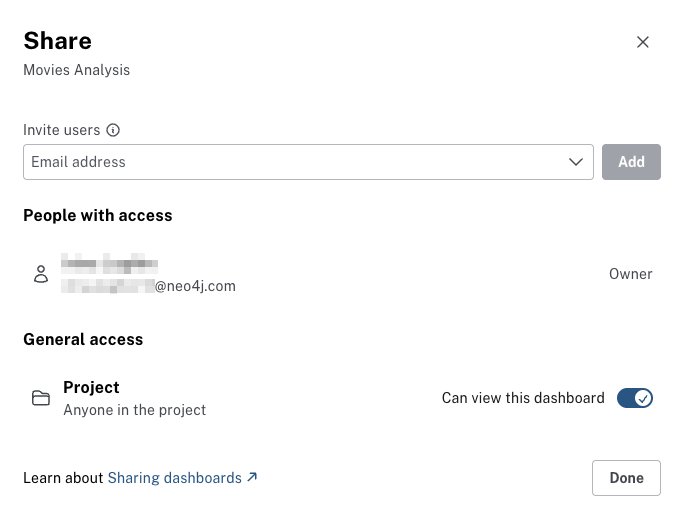
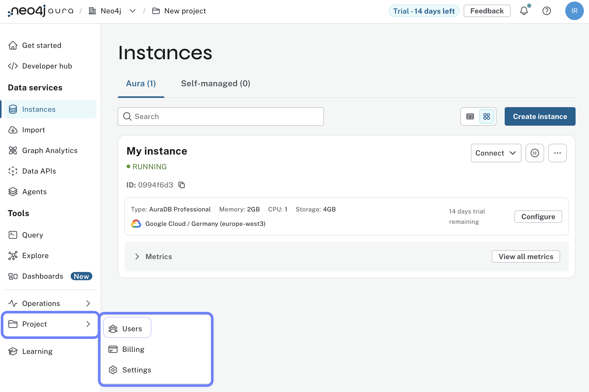
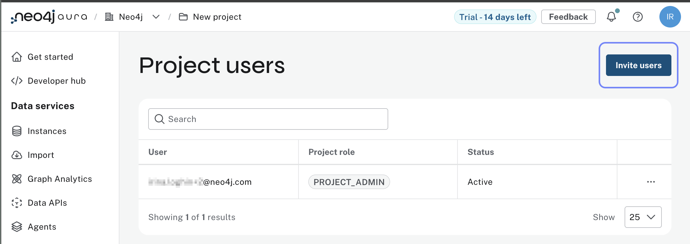
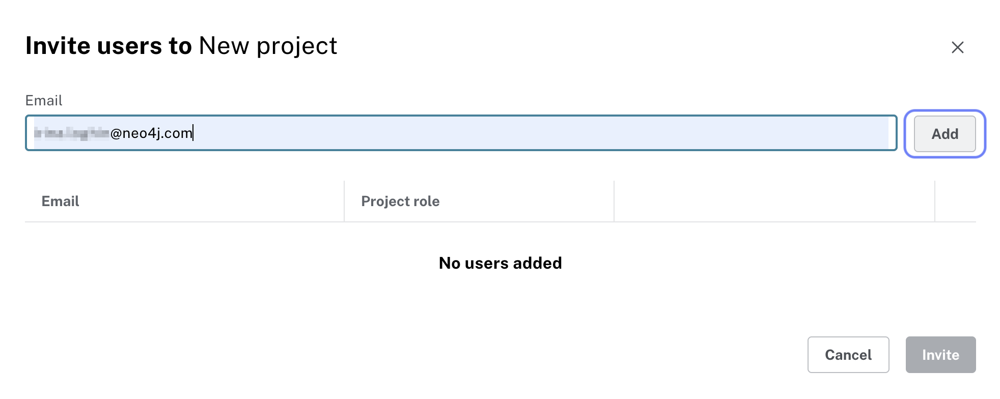
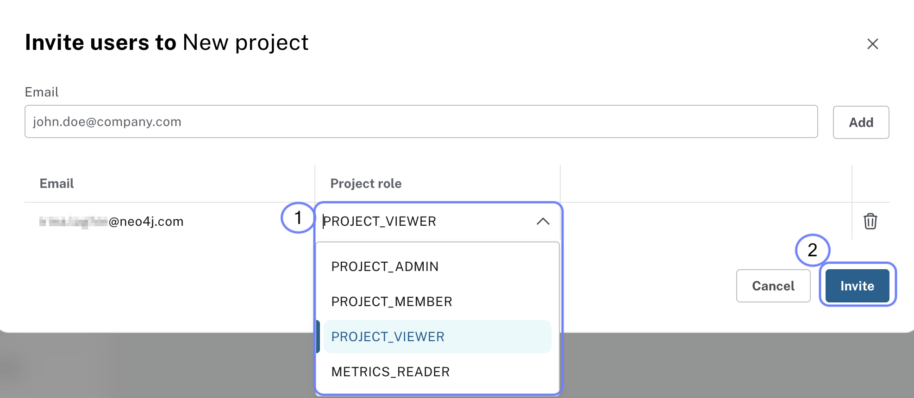
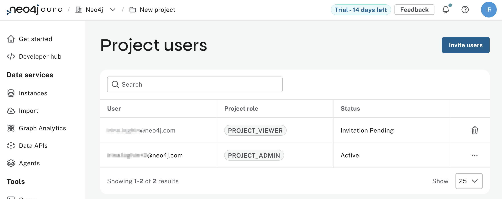
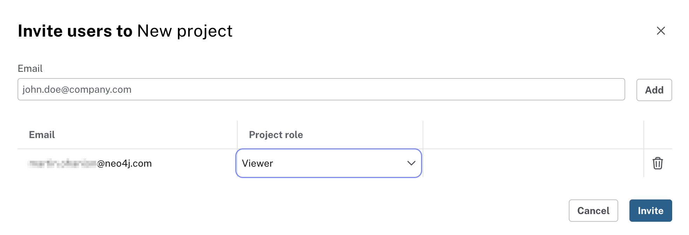
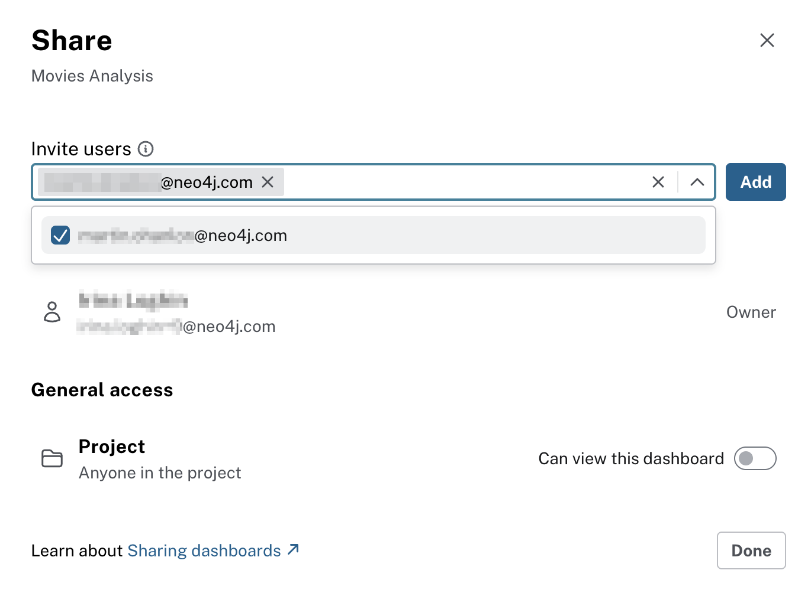
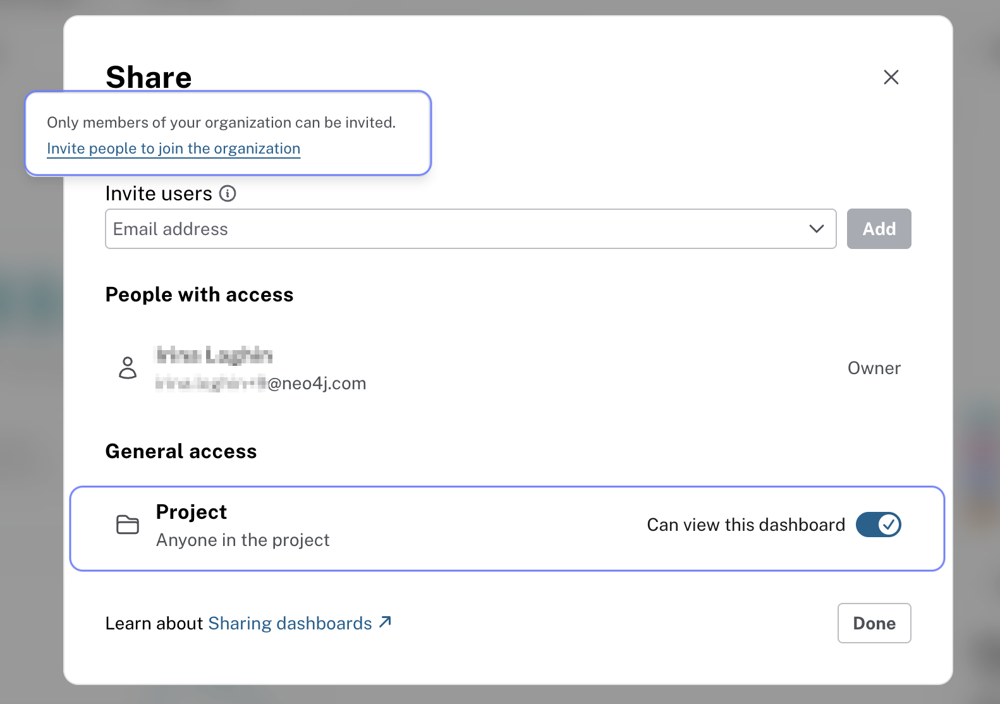

= Sharing Dashboards
:order: 1
:type: lesson

In this lesson you will learn:

* How to share your dashboards with specific stakeholders, such as content teams, marketing, or executives
* How to enable access to dashboards for everyone in your project

[NOTE]
.For Self-Managed users
====
The examples in this lesson focus on Neo4j Aura's sharing features. If you're using Self-Managed Enterprise Edition, work with your administrator to manage dashboard access using your organization's user management system.
====

== Sharing your dashboards

To share a dashboard:

. Open the dashboard you want to share.
. Click the **Share** button at the top right.
. In the **Share dashboard** dialog:
* **Invite specific users** by entering their email addresses.
* **Set project level access** to allow everyone in the project to access the dashboard.
* Click **Send Invites** to send the invitations.

To invite users to your project so they can access your dashboards, follow these steps:

. Go to the **Project Settings** page in the console
. Click on the **Users** menu
+

. Click on the **Invite Users** button
+

. Enter the email addresses of the users you want to invite
+

. Select the appropriate roles for the invited users
+

. Click **Send Invites** to send the invitations
. Review the full list of your project users by going to the **Users** menu in the **Project Settings** page, where their roles and statuses are displayed
+

== Understanding user roles

Before you share dashboards, read each role and what it can do:

[options="header"]
|===
| Role | Access and capabilities
| *Organization Admin* | Has full access to all projects and instances within the organization. Can manage users, billing, and organization settings.
| *Project Admin* | Has full access to all instances within a specific project. Can manage users and project settings.
| *Project Member* | Has read and write access to instances within a specific project but cannot manage users or settings.
| *Project Viewer* | Has read-only access to instances within a specific project. Cannot make any changes to the instance or settings.
| *Metrics Reader* | The only role that cannot view Dashboards. Metrics Reader has access to view performance metrics and monitoring data for instances within a specific project. Cannot make any changes to the instance or settings.
|===

[NOTE]
.Console vs instance access
====
Access to the Aura Console lets users manage projects and instances. Dashboard sharing is controlled by project roles (Viewer, Member, Admin). In Aura, connection to an instance uses the credentials you set when creating the instance.
====

== Sharing dashboards through email invitation

Confirm invited users accepted and hold the **Viewer** role on the project.

Then share the dashboard with them by email:

After you click **Invite**, invited users get email with a link to the dashboard and can open every page you created in it.

== Setting general project access

To allow everyone in your project to have access to the dashboards, set the project level access:

This scenario is useful when you want to share dashboards with a larger group of users without inviting them individually.

== Click through sharing (no pressure to send mail)

. Open a dashboard you actually built here.
. Hit **Share** and read what the dialog offers—invite-by-email versus project-wide access. Close it if you are not inviting anyone yet.
. Go to **Project** → **Settings** → **Users** and check **Project role** on your own row so you know where you stand before you invite others.
. Only send a real invite if your team expects it; otherwise you have already seen the flow.

[.quiz]
== Check your understanding

include::questions/1-choosing.adoc[leveloffset=+1]

[.summary]
== Summary

You now know how invites, project roles, and the **Share** dialog fit together.

Next: optional Learning Assistant prompts, then the final project and wrap-up.
