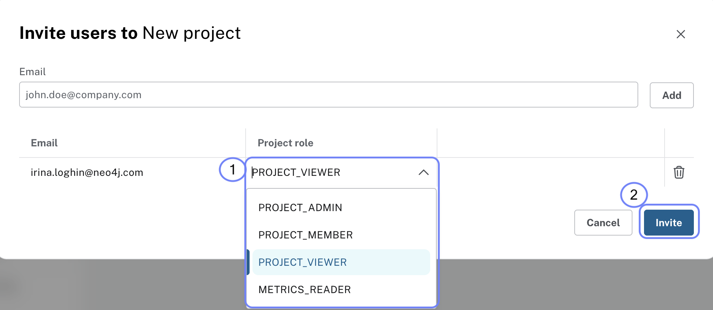

= Sharing Dashboards
:type: lesson
:order: 1

In the previous lessons, you learned how to create interactive dashboards in Aura using AI and Cypher queries.

In this lesson, you will learn about the different responsibilities of Aura and its users.

image::images/01_shared_responsibility.jpg[Shared Responsibility Model]

Aura operates on a shared responsibility model, where Neo4j handles the operational aspects of the database while users focus on their applications and data. This model allows you to benefit from the power of Neo4j without worrying about the underlying infrastructure.

To share a dashboard, you can:

* Share via link: Generate a shareable link that others can use to view your dashboard
* Invite users: Add specific users to your project so they can access your dashboards
* Set permissions: Control who can view, edit, or manage your dashboards

== Sharing via link

You can generate a shareable link for your dashboard that allows others to view it without needing to sign in.

To generate a shareable link:

1. Open your dashboard in the Aura Dashboards interface
2. Click on the **Share** button in the dashboard toolbar
3. Select **Create shareable link**
4. Copy the generated link and share it with others

Anyone with the link can view your dashboard, but they cannot edit it unless you grant them additional permissions.

== Inviting users to your project

To invite users to your project so they can access your dashboards, follow these steps:

1. Go to the **Project Settings** page in the Aura console
2. Click on the **Users** menu

image::images/1-users.png[Project menu open, users is selected]

[start=3]
. Click on the **Invite Users** button

image::images/1-invite-users-1.png[Project users menu with the invite users button highlighted]

[start=4]
. Enter the email addresses of the users you want to invite

image::images/1-invite-users-2.png[Email address added to the invite users field]

[start=5]
. Select the appropriate roles for the invited users

[start=6]
. Click **Send Invites** to send the invitations

[start=7]
. To review the full list of your project users, go to the **Users** menu in the **Project Settings** page, where you can see their roles and statuses

image::images/1-project-viewer.png[Projects users screen showing the new user added]

== Understanding user roles

When sharing dashboards, it's important to understand the different user roles and what permissions they have:

* **Organisation Admin**: Has full access to all projects and instances within the organization. Can manage users, billing, and organization settings.
* **Project Admin**: Has full access to all instances within a specific project. Can manage users and project settings.
* **Project Member**: Has read and write access to instances within a specific project but cannot manage users or settings.
* **Project Viewer**: Has read-only access to instances within a specific project. Cannot make any changes to the database or settings.
* **Metrics Reader**: Has access to view performance metrics and monitoring data for instances within a specific project. Cannot make any changes to the database or settings.

[NOTE]
.Console access vs. database access
====
Access to the Aura Console is **not** the same as access to the database instances.
Console access allows users to create and manage database instances, but it doesn't directly control access to the data within those databases.

When you create a new database instance, you will be supplied with a separate set of credentials to access the database.
====

[.quiz]
== Check your understanding

include::questions/1-choosing.adoc[leveloffset=+1]

[.summary]
== Summary
In this lesson, you learned how to share dashboards with others by generating shareable links and inviting users to your project. You also learned about different user roles and their permissions.

In the next lesson, you will learn about additional resources and next steps to continue your learning journey with Neo4j Aura Dashboards.
