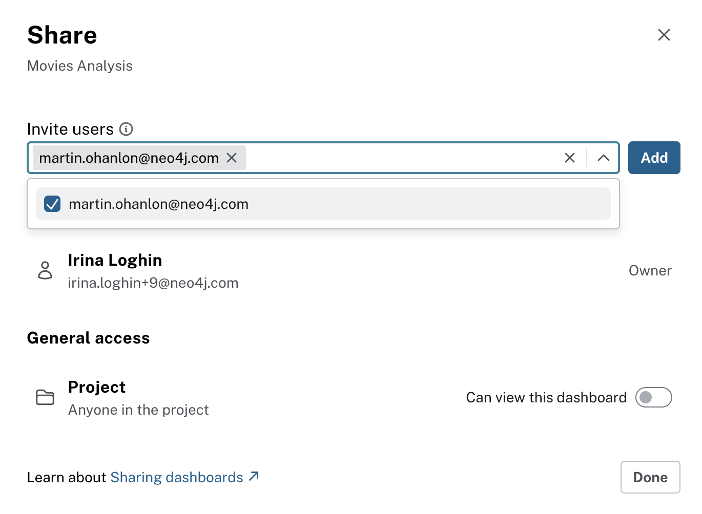

= Sharing Dashboards
:type: lesson
:order: 1

In the previous lessons, you learned how to create interactive dashboards in Aura using AI and Cypher queries.

In this lesson, you will learn how to:

* Share dashboards with specific users.
* Enable access to dashboards to everyone in your project.

== Sharing your dashboards

Once you have created a dashboard, you can share it with others to collaborate and get feedback.

To share a dashboard, you can:

* Invite users: Add specific users to your project so they can access your dashboards
* Set project level access: everyone in the project can access the dashboards

== Inviting users to your project

You can invite specific users to your project by sending them an email invitation. Once they accept the invitation, they will have access to the dashboards in your project based on their assigned role.

First, make sure the users you want to share it with are added as PROJECT_VIEWER to your project:

image::images/invite-project-viewer.png[project viewer added,width=600,align=center]

To do this, Navigate to Project > Users, and use the **Invite Users** button.

// To invite users to your project so they can access your dashboards, follow these steps:

// 1. Go to the **Project Settings** page in the Aura console
// 2. Click on the **Users** menu
// This is what is described on line 33?

image::images/1-users.png[Project menu open, users is selected]

[start=3]
. Click on the **Invite Users** button

image::images/1-invite-users-1.png[Project users menu with the invite users button highlighted]

[start=4]
. Enter the email addresses of the users you want to invite

image::images/1-invite-users-2.png[Email address added to the invite users field]

[start=5]
. Select the appropriate roles for the invited users

image::images/1-users-roles.png[Project role drop down showing the different roles available]

[start=6]
. Click **Send Invites** to send the invitations

[start=7]
. To review the full list of your project users, go to the **Users** menu from **Project** in the left-hand navigation, where you can see their roles and statuses

image::images/1-project-viewer.png[Projects users screen showing the new user added]

== Understanding user roles

When sharing dashboards, it's important to understand the different user roles and what permissions they have:

* **Organisation Admin**: Has full access to all projects and instances within the organization. Can manage users, billing, and organization settings.
* **Project Admin**: Has full access to all instances within a specific project. Can manage users and project settings.
* **Project Member**: Has read and write access to instances within a specific project but cannot manage users or settings.
* **Project Viewer**: Has read-only access to instances within a specific project. Cannot make any changes to the database or settings.
* **Metrics Reader**: This is the only role that cannot view Dashboards, but has access to only view performance metrics and monitoring data for instances within a specific project. Cannot make any changes to the database or settings.

[NOTE]
.Console access vs. database access
====
Access to the Aura Console is **not** the same as access to the database instances.
Console access allows users to create and manage database instances, but it doesn't directly control access to the data within those databases.

When you create a new database instance, you will be supplied with a separate set of credentials to access the database.
====

== Sharing dashboads via email invitation

Confirm that the users you invited have accepted the invitation to join your project, and have a VIEWER role.

Once you have confirmed that the users have access to your project, you can share the dashboard with them by sending an email invitation:

image::images/invite-dashboard-viewer.png[invite dashboard viewer,width=600,align=center]

After clicking the **Invite** button, the users will receive an email invitation to access the dashboard, and will be able to view all your pages created in that dashboard.

//That's not how it seems to be working? I click "Share" and selecy the user I want to share with and their access then confirm by clicking "Add". No email is sent?
// It's described here: https://neo4j.com/docs/aura/dashboards/sharing-dashboards/

== Setting general project access

If you want everyone in your project to have access to the dashboards, you can set the project level access:

image::images/dashboards-access-settings.png[dashboard viewer access confirmed,width=600,align=center]

This scenario is useful when you want to share dashboards with a larger group of users without inviting them individually.

[.quiz]
== Check your understanding

include::questions/1-choosing.adoc[leveloffset=+1]

[.summary]
== Summary
In this lesson, you learned how to share dashboards with others by inviting users to your project and dashboards as VIEWERS. You also learned about different user roles and their permissions.

In the next lesson, you will learn about additional resources and next steps to continue your learning journey with Neo4j Aura Dashboards.
