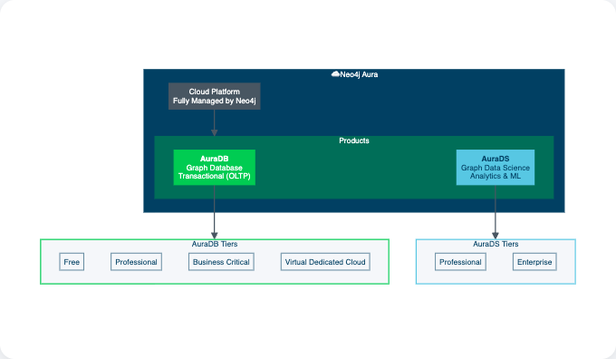
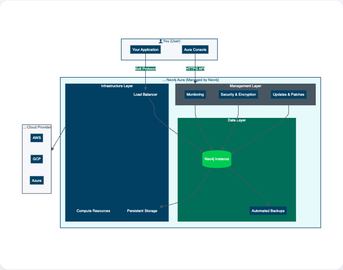

= About Aura
:type: lesson
:order: 1
// :slides: true

[.slide.discrete]
== Welcome to AuraDB Fundamentals

In this course, you will learn how to use Neo4j AuraDB, a fully managed graph database service in the cloud. You will learn how to create instances, import data, query your graph, and visualize insights.

Throughout this course, you will use the Movies dataset as an example to practice AuraDB features. The Movies dataset contains movies, actors, directors, and relationships between them.

image::images/movie-data-model.png[Movie data model showing Person and Movie nodes connected by ACTED_IN relationships,width=600,align=center]

By the end of this course, you will understand how to manage AuraDB instances, import data, write queries, explore your graph visually, and create dashboards.

Before diving in, it's important to understand where AuraDB fits within Neo4j's cloud offerings and what makes it suitable for graph database workloads.

[.slide.col-2]

== Where does AuraDB fit in?

[.col]
====
**Neo4j Aura** is a fully managed Database-as-a-Service (DBaaS) where Neo4j manages the cloud infrastructure on your chosen provider (AWS, GCP, or Azure). Aura offers two products:

* **AuraDB** — A managed graph database for transactional workloads (OLTP). This course focuses on AuraDB.

* **AuraDS** — A managed environment for graph data science, including graph algorithms and machine learning pipelines.

**Understanding OLTP (Online Transaction Processing):**

**OLTP** (Online Transaction Processing) refers to database systems optimized for handling many small, fast transactions in real-time. AuraDB is optimized for OLTP workloads, which means:

* **Fast reads and writes**: The database quickly traverses relationships to retrieve data
* **Concurrent operations**: Multiple users can query the database simultaneously without blocking each other
* **ACID compliance**: Each query is atomic, consistent, isolated, and durable—ensuring data integrity
* **Real-time responses**: Queries return results in milliseconds, which is essential for interactive applications

**Understanding OLTP and OLAP (Online Analytical Processing):**

* **AuraDB (OLTP)**: Optimized for transactional workloads—fast relationship traversal, real-time queries, and concurrent user access. Use AuraDB for applications that need immediate responses to queries.
* **AuraDS (OLAP)**: Optimized for analytical workloads—running graph algorithms, machine learning pipelines, and batch analysis on large datasets. Use AuraDS when you need to analyze patterns across your entire dataset.

For most applications that need real-time query responses, you use AuraDB (OLTP). If you need to run analytical algorithms or machine learning on your graph data, you would use AuraDS.

====

[.col]
====

====

[.slide]

== What is AuraDB?

AuraDB is a cloud hosted Database-as-a-Service (DBaaS) for graph databases. Neo4j manages the underlying infrastructure—servers, storage, networking, backups, and security patches—while you interact with the database through the Aura Console or your application code.

AuraDB lets you focus on your data, not infrastructure:

Aura provides a fully managed Neo4j database service (Database-as-a-Service, DBaaS), which means you don't have to worry about the underlying infrastructure, maintenance, or operations.

[.slide.col-2]
== What happens when creating an instance

[.col]
====
When you create an Aura instance, Neo4j provisions:

* **Load Balancer**: Routes queries from your application to the database. The load balancer ensures queries reach an available database instance.

* **Compute & Storage**: Cloud resources allocated based on your selected size. You need enough memory to hold your graph in RAM for fast traversal, and storage for all your nodes and relationships.

* **Backups**: Automatic snapshots at intervals determined by your tier. If you accidentally delete data or need to restore to a previous state, backups protect your data.

* **Security**: TLS encryption ensures queries and results are encrypted in transit. Access controls prevent unauthorized access to your data.

This provisioning typically completes in under a minute, so you can start loading your data quickly.
====

[.col]
====

====

[.slide]
== When to use AuraDB or self-managed Neo4j

AuraDB is well-suited for production workloads, as well as learning and prototyping, where you prefer not to manage infrastructure. Neo4j runs and maintains the infrastructure; you focus on your data and applications.

AuraDB lets you focus on working with your graph data rather than managing servers. This is especially valuable when you're learning how graph databases work.

* **Infrastructure**: Fully managed service with zero maintenance required from your side.

  * **Infrastructure**: Fully managed service, with zero maintenance required from your side.
  * **Service Level Agreements**: 99.95% uptime SLA is provided, with fault tolerance and high availability.
  * **High Availability**: Depending on the tier, Aura provides single instance or multi-availability zone cluster architectures.
  * **Security**: Encryption at rest and in transit, as well as network isolation and access controls.
  * **Backups**: Automated backups are taken regularly, allowing you to restore your database to a previous state if needed:
  ** Daily backups for Professional, Business Critical and Virtual Dedicated Cloud tiers.
  ** AuraDB Free allows you to take hourly on-demand backups.
  ** Enterprise: Up to 90 days retention.
  * **Updates**: Aura handles all software updates and patches, ensuring you are always running the latest and most secure version of Neo4j.

[.quiz]
== Check your understanding

include::questions/1-versus.adoc[leveloffset=+1]

[.summary]
== Summary

In this lesson, you learned:

* **Neo4j Aura** is a fully managed Database-as-a-Service (DBaaS) where Neo4j manages the cloud infrastructure, offering two products: AuraDB (transactional databases) and AuraDS (data science)
* **AuraDB** is a fully managed graph database service where Neo4j handles infrastructure, backups, security, and updates

In the next lesson, you'll examine the different AuraDB tiers and their specifications to determine which fits your use case.

