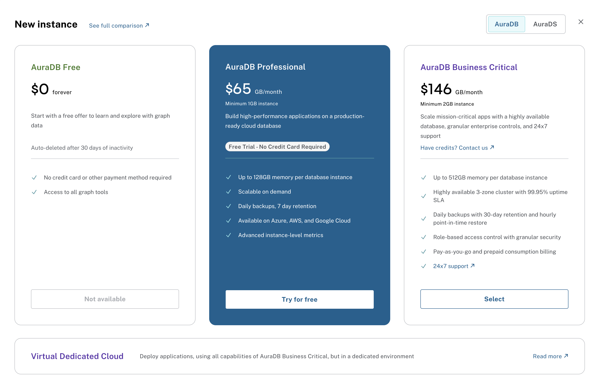

= Aura Tiers
:type: lesson
:order: 2
:slides: true

In the previous lesson, you learned about Neo4j Aura and how it differs from self-managed Neo4j databases.

In this lesson, you will learn about the different Aura tiers available and how to select the right tier for your specific use case.

[.slide]
== Selecting the right tier

Neo4j Aura offers four different tiers, each designed for different stages of your project development and business needs.

[tiers,width=600,align=center]

**Aura Free** is designed for experimentation and learning.

You can use Aura Free when your graph has fewer than 200,000 nodes and fewer than 400,000 relationships, and you don't need high availability.

This tier costs nothing and gives you a way to test Neo4j without any financial commitment.

**Aura Professional** is designed for production applications with moderate requirements.

Use Aura Professional when you need more storage space, want to choose your cloud provider (AWS, GCP, or Azure), and need daily backups, but not haigh availability.

This tier requires payment.

**Aura Business Critical** is designed for enterprise applications that require high availability.

You can use Aura Business Critical when you need guaranteed uptime, role-based access control (RBAC), single sign-on (SSO), and hourly backups.

This tier provides a multi-availability zone cluster architecture for maximum reliability.

**Aura Virtual Dedicated Cloud** is designed for applications with strict compliance and security requirements.

You can use Aura Virtual Dedicated Cloud when you need dedicated infrastructure, customer-managed encryption keys (CMEK), and VPC isolation.

This tier provides the highest level of security and compliance features.

== Check your understanding
include::questions/1-choosing.adoc[leveloffset=+1]

include::questions/2-differences.adoc[leveloffset=+1]

read::Move On[]

[.summary]
== Summary
In this lesson, you learned about the different tiers available on Neo4j Aura and how to select the right tier for your use case.

In the next module, you will learn how to determine the costs associated with running an Aura instance, and how to manage those costs effectively.
