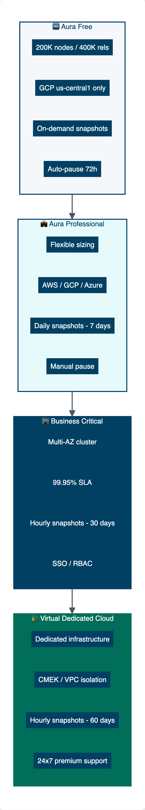

= AuraDB Tiers
:type: lesson
:order: 2
:slides: true

[.slide.discrete]
== AuraDB Tiers

So far in this course, you have learned that AuraDB is Neo4j's managed graph database service. Before you create an instance, you need to choose a tier.

In this lesson, you will learn how to:

* Understand the four AuraDB tiers and their target use cases
* Compare features across tiers (storage, backups, availability)
* Select the right tier for your project

[.slide.col-2]
== Choosing the right tier

[.col]
====
AuraDB offers four tiers, each designed for different stages of development:

* **Free** — Learning and experimentation
* **Professional** — Production apps with moderate requirements
* **Business Critical** — Enterprise apps requiring high availability
* **Virtual Dedicated Cloud** — Strict compliance and security needs

The diagram shows how capabilities scale across tiers.
====

[.col]
====

====

[.slide]
== AuraDB Free

**AuraDB Free** is designed for learning and experimentation.

* **Limits**: Up to 200,000 nodes and 400,000 relationships
* **Cloud provider**: GCP (us-central1 only)
* **Backups**: On-demand snapshots only
* **Auto-pause**: After 72 hours of inactivity

This tier provides a zero-cost way to learn Neo4j and prototype small applications.

[.slide]
== AuraDB Professional

**AuraDB Professional** is designed for production applications with moderate requirements.

* **Storage**: Flexible sizing based on your needs
* **Cloud provider**: AWS, GCP, or Azure (multiple regions)
* **Backups**: Daily snapshots, retained for 7 days
* **Pause control**: Manual pause/resume

Use Professional when you need more storage, cloud provider choice, and daily backups, but don't require high availability.

[.slide]
== AuraDB Business Critical

**AuraDB Business Critical** is designed for enterprise applications requiring high availability.

* **Architecture**: Multi-availability zone cluster with automatic failover
* **SLA**: 99.95% uptime guarantee
* **Security**: Role-based access control (RBAC), single sign-on (SSO)
* **Backups**: Hourly snapshots, retained for 30 days

Use Business Critical when downtime is not acceptable for your application.

[.slide]
== AuraDB Virtual Dedicated Cloud

**AuraDB Virtual Dedicated Cloud (VDC)** is designed for applications with strict compliance and security requirements.

* **Infrastructure**: Dedicated, isolated environment
* **Security**: Customer-managed encryption keys (CMEK), VPC isolation
* **Backups**: Hourly snapshots, retained for 60 days
* **Support**: 24x7 premium support

Use VDC when you need the highest level of isolation and compliance features.

For a detailed comparison of all tiers, see the link:https://neo4j.com/pricing/#graph-database[Neo4j Aura pricing page^] and the link:https://neo4j.com/docs/aura/getting-started/create-instance/[instance creation documentation^].

[.quiz]
== Check your understanding

include::questions/1-choosing.adoc[leveloffset=+1]

== What's next

In the next lesson, you'll sign up for Neo4j Aura and set up an AuraDB instance.

[TIP]
.Free trial available
====
AuraDB Professional, Business Critical, and Virtual Dedicated Cloud tiers include a free trial period (7 days, extendable by an additional 7 days) so you can explore all capabilities before committing.
====

[.summary]
== Summary

In this lesson, you learned:

* **AuraDB Free** — For learning and experimentation (up to 200K nodes)
* **AuraDB Professional** — For production apps with flexible sizing and daily backups
* **AuraDB Business Critical** — For enterprise apps requiring 99.95% uptime SLA
* **AuraDB Virtual Dedicated Cloud** — For strict compliance with dedicated infrastructure

In the next lesson, you'll sign up for Neo4j Aura and create your first AuraDB instance.
