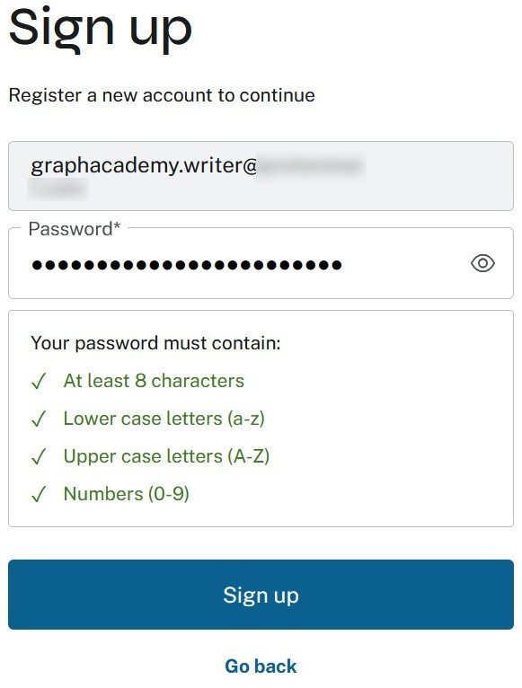

= Getting started
:table-caption!:

To start with Aura, all you have to do is select the **sign up** link at https://console.neo4j.io.

and that gets you here

There is an important observation to be made here. And it's about the **Business preferred**. What it means is this:

* If you are working within the context of an organisation enter a **business emailaddress**.
* If you intend to use this for your personal experiments only, stick with a **personal emailaddress**. 

Moving the data between the tiers is quite easy, but once you add a payment method you want the correct email address attached.

Next up is verifying the email address.

And then you set your password.

And you are signed up, **congratulations**!

What follows is an onboarding process. Interesting to opt in/out of some things. But do pay attention near the end! It'll ask you if you wish to launch a trial. That is an **Aura Professional** trial and it'll create an instance for you in a cloud and region of your choosing. If that's what you **want** go ahead and do it. For the purpose of this training it is assumed you did **not** want that and ended the onboarding without creating an instance.

[.quiz]
== Check your understanding
include::questions/1-business-email.adoc[leveloffset=+1]

[.summary]
== Summary
In this lesson you got started with Aura.
