= Sign up for Aura
:description: Learn how to sign up for a Neo4j Aura Professional instance.
:type: lesson
:order: 3
:slides: true
:optional: true

Signing up for Neo4j Aura is a straightforward process that allows you to get started with a fully managed graph database in the cloud.

In this lesson, you will learn how to:

* Create a Neo4j Aura account 
* Set up your first Aura Professional instance 
     

== Step 1: Visit the Neo4j Aura Website

Go to link: console.neo4j.io in your web browser. This is the official portal for managing Neo4j Aura databases.

On this page, you will see options to sign up for a new account or log in if you already have one. 

Click on the **Sign Up** button to create a new account.

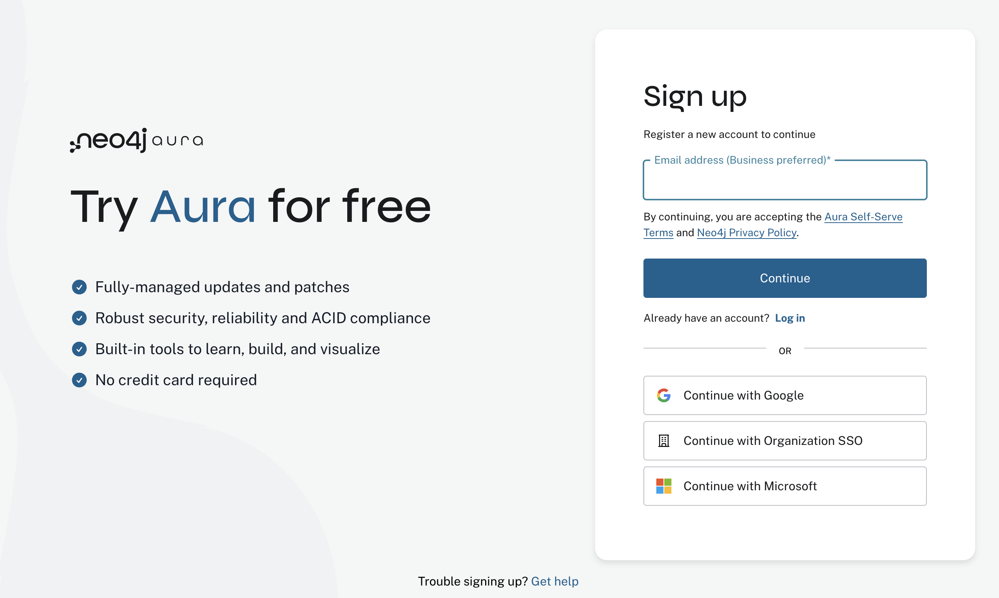
     

== Step 2: Create Your Account

After clicking the **Sign Up** button, you will be directed to the registration form. After filling in your email address, you will have to confirm your identity before proceeding, to make sure it is a valid email address and not a bot or impersonation.

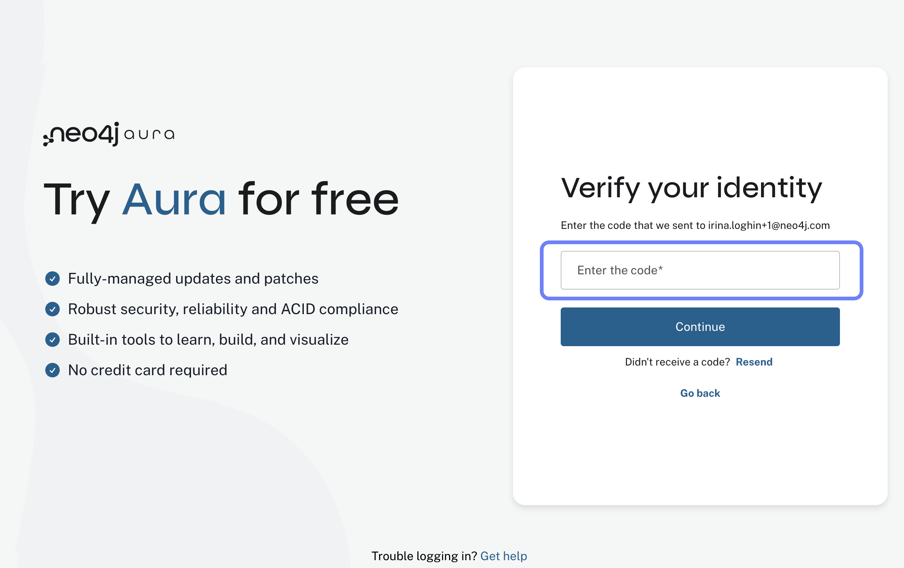

Once your email is verified, you will be prompted to create a password: 

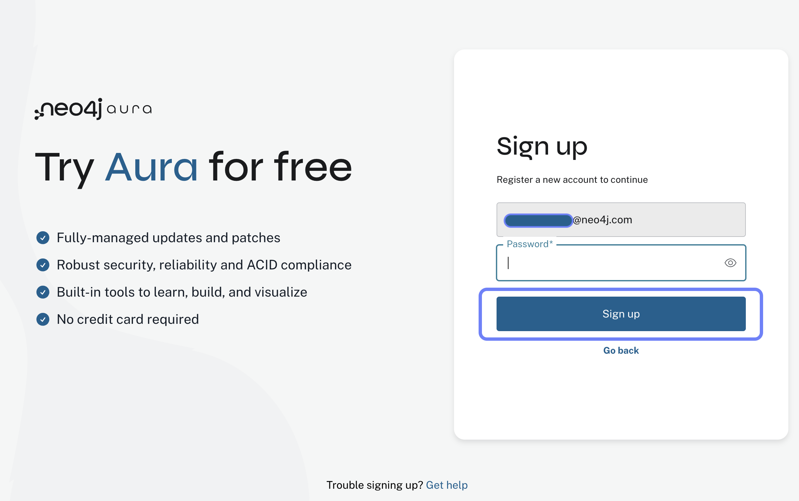

After setting up your password, you will be asked to provide some additional information, such as your name and company (if applicable). Fill in the required fields and click **Next**.

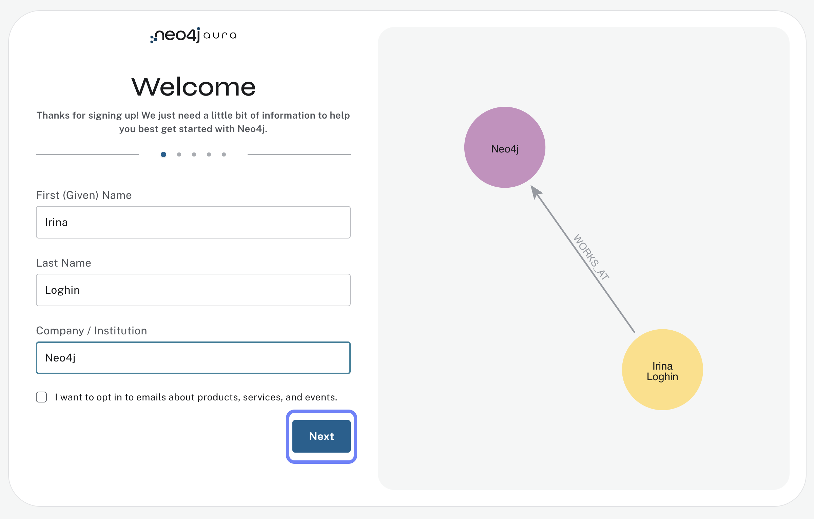

     

== Step 3: Personalize Your Experience

After creating your account, you will be prompted to personalize your experience by selecting your interests and how you plan to use Neo4j Aura. This helps Neo4j tailor the experience to your needs.

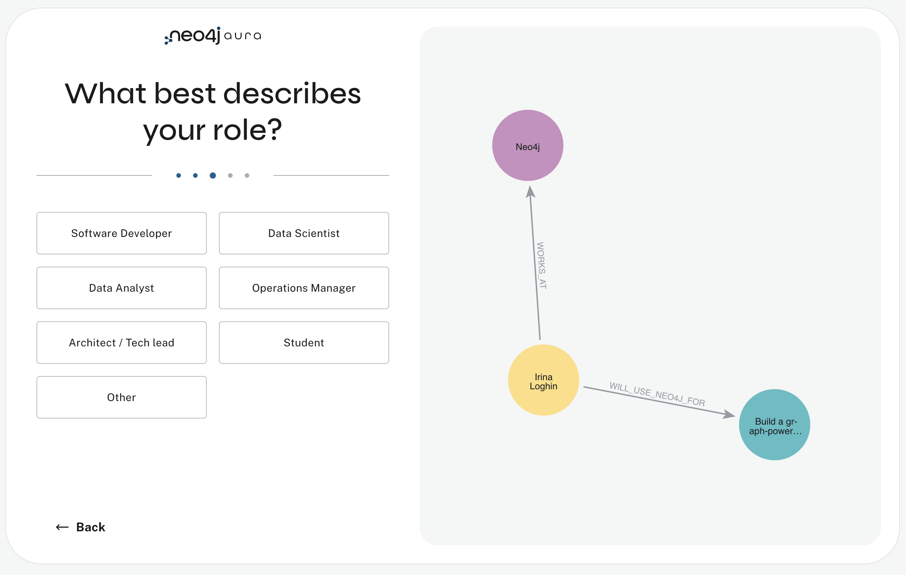

As you select your interests, you will see instead of a progress bar, a graph getting built indicating how far along you are in the setup process. Once you have made your selections, click **Next** to proceed.

     

== Step 4: Set Up Your First Aura Professional Instance

After setting up your account, you will be directed to the region and cloud provider selection page. Here, you can either choose to create your first Aura Professional instance, or skip and create a free instance.

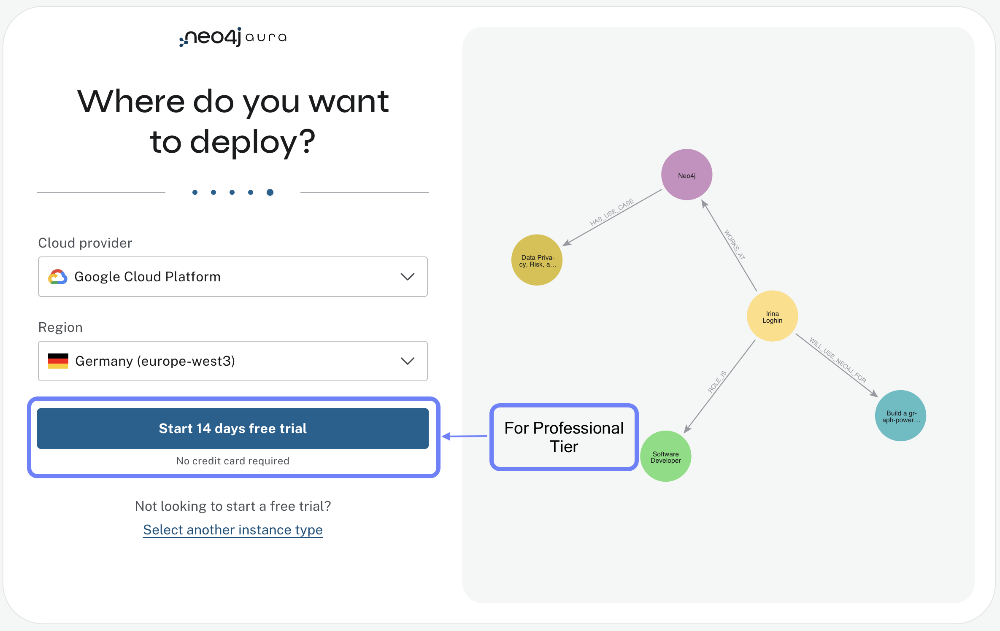

If you prefer to start with a Free instance, skip to **Step 6**.

== Choosing the right location

When creating a new database instance, you need to choose the right location for your instance.

For most Aura tiers, you can choose from multiple cloud providers (AWS, GCP, Azure) and regions within those providers. 

You should consider the following questions:

1. Where is your application running / going to run?
2. What cloud provider do / did you pick for your application?
3. Can you mirror the choices of the first two questions for your database?

If your application is hosted on AWS in the same region, you should choose the same region for your database instance to minimize latency and ensure optimal performance, as well as data security and compliance.
  
== Understanding size requirements

For the rest of the tiers, except for Aura Free, when sizing a graph database, you need to consider two main components:

**Storage size** needs to be large enough to store all your nodes and relationships on disk, including their properties and any indexes.

**Memory size** needs to accommodate both your data and the transaction workload (Java heap space for query processing).

To determine the right size, you'll need to know:

* How many nodes and relationships?
* How many properties in the nodes and relationships?
* What type of data is stored as properties? (numbers, strings, etc.)
* How many indexes are required?
* Do you need to make use of any vector indexes?

== Estimating size requirements
Unless all this information is available, the best you can do is an estimate.
This is less of a problem for Aura as database instances can be resized through the Aura console with a few clicks.

For most Aura tiers, you must pick **memory size** (RAM) and **memory / storage ratio (1/2, 1/4, 1/8)**.

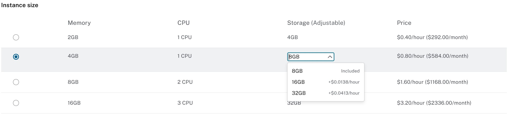

As an example, if you pick 2GB memory, this corresponds to 4GB storage.
You can increase the storage to 8GB (1/4) or 16GB (1/8) at additional cost.

For **Aura Free**, size choices are hidden from you, but the database limits (200,000 nodes and 400,000 relationships) typically need between 3GB and 4GB of storage.

[TIP]
.Sizing calculation
====
You can visit the link:https://neo4j.com/developer/kb/capacity-planning-example/[Capacity Planning Example^] for a detailed example of how to calculate the right size for your database.
====

After this, you will be presented with a set of credentials, that would be needed to connect to your database. Make sure to save these credentials in a secure location, as you will need them to access your database later.

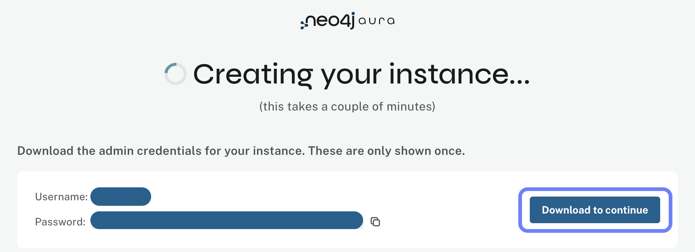
     

== Step 5: Access your Professional Aura Instance

Once your instance is set up, you can access it through the Neo4j Aura console. From here, you can manage your database, run queries, and monitor performance:

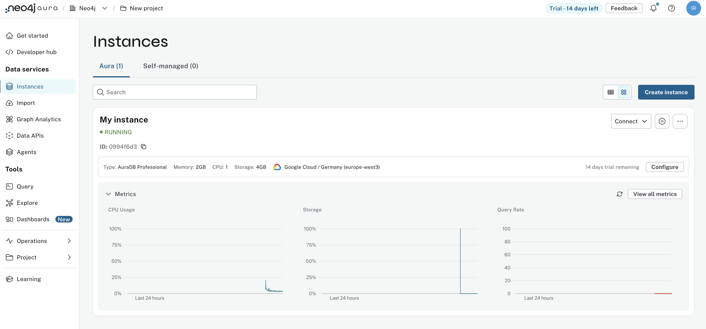

== Step 6: Sign up and Access your Free Aura Instance

If you prefer to start with a Free instance instead of a free trial of Aura Professional, you can do so by selecting the link below the "Start 14 days free trial" button on the region and cloud provider selection page. 

This link is labeled "Select another instance" and will take you to the Free instance creation page: 

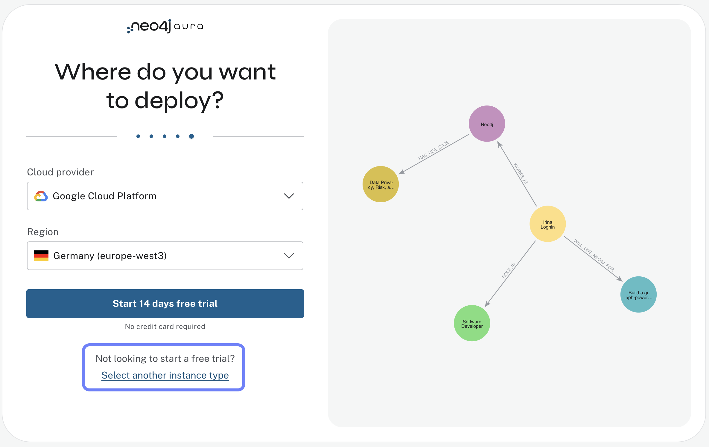

After clicking the link, you will be directed to choose from a more comprehensive list of tiers, including the Free tier. Under the Free tier description, click on **Select** to proceed. 

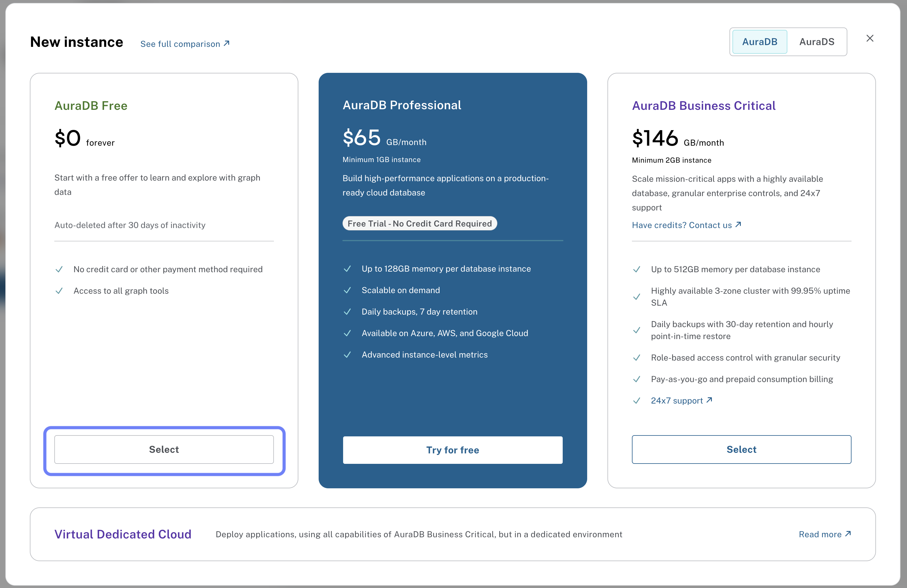

Once you have selected the Free tier option, you will have access to a Google Cloud Platform (GCP) instance in the us-central1 region, and the UI will not prompt you for size or cloud provider options, as these are fixed for the Free tier.

Your instance will be running continuously until you decide to delete it, with a limit of 200,000 nodes and 400,000 relationships: 

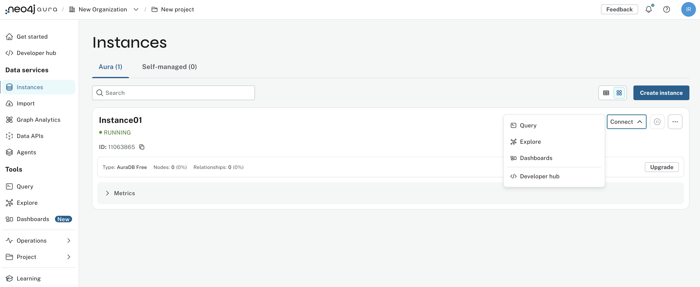

[.summary]
== Summary

In this lesson, you learned how to sign up for a Neo4j Aura account and set up your first Aura Professional instance. You are now ready to start exploring the capabilities of Neo4j Aura and building graph-based applications.

In the next lesson, you will explore how to create and manage a free Aura instance, as well as how to connect to an existing one
