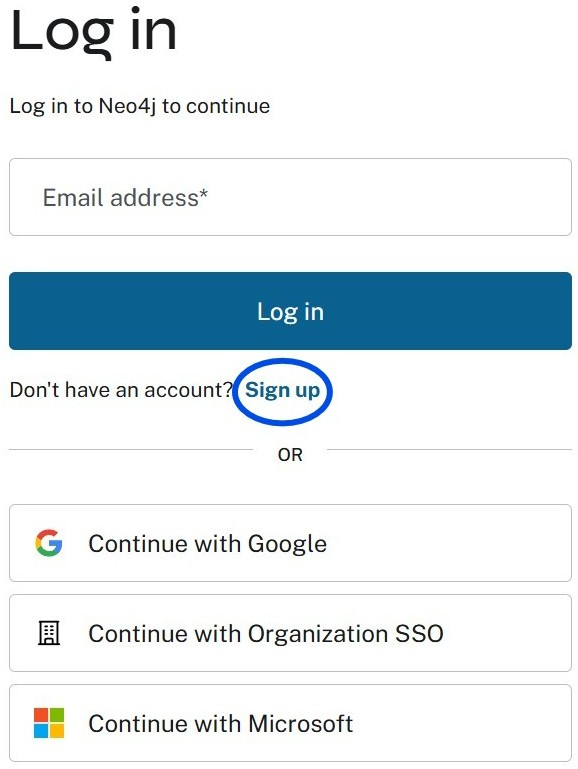
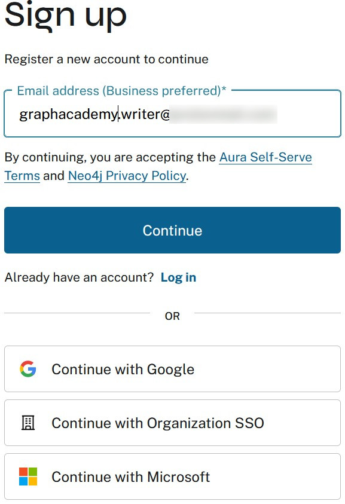
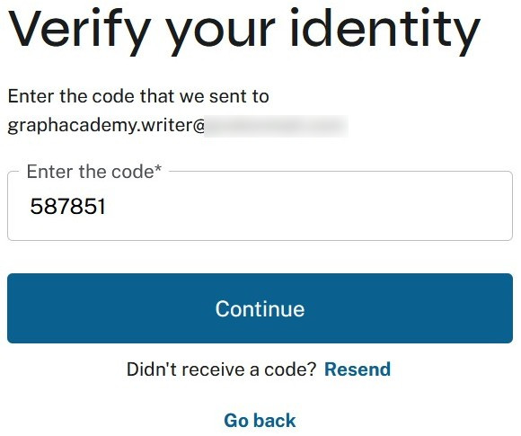
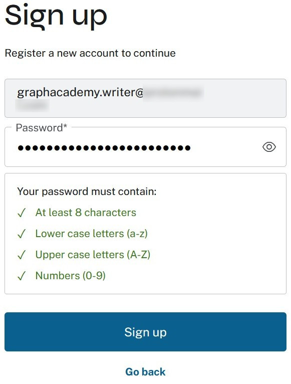

= Sign up for Neo4j Aura
:type: challenge 
:optional: true

In the previous lesson, you learned about the different Aura tiers and how to select the right tier for your use case.

In this lesson, you will learn how to sign up for Neo4j Aura and the important considerations when creating your account.

== Creating your Aura account

To start with Aura, you need to create an account at https://console.neo4j.io.

Click the **Sign up** link to begin the registration process.

This will take you to the sign-up form.

[TIP]
.Choosing the right email address
====
When signing up for Aura, you'll notice the form mentions **Business preferred**. This is an important consideration for your account setup:

* If you are working within the context of an organization, enter a **business email address**.
* If you intend to use this for personal experiments only, use a **personal email address**.

While moving data between tiers is straightforward, once you add a payment method, you want the correct email address attached to your account for administrative purposes.
====

== Completing the verification process

After submitting your registration, you'll need to verify your email address.

Once verified, you'll set your password to complete the account creation.

read::Mark as completed[]

== Understanding the onboarding process

After creating your account, Aura will guide you through an onboarding process.

[.summary]
== Summary

Congratulations! You now have an Aura account.

At the end of the onboarding process, you will be asked if you want to launch a trial. This creates an **Aura Professional** trial instance in a cloud and region of your choosing.
For this course, it's assumed you **did not** create a trial instance during onboarding, so you can focus on learning the fundamentals first.

In the next module, you will explore the Neo4j Aura Console and learn how to create your first Aura instance.
