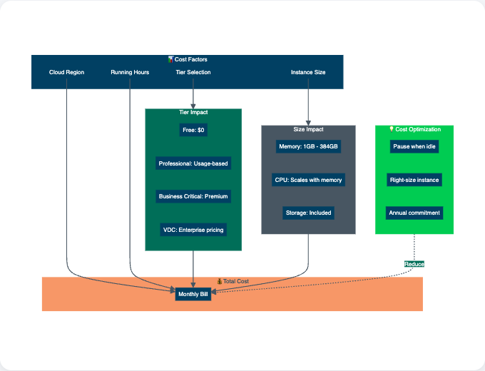

= Understanding costs
:type: lesson
:order: 4
:slides: true

[.slide.discrete]
== Understanding Aura Costs

You have learned about the different tiers available on Neo4j Aura and how to select the right tier for your specific use case.

In this lesson, you will learn how to:

* Explore the cost structure of Neo4j Aura
* Understand what's included in Aura pricing beyond compute resources
* Manage costs effectively through pausing and right-sizing instances

[.slide.col-2]
== The cost structure

[.col]
====
When considering Neo4j Aura, it's essential to understand what you're actually paying for. The cost of using Aura includes a range of services and capabilities (depending on tier) that would require significant effort to implement and maintain in a self-managed setup:
====

[.col]
====

====

[.slide]
== What's included in pricing

* **Compute resources**: The virtual machines running your database instances.
* **Storage**: The disk space used for your database, including indexes and logs.
* **Backups**: Automated daily backups with point-in-time recovery options.
* **Monitoring and metrics**: Advanced monitoring capabilities to track performance and health.
* **Security**: Encryption at rest and in transit, role-based access control (RBAC), and network isolation.
* **Updates and maintenance**: Automatic updates to ensure you're running the latest and most secure version of Neo4j.
* **Support**: Access to Neo4j support services, depending on your tier.

[NOTE]
.Important considerations
====
Neo4j Community Edition has licensing and feature limitations compared to Aura, including GPL v3 licensing requirements, limited backup options, and restricted access control capabilities.

====

[.slide]

== Optimizing costs across tiers

For each tier, there are specific cost differences to consider:

* A cluster is more expensive than a single instance
* Dedicated infrastructure is more expensive than shared infrastructure
* Hourly backups require more storage than daily backups
* Vector indexes are very storage and memory intensive

[.slide]   
== Managing costs best practices

To effectively manage costs in Neo4j Aura, consider the following best practices:

* **Instance sizing**: Choose the right instance size based on your workload requirements. Avoid over-provisioning resources, since scaling up is always possible if needed.
* **Right-tier selection**: Select the appropriate tier based on your application's needs. For example, use Aura Free for development and testing, and Aura Professional or Business Critical for production workloads.
* **Pausing instances**: Use the pause feature to stop incurring costs when instances are not in use, especially for development and testing environments.

[.slide]
== Managing costs through pausing

One of the most direct ways to control costs is by pausing instances when they're not in use.

For example, if you have a development instance that is only used during business hours, pause it overnight and on weekends to save costs.

[.slide]
=== Auto-pause and manual pause

Aura offers two types of pausing behavior depending on your tier:

Auto-pause (Aura Free only):

* Triggers automatically after 72 hours of inactivity
* Inactivity means no queries are executed against the database
* Free instances cannot be manually paused
* After 30 days of being paused, the instance is deleted

Manual pause (Paid tiers):

* You control when to pause and resume
* Instances never auto-pause, even if idle
* Automatically resumed after 30 days of pausing to prevent data loss

[WARNING]
.Not querying does NOT reduce costs
====
**An idle instance is not a paused instance.** A running instance continues to consume resources and incur costs even when no queries are being executed.

For paid tiers (Professional, Business Critical, Virtual Dedicated Cloud):

* Instances **never auto-pause**, regardless of inactivity
* Not running queries does **not** stop billing
* Only explicitly pausing the instance stops costs

To stop incurring costs, manually pause your instance through the Aura console.
====

[.slide]        
=== Understanding pause behavior

Pausing puts your instance into hibernation - it stops consuming resources and incurring costs but can be quickly resumed when needed.

This behavior differs by tier:

**Aura Free** instances:

* Cannot be manually paused
* Auto-pause after 72 hours of inactivity
* Deleted after 30 days of being paused

**Aura Professional / Business Critical / Virtual Dedicated Cloud** instances:

* Can be manually paused at any time
* Do not auto-pause when inactive
* Automatically resumed after 30 days of pausing

[.slide]     
=== When to pause instances

Consider pausing instances in these scenarios:

* Development environments during off-hours
* Testing environments between testing cycles
* Staging environments when not actively used
* Temporary instances for specific projects

[WARNING]
.Coordinate before pausing
====
Pausing stops all database activity, so coordinate with your team before pausing shared instances.
====

[.slide]
== Making informed decisions

The following are some key takeaways to help you make informed decisions about using Aura:

* Size your instances correctly
* Pick the correct Aura tier for your use case requirements
* Commitment can save in the long run
* Understand the full cost of self-managed alternatives, including maintenance and operational overhead.
* Use pausing to control costs for development and testing environments

Understanding these cost factors helps effectively manage Neo4j Aura instances and build successful applications while keeping expenses in check.

For more detailed information on pricing, https://neo4j.com/pricing/[visit the Neo4j Aura Pricing guide^].

[.quiz]
== Check your understanding

include::questions/1-cost-determination.adoc[leveloffset=+1]

[.summary]
== Summary

In this lesson, you learned about what makes up the cost of Aura and practical cost management techniques, including the difference between auto-pause and manual pause.

In the next module, you will explore the Aura Console and learn how to manage your database instances.
