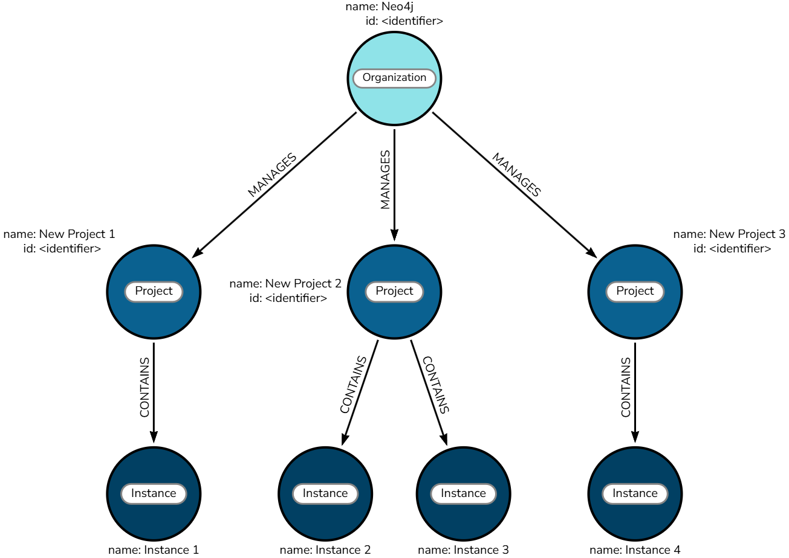
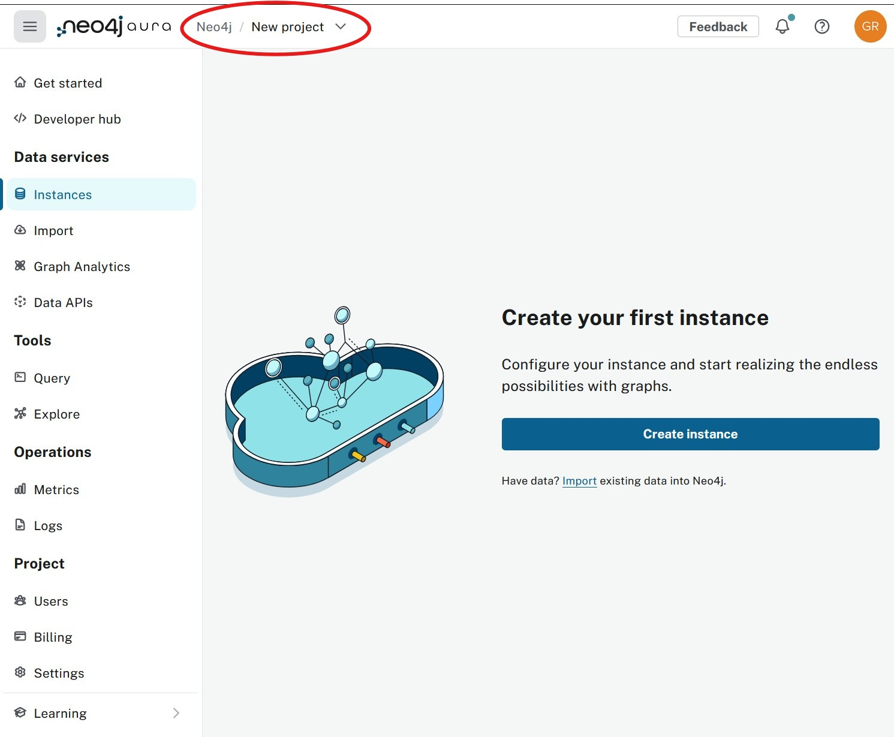
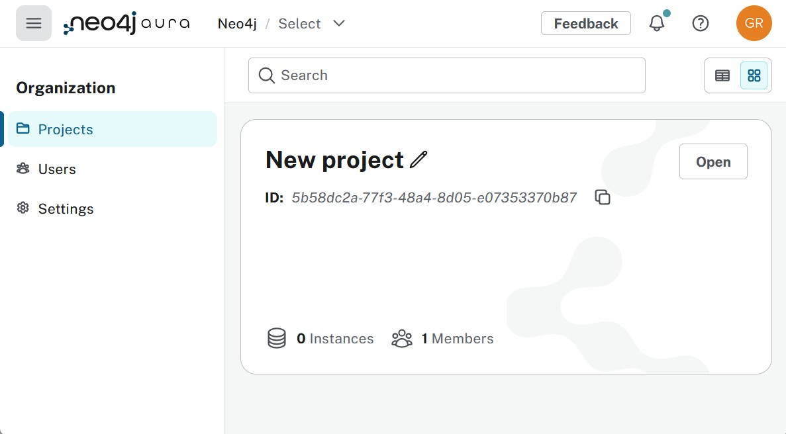
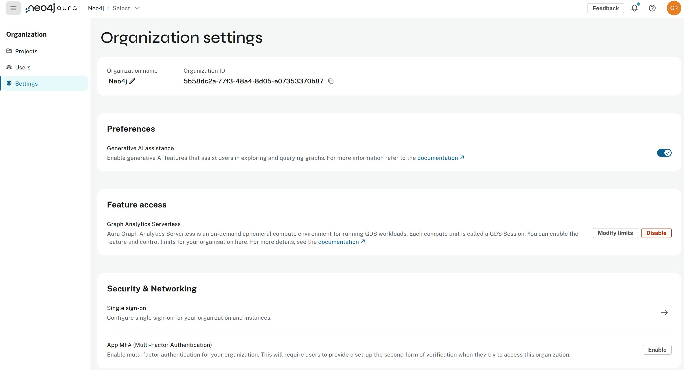
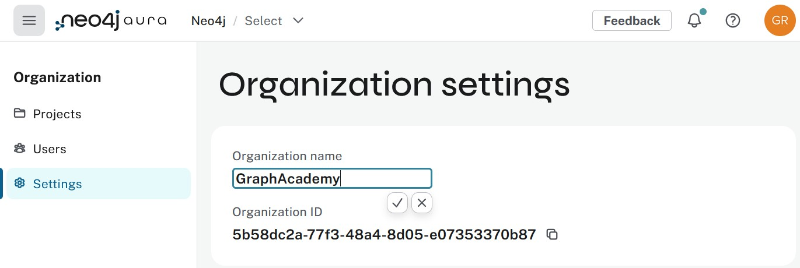
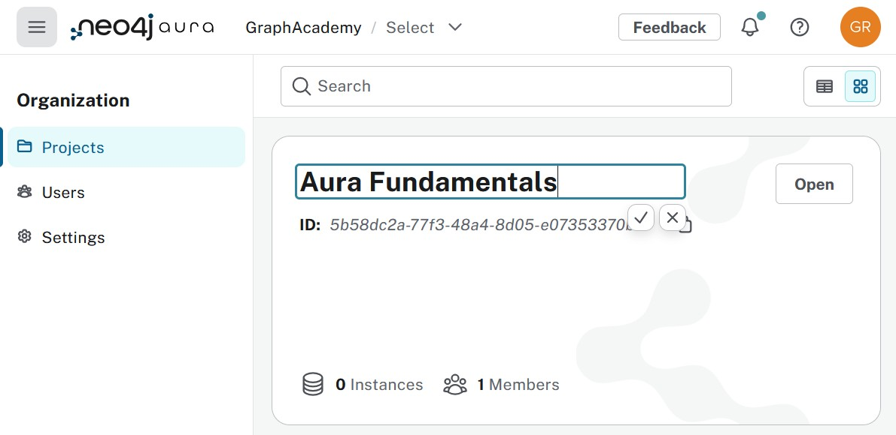
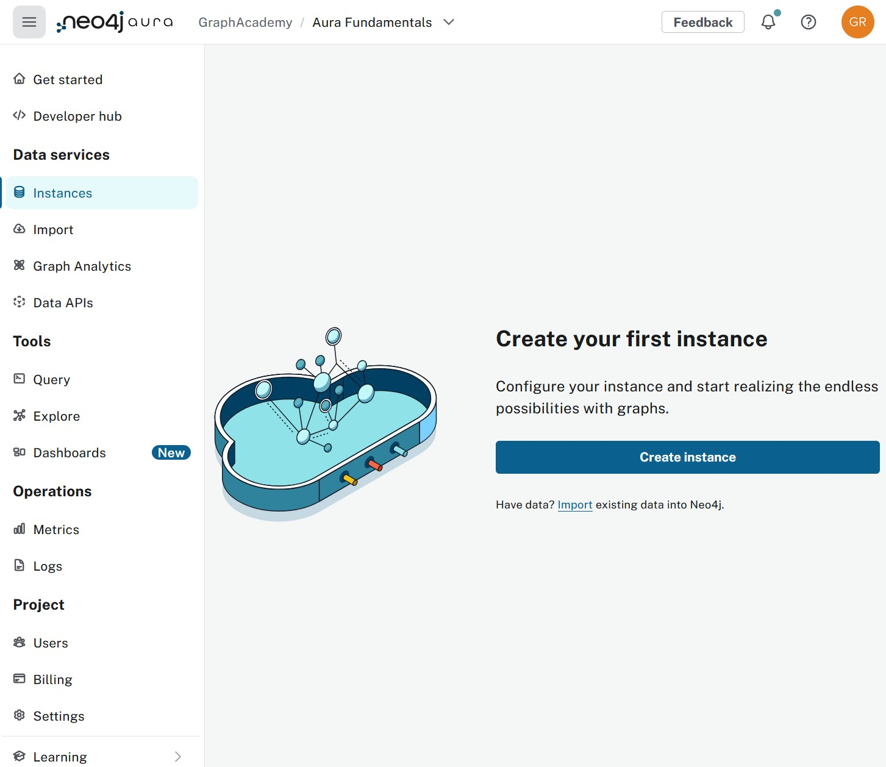
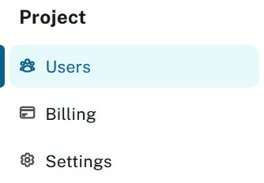

= Layout of the Aura Console
:table-caption!:

In the previous lesson, you learned about the different Aura tiers and how to choose the right one for your needs. 
In this lesson, you will learn about the structure of the Aura Console and how organizations, projects, and instances relate to each other. 

By the end of this lesson, you will be able to:

* Identify the hierarchical structure of organizations, projects, and instances in Aura
* Navigate the Aura Console organization and project settings
* Understand the difference between console access and database access security

== Understanding the console hierarchy

When you create a new account, you are automatically assigned to an organization.
A user can be a member of multiple organizations, each of which contains one or more projects.
Each project may contain multiple database instances.

The Aura Console is organized into two main levels: **organization** and **project**.

You can view your current organization and project in the top left corner, and switch to another by clicking the down arrows.

By default, you will be assigned to an organization called **Neo4j**, with a project called **New project**.

== Managing organization settings

To access organization-level settings, click on the **Neo4j** part of the **Neo4j / New project** section at the top.

The organization level is where you control global settings and user access for your entire organization.
To begin customizing your organization, select **Settings** from the menu on the left.

You can update the organization name by clicking the pencil icon next to the organization name, typing the new name, and clicking the tick when you are done.

The other settings control what features are allowed or restricted at the organization level. 
Under **Users**, you can manage who has access to the console for your organization. 
Paid tiers offer additional user management options.

[NOTE]
.Console access vs. database access
====
Access to the Aura Console is **not** the same as access to the database instances. 
Console access allows users to create and manage database instances, but it doesn't directly control access to the data within those databases.

When you create a new database instance, you will be supplied with a separate set of credentials to access the database.
====

== Managing project settings

Projects are where management control and permissions for database instances are defined. 
For example, you might create separate projects for **Development** and **Production**, or **Non-critical** and **Critical** workloads.

[NOTE]
====
By default, only **one** project is provisioned. Only paid tiers offer the option to have multiple projects available.
====

To customize your project name, select **Projects** in the organization menu and click the pencil icon next to the project name.

You can view a list of instances in the project by clicking the **Open** button. 
// You'll return to the main view, which now reflects your updated organization settings.

The main console view is project-focused. 
The **Users**, **Billing**, and **Settings** options in the bottom-left navigation all apply to the current project.

Now that you understand the console structure, you're ready to create your first database instance.

== Check your understanding
include::questions/1-structure.adoc[leveloffset=+1]

include::questions/2-security.adoc[leveloffset=+1]

[.summary]
== Summary
In this lesson, you learned about the Aura Console structure and how to navigate organization and project settings.

As a reminder, organizations contain projects, and projects contain database instances. 
You also learned that console access is separate from database access security.

In the next lesson, you will create your first Aura database instance and configure it for your business needs.
