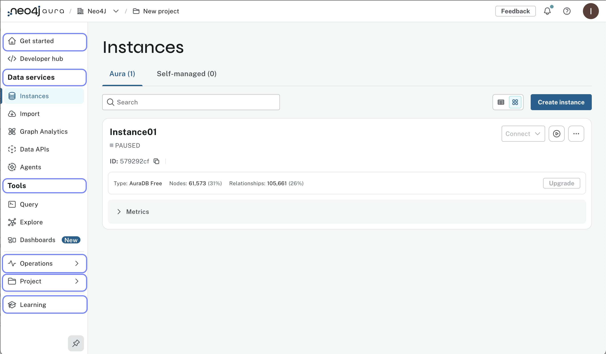

= Layout of the Aura Console
:type: lesson
:order: 1

In the previous lesson, you learned about the different Aura tiers and how to choose the right one for your needs.
In this lesson, you will learn about the structure of the Aura Console and how organizations, projects, and instances relate to each other.

By the end of this lesson, you will learn how to:

* Identify the hierarchical structure of organizations, projects, and instances in Aura.
* Navigate the Aura Console organization and project settings
* Understand the difference between console access and database access security

[.slide]

== Understanding the Aura Console

The Aura Console is the web-based interface for managing your Neo4j Aura instances.
It provides a user-friendly way to create, configure, and monitor your database instances, as well as manage your organization and project settings.

[layout,width=600,align=center]

[.slide.col-2]

== Understanding the console hierarchy

When you create a new account, you are automatically assigned to an organization.
A user can be a member of multiple organizations, each of which contains a project.
Each project may contain multiple database instances.

image::images/01_aura_console_organization_structure.png[Organization structure as a graph,width=450,align=center]
The Aura Console is organized into two main levels: **organization** and **project**.

You can view and change your current organization and project in the top left corner.

image::images/01_aura_console_overview.jpg[layout,width=600,align=center]

By default, you will be assigned to an organization called **Neo4j**, with a project called **New project**.

[.slide.col-2]

== Managing organizations

Aura organizes your graph databases into a three-level hierarchy: organizations, project, and instances.

**Organizations** are the control center for managing global settings and user role access.

**Projects** is used to group database instances.

**Instances** are the actual Neo4j database instances where your data is stored and managed.

To access organization-level settings, click on the organization name (**Neo4j** be default) in the **Organization / Project** section at the top.

image::images/01_aura_console_organization.jpg[organization,width=450,align=center]

To begin customizing your organization, select **Settings** from the menu on the left.

You can update the organization name using the pencil icon next to the organization name, typing the new name, and confirming with the tick when you are done.

image::images/01_aura_console_organization_name.jpg[name,width=450,align=center]

The other settings control what features are allowed or restricted at the organization level.
Under **Users**, you can manage who has access to the console for your organization.
Paid tiers offer additional user management options.

[NOTE]
.Console access vs. database access
====
Access to the Aura Console is **not** the same as access to the database instances.
Console access allows users to create and manage database instances, but it doesn't directly control access to the data within those databases.

When you create a new database instance, you will be supplied with a separate set of credentials to access the database.
====

== Managing project settings

You can manage control and permissions for database instances in project settings.
//For example, you can create separate projects for **Development** and **Production**, or **Non-critical** and **Critical** workloads.

// [NOTE]
// ====
// By default, only **one** project is provisioned. Only paid tiers offer the option to have multiple projects available.
// ====

To customize your project name, select **Projects** in the organization menu and click the pencil icon next to the project name.

image::images/01_aura_console_organization_project.jpg[project,width=450,align=center]

**Open** the project to view a list of instances.
// You'll return to the main view, which now reflects your updated organization settings.

image::images/01_aura_console_overview_fixed.jpg[layoutfixed,width=600,align=center]

The main console view is project-focused.
The **Users**, **Billing**, and **Settings** options in the bottom-left navigation all apply to the current project.

In this lesson you looked at the console structure - you're ready to create your first database instance.

== Check your understanding
include::questions/1-structure.adoc[leveloffset=+1]

[.summary]
== Summary
In this lesson, you learned about the Aura Console structure and how to navigate organization and project settings.

In the next lesson, you will create your first Aura database instance and configure it for your business needs.
