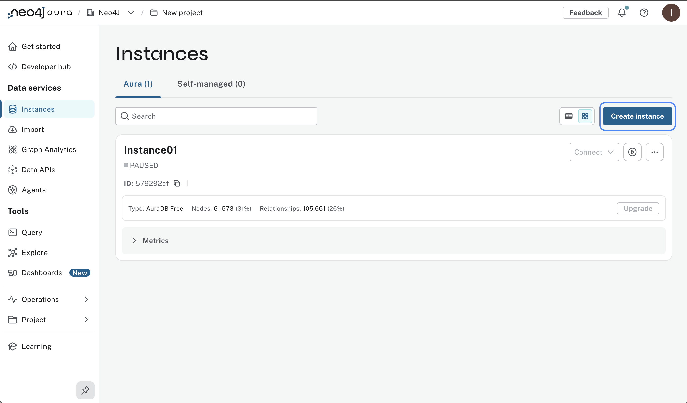
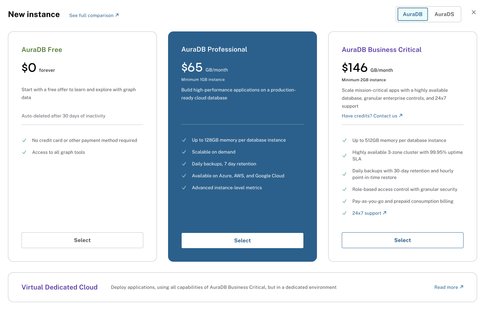
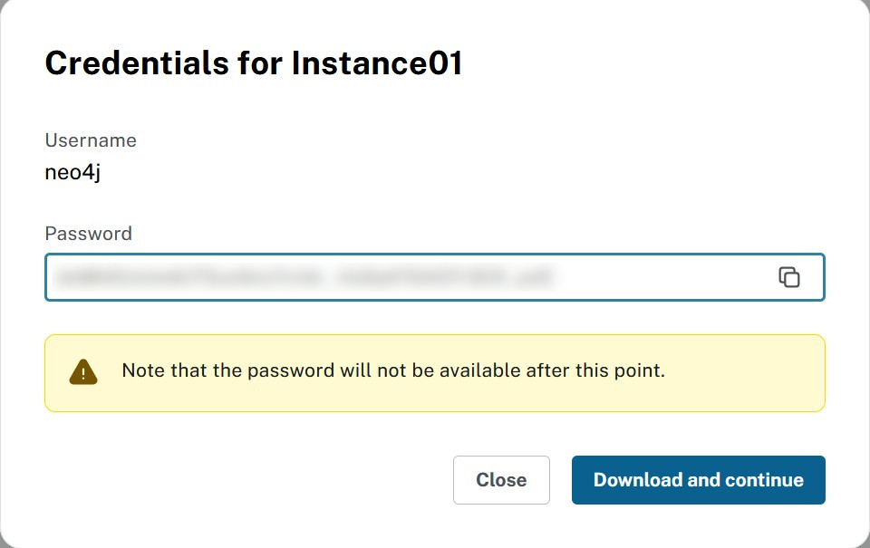
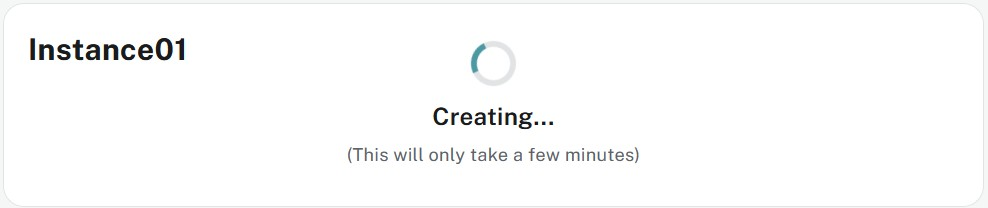
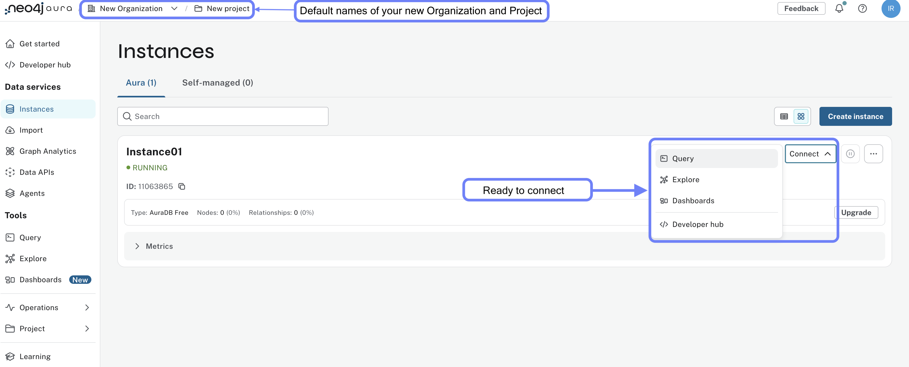

= Create an instance
:type: lesson
:order: 2

In the previous lesson, you learned how to manage organizations and projects in the Aura Console.
In this lesson, you will learn how to create your first Aura Free database instance and understand the key factors that influence instance configuration.

By the end of this lesson, you will be able to:

* Create an Aura Free database instance
* Understand why location and instance size matter for database performance

[.slide]
== Creating a new instance

To create a new database instance, select **Instances** in the menu on the left, then click **Create Instance**.

This will take you to the instance creation page, where you can configure your new database instance.

// [NOTE]
// ====
// At this time you have no flexibility on CPU. If you need more horsepower, you have to pick a bigger instance.
// ====

You will be presented with a modal window that provides you with the seleccion of tiers.

Select **Aura Free** to create a new free instance.

A modal window will appear with the username and password for the database.

Make sure to **Download and continue** and **keep** the file safe. It contains the credentials needed to connect to your new database.

[.slide..col-2]

== Instance connection details

.Credentials
[cols="1,1"]
|===
|Entry |Value

|NEO4J_URI |neo4j+s://<instanceid>.databases.neo4j.io
|NEO4J_USERNAME |neo4j
|NEO4J_PASSWORD |<your password>
|NEO4J_DATABASE |neo4j
|AURA_INSTANCEID |<instanceid>
|AURA_INSTANCENAME |Instance01
|===

[NOTE]
====
* The instanceid cannot be changed in the lifetime of the instance.
* The user has admin rights on the database.
* The password can be changed later.
// * At this time there is only one database per instance and it's neo4j.
====

You will then see the new instance listed on the instances page with a status of **Creating**.

Once the database is ready, the status will change to **Running**.

image::images/02_create_free_running.jpg[running database,width=450,align=center]

Your first instance is **up and running**! The indicators shown are specific to **Aura Free**, whereas other tiers will show indicators for size and location.

[.quiz]
== Check your understanding

include::questions/1-location.adoc[leveloffset=+1]

include::questions/2-instance-setup.adoc[leveloffset=+1]

[.summary]
== Summary

In this lesson, you created your first Aura Free database instance and learned why location and size matter for database performance.

You now have a running Neo4j Aura Free instance with connection credentials that you can use to access your database.

In the next lesson, you will try the tools available in the Aura Console to manage and interact with your database instance.
