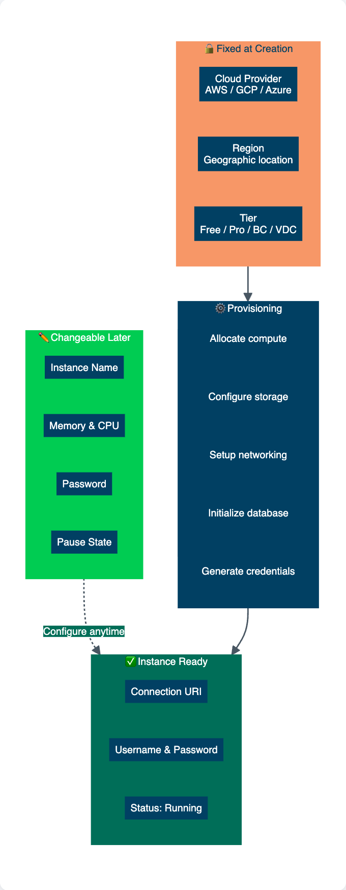

= Create an instance
:type: lesson
:order: 2
:slides: true

[.slide.discrete]
== Creating an Aura Free instance

In the previous lesson, you learned how to manage organizations and projects in the Aura Console.
In this lesson, you will learn how to create your first Aura database instance.

By the end of this lesson, you will be able to:

* Create an Aura database instance
* Understand which settings are fixed at creation vs changeable later

[.slide]
== Creating a new instance

To create a new database instance, select **Instances** in the menu on the left, then click **Create Instance**.

image::images/02_create_instance.png[create instance,width=600,align=center]

This opens the instance creation page where you configure your new database instance.

// [NOTE]
// ====
// At this time you have no flexibility on CPU. If you need more horsepower, you have to pick a bigger instance.
// ====

[.slide]
== Selecting the instance tier
You will be presented with a modal window that provides you with the selection of tiers.

image::images/new-instance-modal.jpg[Selecting the correct tier,width=450,align=center]

[.slide]

Select **Aura Free** to create a new free instance.

video::https://cdn.graphacademy.neo4j.com/courses/aura-fundamentals/create-new-free-instance.mp4["Create New Free Instance", role="cdn", width=100%]

[.slide]
== Naming your instance
A modal window will appear with the username and password for the database.

image::images/02_create_free_credentials.jpg[credentials,width=300,align=center]

Make sure to **Download and continue** and **keep** the file safe. It contains the credentials needed to connect to your new database.

[.slide]
== Instance connection details

.Credentials
[cols="1,1"]
|===
|Entry |Value

|NEO4J_URI |neo4j+s://<instanceid>.databases.neo4j.io
|NEO4J_USERNAME |neo4j
|NEO4J_PASSWORD |<your password>
|NEO4J_DATABASE |neo4j
|AURA_INSTANCEID |<instanceid>
|AURA_INSTANCENAME |Instance01
|===

[.slide.discrete]
[NOTE]
.Instance connection details
====
* The instance ID cannot be changed in the lifetime of the instance.
* The user has admin rights on the database.
* The password can be changed later.
====
[.slide]
== Instance creation in progress
You will then see the new instance listed on the instances page with a status of **Creating**.

image::images/02_create_free_in_progress.jpg[spinner,width=450,align=center]

[.slide]
== Instance running
Once the database is ready, the status will change to **Running**.

image::images/02_create_free_running.jpg[running database,width=450,align=center]

[.slide]
Your first instance is **up and running**! The indicators shown are specific to **Aura Free**, whereas other tiers will show indicators for size and location.

image::images/02-free-instance-ready.png[instance ready,width=600,align=center]

[.slide.col-2]
== Initial vs later configuration

[.col]
====
Some instance settings can only be configured at creation time, while others can be changed later.

Plan your cloud provider and region carefully during initial setup, as these require creating a new instance to change.
====

[.col]
====

====

[.slide.discrete]
=== Fixed vs changeable settings

**Fixed at creation (cannot be changed later)**:

* Cloud provider (AWS, GCP, Azure)
* Region/location
* Instance ID

**Can be changed later**:

* Instance name
* Memory and storage size (paid tiers)
* Password

[.quiz]
== Check your understanding

include::questions/1-location.adoc[leveloffset=+1]

[.summary]
== Summary

In this lesson, you created your first Aura database instance and learned which settings are fixed at creation (cloud provider, region) versus changeable later (name, password, size).

You now have a running Neo4j Aura instance with connection credentials for accessing your database.

For more information on instance creation options, see the link:https://neo4j.com/docs/aura/getting-started/create-instance/[Neo4j Aura Create Instance documentation^].

In the next lesson, you will learn how to manage your instance, including inspecting, configuring, and upgrading.
