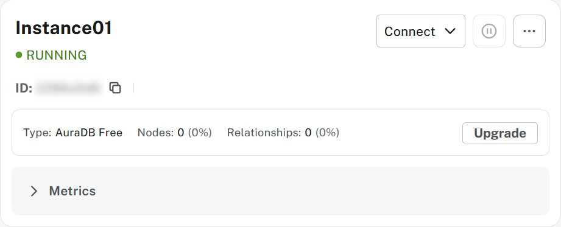

= Create an instance
:table-caption!:

In the previous lesson, you learned how to manage organizations and projects in the Aura Console.
In this lesson, you will learn how to create your first Aura Free database instance and understand the key factors that influence instance configuration.

By the end of this lesson, you will be able to:

* Create an Aura Free database instance
* Understand why location and instance size matter for database performance

== Choosing the right location

When creating an instance, you need to consider where your application will run and choose a database location that minimizes distance.
If you are aiming for **< 100ms** response times (a quite common request), you do not want distance to play a role.

You should consider the following questions:

1. Where is my application running / going to run?
2. What cloud provider do / did I pick for my application?
3. Can I mirror the choices of the first two questions for my database?

image::images/02_location_choice.jpg[location,width=600,align=center]

For example, the Neo4j Aura database that powers the GraphAcademy platform is hosted on AWS in the US East region.
This reduces the distance between the application and the database, and therefore the time it takes for a roundtrip from the application to the database.

== Understanding size requirements

When sizing a graph database, you need to consider two main components:

**Storage size** needs to be large enough to store all your nodes and relationships on disk, including their properties and any indexes.

**Memory size** needs to accommodate both your data and the transaction workload (Java heap space for query processing).

To determine the right size, you'll need to know:

* How many nodes and relationships?
* How many properties in the nodes and relationships?
* What type of data is stored as properties? (numbers, strings, etc.)
* How many indexes are required?
* Do you need to make use of any vector indexes?

Unless all this information is available, the best you can do is an estimate.
This is less of a problem for Aura as database instances can be resized through the Aura console with a few clicks.

For most Aura tiers, you must pick **memory size** (RAM) and **memory / storage ratio (1/2, 1/4, 1/8)**.

image::images/02_size_choice.jpg[size,width=600,align=center]

As an example, if you pick 2GB memory, this corresponds to 4GB storage.
You can increase the storage to 8GB (1/4) or 16GB (1/8) at additional cost.

For **Aura Free**, size choices are hidden from you, but the database limits (200,000 nodes and 400,000 relationships) typically need between 3GB and 4GB of storage.

[TIP]
.Sizing calculation
====
You can link:https://neo4j.com/developer/kb/capacity-planning-example/[refer to the Capacity Planning Example^] for a detailed example of how to calculate the right size for your database.
====

// [NOTE]
// ====
// At this time you have no flexibility on CPU. If you need more horsepower, you have to pick a bigger instance.
// ====

== Creating your first instance

Once you have chosen the right location and size, you can create your first Aura Free instance.

Select **instances** in the menu on the left, click **Create Instance**.

You will be presented with a modal window that provides you with your choice of tier.

image::images/new-instance-modal.jpg[Selecting the correct tier,width=450,align=center]

Click the **Select** button under **Aura Free** to create a new instance.

A modal window will appear with the username and password for the database.

Make sure to **Download and continue** and **keep** the file safe. It contains the credentials  needed to connect to your new database.

.Credentials
[cols="1,1"]  
|===
|Entry |Value

|NEO4J_URI |neo4j+s://<instanceid>.databases.neo4j.io
|NEO4J_USERNAME |neo4j
|NEO4J_PASSWORD |<your password>
|NEO4J_DATABASE |neo4j
|AURA_INSTANCEID |<instanceid>
|AURA_INSTANCENAME |Instance01
|===

[NOTE]
====
* The instanceid cannot be changed in the lifetime of the instance.
* The user has admin rights on the database.
* The password can be changed later.
// * At this time there is only one database per instance and it's neo4j.
====

You will then see the new instance listed on the instances page with a status of **Creating**.

image::images/02_create_free_in_progress.jpg[spinner,width=450,align=center]

Once the database is ready, the status will change to **Running**.

Your first instance is **up and running**! The indicators shown are specific to **Aura Free**, whereas other tiers will show indicators for size and location.

== Check your understanding
include::questions/1-location-matters.adoc[leveloffset=+1]

include::questions/2-size-matters.adoc[leveloffset=+1]

[.summary]
== Summary

In this lesson, you created your first Aura Free database instance and learned why location and size matter for database performance.

You now have a running Neo4j Aura instance with connection credentials that you can use to access your database.

In the next lesson, you will explore the tools available in the Aura Console to manage and interact with your database instance.
