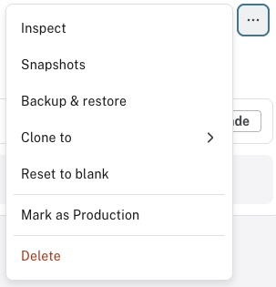
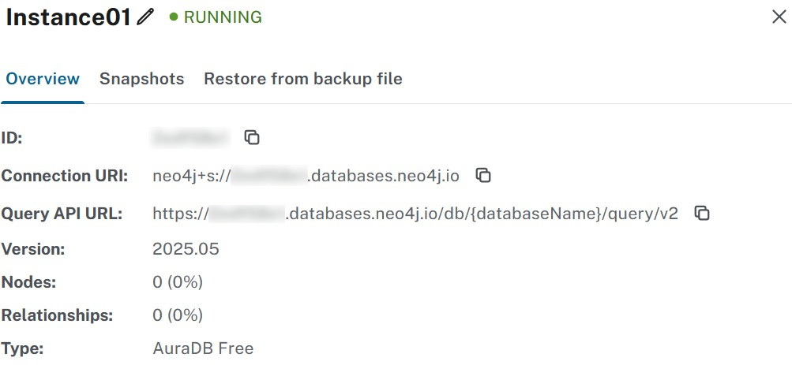
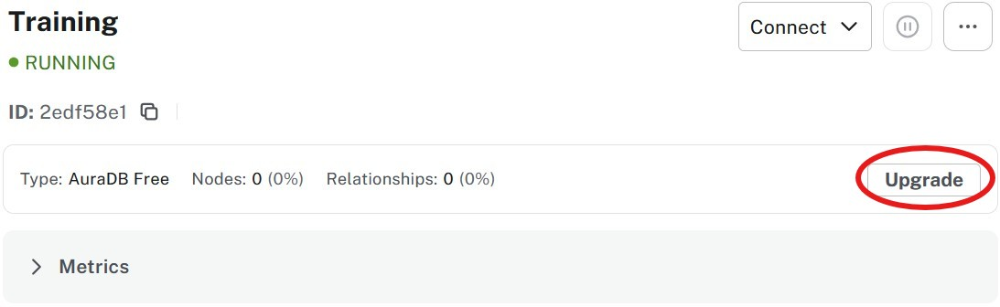
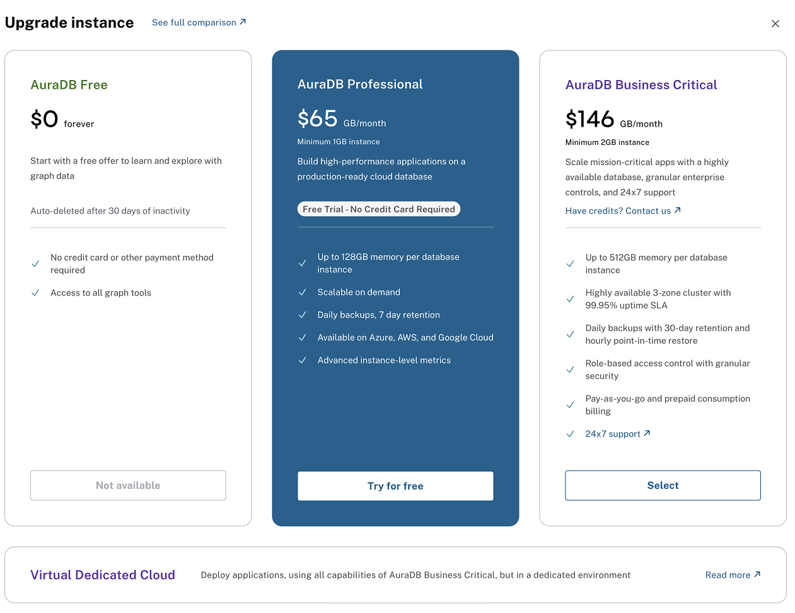
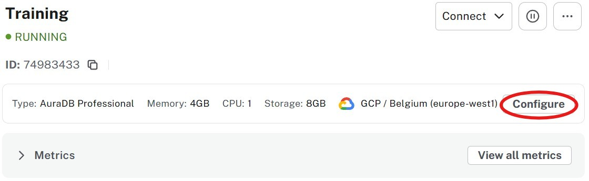
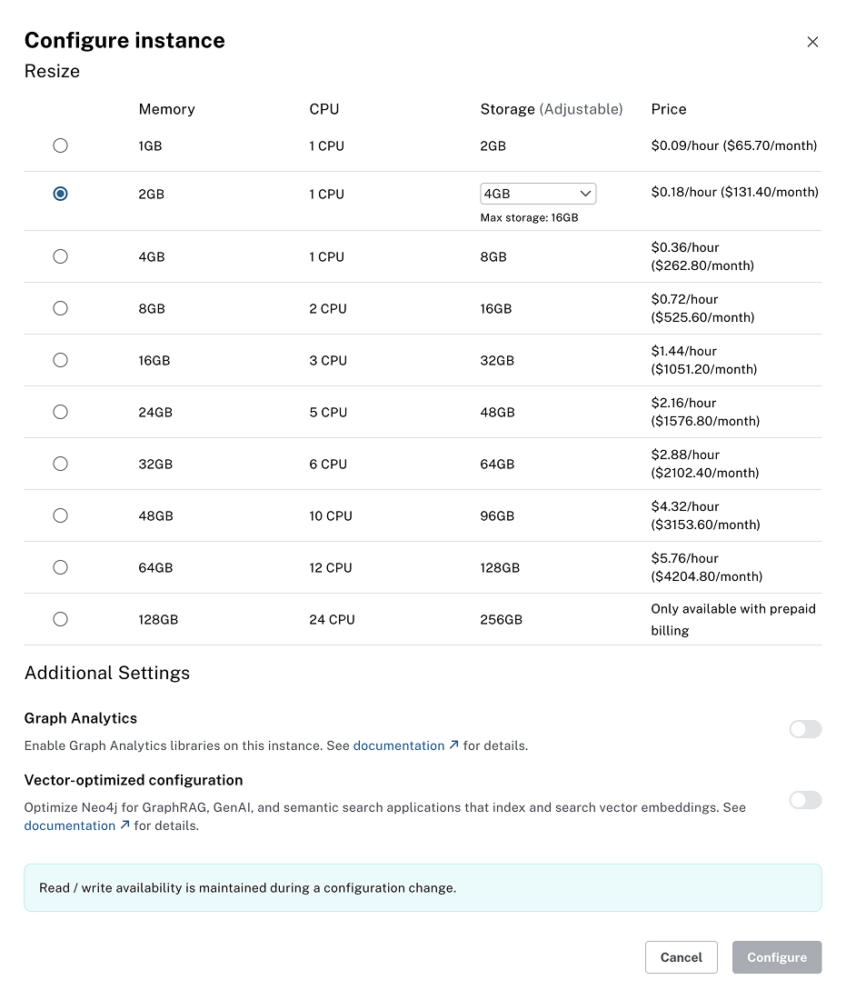
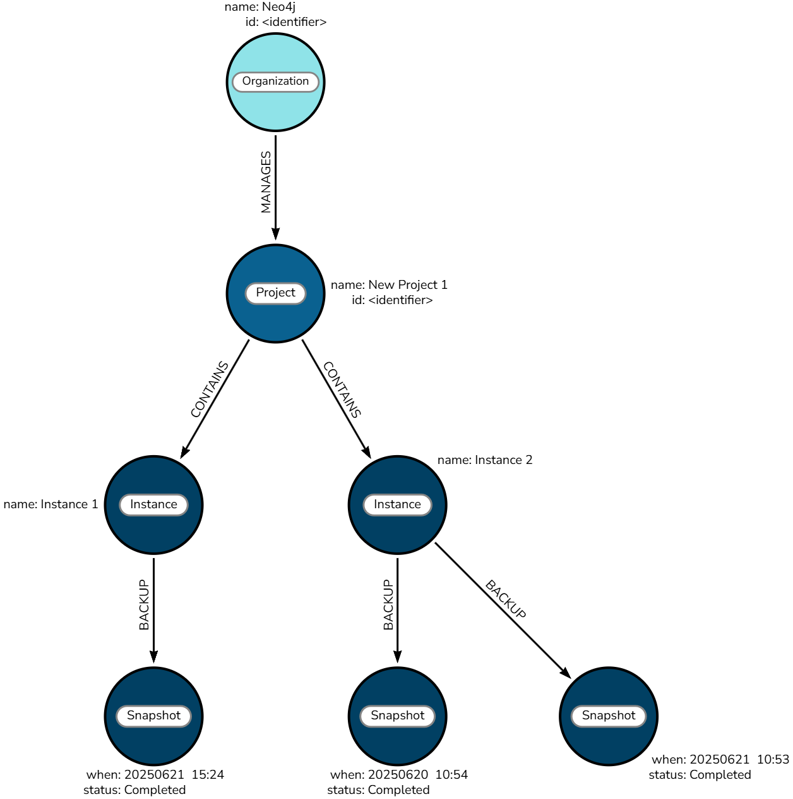

// REVIEW CHECKLIST - Issues to address:
// [ ] Consider shortening the lesson - currently covers too many concepts (inspect, configure, backup limits)
// [ ] Add more explicit connection to previous lesson about creating instances
// [ ] Add clear teaser for next lesson about hands-on backup/restore operations
// [ ] Consider adding a hands-on challenge section to prepare for next lesson

= Manage an instance
:type: lesson
:order: 3
:slides: true

In the previous lesson, you learned how to create an Aura Free database instance and to understand the key factors that influence instance configuration.

In this lesson, you will learn how to:

* Find connection details for your instance
* Configure your instance as needs change
* Understand backup and restore limitations

[.slide]
== Understanding instance management

Your Aura instance comes with a comprehensive set of management options accessible through the three-dot menu in your console.

The menu provides access to the following options:

* **Inspect** - View connection details and instance statistics
* **Snapshots** - Take and export database snapshots
* **Backup & Restore** - Restore database from a backup file
* **Clone to** - Clone the data in the graph to a new or existing instance
//* **Upgrade** - Upgrade your instance to a higher tier
* **Reset to blank ** - Clear the database and start fresh
// * **Mark as Production ** -
* **Delete ** - Permanently delete the instance and all data

[.slide..col-2]
== Inspecting your instance

The inspect option allows you to view the details of your instance.

Here you will find connection information for the database, the current version and tier related information.

You can rename your instance with the pencil icon to the top right of the name.

This panel also allows you to view and take snapshots and restore the database from a backup.

// image::images/03_inspect_instance_pro.jpg[inspectpro,width=450,align=center]

[.slide..col-2]
== Scaling and configuration

As your application grows, you may need to adjust your instance size or move to a different tier.
You can scale up or down by clicking **Upgrade**.

=== Upgrading an Aura Free instance

On Free instances, **Upgrade** is a button on the instance card and allows you to change the instance to a higher tier.

This will open up the Upgrade instance modal window, allowing you to select the tier you want to upgrade to.

[TIP]
.Upgrading to Aura Professional
====
You can upgrade to a trial Aura Professional tier, but upgrading to Business Critical tier requires adding payment information. That is not covered in this training. Do it when you need it.
====

=== Configuring instance sizes

For Aura Professional and Business Critical tiers, you can configure the instance size with the **Configure** button.

**Configure** allows you to resize (in **both** directions) the instance according to your needs.

This screen allows you to resize the size of the memory, number of CPUs and the storage space.
The storage space is adjustable to store larger graphs on disk for when you don't require the entire graph to be loaded into memory.

[TIP]
.Additional configuration
====
You can also enable the _Graph Analytics_ library and turn on _Vector optimized configuration_.
These are outside of the scope of this course.
====

Once you have chosen your configuration and have reviewed the pricing outlined at the bottom of the page, check **I accept** and then click **Configure**.

Configuration may take a few minutes to complete, but read and write access will be maintained during this time.

[.slide..col-2]
== Cloning your instance

Cloning makes a copy of an existing instance into:

1. Another existing instance. That overwrites the data that is already there.
2. A new instance.

This is perfect for creating development environments, testing changes, or setting up staging environments that mirror production.

[NOTE]
====
This can be used to shift a database to a higher tier. The difference with **upgrade** is that the URI of the new instance will be different.
====

[.slide..col-2]
== Deleting an instance

Deleting an instance will terminate the instance and delete all data associated with it.

This is a permanent action. Unlike pausing, there's no coming back from deletion unless you have exported snapshots.

Before deleting, ensure you have exported any data you want to keep.

== Check your understanding

include::questions/1-inspect.adoc[leveloffset=+1]

include::questions/2-configure.adoc[leveloffset=+1]

[.summary]
== Summary

In this lesson, you learned the essential management operations for Aura instances:

* **Inspecting instances** - Access connection details, instance statistics, and configuration information through the three-dot menu
* **Upgrading instances** - Move from Aura Free to Professional and Business Critical tiers with payment information
* **Configuring instance sizes** - Adjust memory, CPU, and storage for Professional and Business Critical tiers
* **Cloning instances** - Create copies for development, testing, or staging environments
* **Deleting instances** - Permanently remove instances and data (with proper export planning)

Understanding these management capabilities gives you the flexibility to adapt your Aura setup as your needs change, whether scaling for increased demand or managing development environments.

In the next lesson, you'll learn about understanding costs and how Aura pricing compares to self-managed alternatives.
