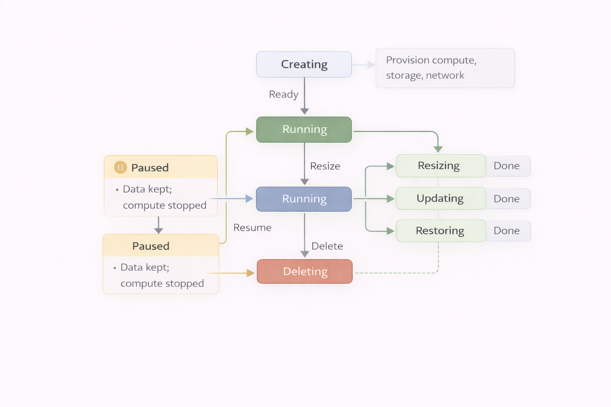

// REVIEW CHECKLIST - Issues to address:
// [ ] Consider shortening the lesson - currently covers too many concepts (inspect, configure, backup limits)
// [ ] Add more explicit connection to previous lesson about creating instances
// [ ] Add clear teaser for next lesson about hands-on backup/restore operations
// [ ] Consider adding a hands-on challenge section to prepare for next lesson

= Manage an instance
:type: lesson
:order: 3
:slides: true

[.slide.discrete]
== Managing instances

So far in this course, you have learned how to create Aura instances and to understand the key factors that influence instance configuration.

In this lesson, you will learn how to:

* Find connection details for your instance
* Resize instances up or down based on workload needs
* Upgrade to a different tier
* Pause instances to stop costs (and why idle instances still incur costs)
* Clone and delete instances

[.slide.col-2]
== Understanding instance management

[.col]
====
Your Aura instance comes with a comprehensive set of management options accessible through the three-dot menu in your console.

The diagram shows the complete instance lifecycle from creation to deletion, including pause/resume and resize operations.
====

[.col]
====

====

[.slide]
== Instance management options
The menu provides access to the following options:

* **Inspect** - View connection details and instance statistics
* **Snapshots** - Take and export database snapshots
* **Backup & Restore** - Restore database from a backup file
* **Clone to** - Clone the data in the graph to a new or existing instance
//* **Upgrade** - Upgrade your instance to a higher tier
* **Reset to blank ** - Clear the database and start fresh
// * **Mark as Production ** -
* **Delete ** - Permanently delete the instance and all data

[.slide]
== Inspecting your instance

The inspect option allows you to view the details of your instance.

image::images/03_inspect_instance.jpg[inspect,width=450,align=center]

[.slide]
== Tips for inspecting an instance

Here you will find connection information for the database, the current version and tier related information.

Rename your instance using the pencil icon to the top right of the name.

This panel also allows you to view and take snapshots and restore the database from a backup.

// image::images/03_inspect_instance_pro.jpg[inspectpro,width=450,align=center]

[.slide]
=== Upgrading an Aura Free instance

As your application grows, you may need to adjust your instance size or move to a different tier.

To upgrade, click the **Upgrade** button on the instance card.

On Free instances, **Upgrade** is a button on the instance card and allows you to change the instance to a higher tier.

image::images/03_upgrade.jpg[update,width=450,align=center]

[.slide]
This will open up the Upgrade instance modal window, allowing you to select the tier you want to upgrade to.

image::images/upgrade-instance-modal.jpg[Upgrade instance to another tier,width=450,align=center]

[.slide.discrete]
== Upgrading to Aura Professional

[TIP]
.Upgrading to Aura Professional
====
Upgrade to a trial Aura Professional tier without payment information. Upgrading to Business Critical requires adding payment details.
====

[.slide.discrete]
=== Configuring instance sizes

For Aura Professional and Business Critical tiers, configure the instance size using the **Configure** button.

image::images/03_configure.jpg[configure,width=450,align=center]

[.slide]
== Configuring an instance

The **Configure** option allows you to resize your instance in **both directions** - scaling up when you need more resources, or scaling down to reduce costs.

video::https://cdn.graphacademy.neo4j.com/courses/aura-fundamentals/click-configure.mp4["Click Configure", role="cdn", width=100%]

[.slide]
=== Scaling up

Scale up your instance when:

* Query performance degrades due to insufficient memory
* Your dataset grows beyond current storage capacity
* You need more CPU for complex graph algorithms

On the configuration screen, select higher memory settings. Storage and CPU scale proportionally.

[.slide]
=== Scaling down

Scale down your instance when:

* Your workload decreases (e.g., after a busy season)
* You over-provisioned during initial setup
* You want to reduce costs for development or testing environments

Select lower memory settings to reduce resource allocation and costs.

[.slide]
=== Configuration options

The configuration screen provides options to:

* Adjust memory size (RAM) for vertical scaling (improves write performance)
* Add or remove secondaries for horizontal scaling (improves read performance)
* Change the memory-to-storage ratio
* Rename your instance

video::https://cdn.graphacademy.neo4j.com/courses/aura-fundamentals/configure-details.mp4["Configure Details", role="cdn", width=100%]

[.slide]
=== Vertical and horizontal scaling

**Vertical scaling** (scaling up/down):

* Increases memory and CPU on the primary instance
* Improves write performance and complex query execution
* Select higher memory settings in the configuration screen

**Horizontal scaling** (adding secondaries):

* Adds read replicas to distribute query load
* Improves read performance for high-traffic applications
* Available on Business Critical and VDC tiers

[TIP]
.Additional configuration
====
Advanced options include enabling the _Graph Analytics_ library and _Vector optimized configuration_. For more information, see the link:https://neo4j.com/docs/aura/managing-instances/instance-actions/#_resize_an_instance[Neo4j Aura documentation on resizing instances^].
====

After selecting your configuration and reviewing the pricing, check **I accept** and click **Configure**.

Configuration takes a few minutes to complete. Read and write access is maintained during this time.

[.slide]
== Cloning your instance

Cloning makes a copy of an existing instance into:

1. Another existing instance, overwriting the existing data
2. A new instance

Cloning works well for creating development environments, testing changes, or setting up staging environments that mirror production.

[NOTE]
.Cloning an instance
====
Clone to a higher tier when you need different infrastructure. Unlike **upgrade**, cloning creates a new instance with a different URI.
====

[.slide]
== Pausing an instance

For paid tiers (Professional, Business Critical, VDC), pause instances to stop incurring costs when not in use.

Access the pause option through the three-dot menu on your instance card.

[WARNING]
.Idle instances still incur costs
====
A running instance continues to bill even when idle. Even if you do not execute any queries, this does **not** pause your instance or reduce costs. You need to manually pause the instance to stop billing.
====

[.slide]
== Deleting an instance

Deleting an instance terminates the instance and deletes all associated data.

Deletion is permanent. Unlike pausing, there's no coming back from deletion unless you have exported snapshots.

Before deleting, ensure you have exported any data you want to keep.

image::images/03_aura_console_organization_structure.png[structure,width=450,align=center]

[.quiz]
== Check your understanding

include::questions/1-inspect.adoc[leveloffset=+1]

[.summary]
== Summary

In this lesson, you learned the essential management operations for Aura instances:

* **Inspecting instances** - Access connection details, instance statistics, and configuration information through the three-dot menu
* **Upgrading instances** - Move from Aura Free to Professional and Business Critical tiers
* **Configuring instance sizes** - Adjust memory, CPU, and storage for Professional and Business Critical tiers
* **Pausing instances** - Stop costs by manually pausing (idle instances still incur costs)
* **Cloning instances** - Create copies for development, testing, or staging environments
* **Deleting instances** - Permanently remove instances and data

For more information on instance management, see the link:https://neo4j.com/docs/aura/managing-instances/instance-actions/[Neo4j Aura Instance Actions documentation^].

In the next lesson, you will learn about backup and restore operations to protect your data.
