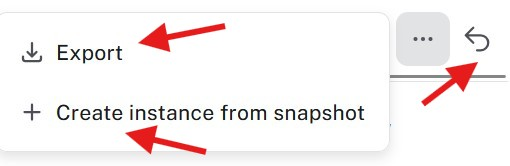
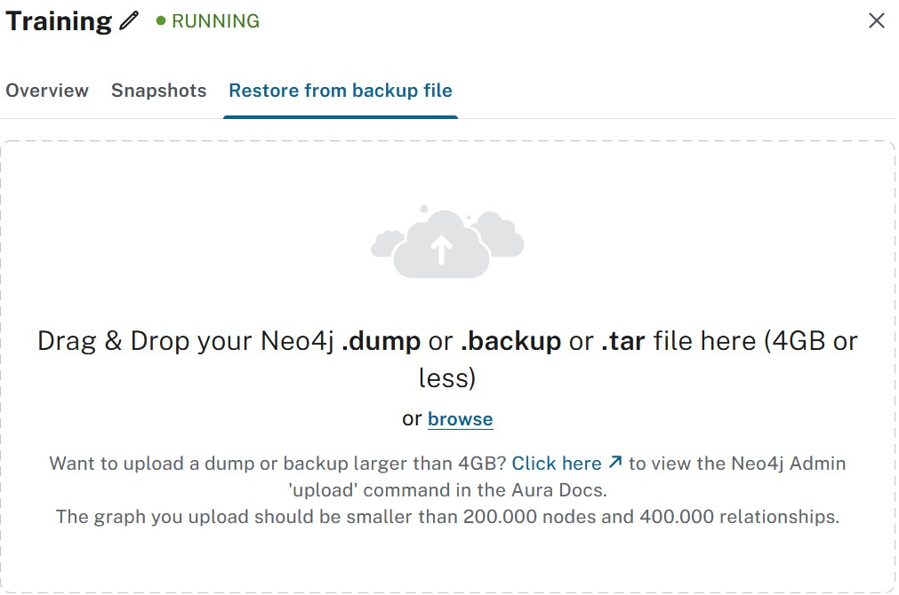

= Backup and restore
:type: lesson
:order: 4
:slides: true

Data protection is one of the most important aspects of database management. Whether you're preparing for a major application update, migrating between environments, or simply want to ensure you can recover from unexpected problems, having a solid backup and restore strategy is essential.

In this lesson, you will learn how to:

* Understand Aura's snapshot system for automated backups
* Export and manage snapshots for long-term storage
* Restore data from snapshots and local backup files
* Plan your backup strategy

[.slide]

== Understanding Aura snapshots

Snapshots are Aura's term for **backups**. The tier determines when they are taken and how many are kept available in Aura itself.

image::images/03_snapshot.jpg[snapshot,width=450,align=center]

Snapshots are your safety net. Think of them as save points in a video game - you can always go back to a known good state.

Aura creates snapshots based on your instance tier:

* **Aura Free**: On-demand only and limited snapshot retention
* **Aura Professional**: Regular automated snapshots with longer retention
* **Aura Business Critical**: Frequent automated snapshots with extended retention periods

// [NOTE]
// ====
// The frequency and retention of snapshots varies by tier. Check your specific tier documentation for exact details.
// ====

[.slide][.col=2]
== Working with snapshots

There are three key actions you can take with any snapshot:

* **Export** - Download the snapshot to your local machine for long-term storage.
* **Create a new instance from snapshot** - Spin up a new Aura instance using the snapshot data.
* **Restore** - Revert your current instance to the snapshot's point in time.

[.slide][.col=2]

=== Export snapshots

**Export** downloads the snapshot to your local machine. This is crucial for long-term archival beyond Aura's retention period, especially when you need to meet compliance requirements that mandate offline backups.

It's also essential for creating backups before major changes or migrations, and for sharing data securely with development teams.

[.slide][.col=2]
=== Create new instances from snapshots

**Create instance from snapshot** spins up a fresh instance with the snapshot's data. This is perfect for setting up development environments that mirror production, allowing you to test changes on a copy of real data.

You can also use this to create staging environments for application testing, or as part of your disaster recovery scenarios.

[.slide][.col=2]
=== Restoring snapshots

**Restore** reverts your current instance to the snapshot's point in time. You want to use this when you need to roll back problematic changes, when data corruption has occurred, or when you want to return to a known good state after testing.

[WARNING]
.Overwriting data
====
Restoring a snapshot **overwrites** all current data in your instance. Make sure you export a current snapshot first if you might need to recover the current state later.
====

[.slide][.col=2]
== Restoring from backup file

If you have a backup or dump on your **local system** (different from having snapshots available in Aura), you can use it to overwrite the current instance.

This is particularly useful when:

* Migrating from a self-managed Neo4j setup to Aura
* Restoring from an exported snapshot
* Loading data from another Neo4j environment

[.slide][.col=2]
=== Important limitations

Keep these constraints in mind when restoring from local files:

* **Instance size**: The target instance must be large enough to hold the data
* **Aura Free restrictions**: Additional limitations on node and relationship counts apply
* **File size limit**: Backup files cannot exceed 4GB for upload through the console
* **Larger files**: Files bigger than 4GB require command-line tools

[.slide][.col=2]
=== When to use local restore

The use case for local file restore is somewhat limited, but it's a **great** way to get started with smaller databases when moving from self-managed setups to Aura.

Consider this approach when:

* Your backup file is under 4GB
* You're migrating from Neo4j Community or Enterprise
* You need to bootstrap a new environment with existing data
* You're moving between different Neo4j hosting environments

// -----
//
// TODO: migrate to course summary, optional lesson?

[.slide]

== Planning your backup strategy

Having a backup plan is essential for data protection, as well as for managing changes and migrations.

Here are some best practices to consider:

* **Plan for regular exports** - Schedule regular exports of important snapshots to your own storage. This ensures you have a reliable backup that meets your compliance and retention requirements.
* **Test your restore process** - Regularly test restoring from snapshots to ensure you can recover data when needed. This helps identify any issues in your backup and restore procedures before an actual need arises.
* **Consider compliance and retention** - Understand your organization's requirements for data retention and compliance. Ensure your backup strategy aligns with these needs, including how long backups must be kept and any specific storage or encryption requirements.

[.slide][.col=2]
=== Regular snapshot exports

Regularly export important snapshots to your own storage:

* Before major application deployments
* After significant data imports or changes
* On a scheduled basis for critical production data
* Before performing any potentially risky operations

[.slide][.col=2]
=== Testing your restore process

A backup is only as good as your ability to restore from it. Regularly test your backup and restore procedures:

* Create test instances from snapshots
* Verify data integrity after restoration
* Document your restore procedures
* Train your team on the restore process

[.slide][.col=2]
=== Compliance and retention

Consider your organization's requirements:

* How long must backups be retained?
* Are there specific compliance requirements?
* Do you need backups stored in specific geographic regions?
* Are there encryption requirements for exported snapshots?

[TIP]
.Restoring using the Aura API
====
You can also restore an instance and create a new instances from a snapshot by its ID through the Aura API.

link:https://neo4j.com/docs/aura/platform/api/specification/#/instances/post-instances[View the Aura API reference documentation]

====

== Check your understanding

include::questions/1-snapshot-purpose.adoc[leveloffset=+1]

include::questions/2-snapshot-actions.adoc[leveloffset=+1]

include::questions/3-restore-limitations.adoc[leveloffset=+1]

[.summary]
== Summary

In this lesson, you learned about Aura's comprehensive backup and restore capabilities.

You also learned about the important limitations to keep in mind, particularly the 4GB file size limit for console uploads and the various restrictions that apply to different Aura tiers.

In the next lesson, you'll move on to connecting to your instance and start working with your data directly.