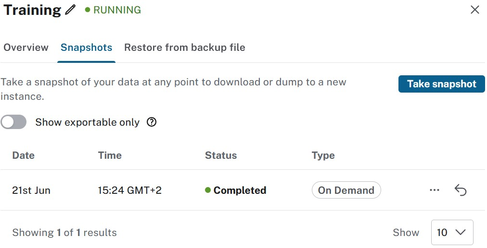

= Backup and restore
:type: lesson
:order: 4
:slides: true

[.slide.discrete]
== Backing up and restoring data

Data protection is one of the most important aspects of database management. Whether you're preparing for a major application update, migrating between environments, or simply want to ensure you can recover from unexpected problems, having a solid backup and restore strategy is essential.

In this lesson, you will learn how to:

* Understand Aura's snapshot system for automated backups
* Export and manage snapshots for long-term storage
* Restore data from snapshots and local backup files
* Plan your backup strategy

[.slide]
== Understanding Aura snapshots

Snapshots are Aura's backup mechanism. Your tier determines when snapshots are taken automatically and how long they are retained.

[.slide]
== Scheduled and on-demand snapshots

Aura provides two types of snapshots:

**Scheduled snapshots** are taken automatically based on your tier:

* Provide regular, predictable backup points
* Require no manual intervention
* Retention period determined by tier

**On-demand snapshots** are triggered manually:

* Take a snapshot whenever you need one
* Useful before risky operations or major changes
* Same retention period as scheduled snapshots (except Free tier)

[.slide]
== Snapshot frequency and retention by tier

[cols="1,2,2"]
|===
|Tier |Scheduled Snapshots |Retention

|**Free**
|None (on-demand only)
|Latest snapshot only

|**Professional**
|Daily
|7 days

|**Business Critical**
|Hourly
|30 days

|**Virtual Dedicated Cloud**
|Hourly (days 1-7), Daily (days 8-60)
|60 days
|===

[.slide.col-2]
== When to use each snapshot type

[.col]
====
The decision tree helps you choose the right backup approach for your situation.

Use the diagram to determine whether you need an on-demand snapshot, should rely on scheduled snapshots, or need to export for long-term storage.
====

[.col]
====
image::images/backup-decision.png[Backup decision tree showing when to use different snapshot types]
====

[.slide]
=== Snapshot use cases

**Use scheduled snapshots** for:

* Regular disaster recovery protection
* Compliance requirements for periodic backups
* General data protection without manual effort

**Use on-demand snapshots** for:

* Before major application updates or schema changes
* After significant data imports
* Before performing risky operations (bulk deletes, migrations)
* Creating a known-good restore point before testing

[.slide]
== Working with snapshots

There are three key actions available for any snapshot:

* **Export** - Download the snapshot to your local machine for long-term storage.
* **Create a new instance from snapshot** - Spin up a new Aura instance using the snapshot data.
* **Restore** - Revert your current instance to the snapshot's point in time.

[.slide]
== Snapshot actions

[.slide]
=== Export snapshots

**Export** downloads the snapshot to your local machine. Exporting is essential for long-term archival beyond Aura's retention period, especially when you need to meet compliance requirements that mandate offline backups.

It's also essential for creating backups before major changes or migrations, and for sharing data securely with development teams.

[.slide]
=== How to export a snapshot

To export a snapshot:

1. Navigate to the **Snapshots** tab within your Aura instance
2. Locate the snapshot you want to export
3. Click the more menu (…​) next to the snapshot
4. Select **Export** to download the snapshot

The download time depends on your database size and network speed.

[.slide]
=== Export file formats

Exported snapshots use different file formats depending on your Neo4j version:

* **Neo4j Version 5**: `.backup` format (changed October 1, 2024)
* **Neo4j Version 4.x**: `.dump` format

Store your exported snapshots in a secure location with a clear naming convention that includes the instance name and export date.

[.slide]
=== Create new instances from snapshots

**Create instance from snapshot** spins up a fresh instance with the snapshot's data. Use this option to set up development environments that mirror production, allowing you to test changes on a copy of real data.

Creating instances from snapshots also works well for staging environments for application testing, or as part of disaster recovery scenarios.

[.slide]
=== How to create an instance from a snapshot

To create a new instance from a snapshot:

1. In the **Snapshots** tab, find the snapshot you want to use
2. Click the more menu (…​) next to the snapshot
3. Select **Create instance from snapshot**
4. Choose your desired tier and size (can be different from the original)
5. Follow the prompts to configure the new instance

[NOTE]
.Remember
====
The new instance will be billed separately according to its selected tier and size. The time to create the instance varies based on database size and system load.
====

[.slide]
=== Restoring snapshots

**Restore** reverts your current instance to the snapshot's point in time. You want to use this when you need to roll back problematic changes, when data corruption has occurred, or when you want to return to a known good state after testing.

[WARNING]
.Overwriting data
====
Restoring a snapshot **overwrites** all current data in your instance. Make sure you export a current snapshot first if you might need to recover the current state later.
====

[.slide]
=== How to restore a snapshot

To restore your instance to a previous snapshot:

1. Go to the **Snapshots** tab in your Aura instance
2. Locate the snapshot you wish to restore
3. Click the restore icon (↩) next to the snapshot
4. Type **RESTORE** to confirm the action
5. Click **Restore** to proceed

[NOTE]
.Restore process
====
Your instance will be temporarily unavailable during the restore process. The duration depends on your database size. Plan for potential downtime when restoring snapshots.
====

[.slide]
=== Previewing snapshot data

There's no direct way to preview snapshot contents before restoring. However, consider these alternatives:

* Create a new instance from the snapshot to inspect the data
* Verify the snapshot timestamp matches your expected state
* Check the snapshot size as an indicator of data volume

[.slide]
== Restoring from backup file

image::images/03_restore_from_backup.jpg[restore,width=450,align=center]

[.slide]
== Restoring using local files

If you have a backup or dump on your **local system** (different from snapshots available in Aura), use it to overwrite the current instance.

Local file restore works well for:

* Migrating from a self-managed Neo4j setup to Aura
* Restoring from an exported snapshot
* Loading data from another Neo4j environment

[.slide]
=== How to restore from a local backup file

To restore your instance from a local backup file:

1. Navigate to the **Restore from backup file** tab in your Aura instance
2. Click to browse and select your `.backup`, `.dump`, or `.tar` file
3. Confirm the restoration, understanding that this will overwrite all existing data
4. Wait for the process to complete

[NOTE]
.Local restore process
====
Your instance will be unavailable during the restoration process. Duration varies based on file size and system resources.
====

[.slide]
=== Important limitations

Keep these constraints in mind when restoring from local files:

* **Instance size**: The target instance must be large enough to hold the data
* **Aura Free restrictions**: Additional limitations on node and relationship counts apply
* **File size limit**: Backup files cannot exceed 4GB for upload through the console
* **Larger files**: Files bigger than 4GB require command-line tools

[.slide]
=== Handling files larger than 4GB

For backup files exceeding 4GB, you'll need to use the Neo4j Admin command-line tool:

[source,bash]
----
neo4j-admin database upload <database-name> \
  --from-path=<path-to-backup> \
  --to-uri=<aura-instance-uri> \
  --to-user=<username> \
  --to-password=<password>
----

This command uploads your database directly to your Aura instance, bypassing the console file size limitation.

[.slide]
=== When to use local restore

The use case for local file restore is somewhat limited, but it's a **great** way to get started with smaller databases when moving from self-managed setups to Aura.

Consider this approach when:

* Your backup file is under 4GB
* You're migrating from Neo4j Community or Enterprise
* You need to bootstrap a new environment with existing data
* You're moving between different Neo4j hosting environments

// -----
//
// TODO: migrate to course summary, optional lesson?

[.slide]

== Planning your backup strategy

Having a backup plan is essential for data protection, as well as for managing changes and migrations.

Here are some best practices to consider:

* **Plan for regular exports** - Schedule regular exports of important snapshots to your own storage. This ensures a reliable backup that meets compliance and retention requirements.
* **Test your restore process** - Regularly test restoring from snapshots to ensure data recovery works when needed. This helps identify issues in backup and restore procedures before an actual need arises.
* **Consider compliance and retention** - Understand your organization's requirements for data retention and compliance. Ensure your backup strategy aligns with these needs, including how long backups must be kept and any specific storage or encryption requirements.

For more information, see the link:https://neo4j.com/docs/aura/managing-instances/backup-restore-export/[Neo4j Aura documentation on backup, export, and restore^].

[.slide]

=== Regular snapshot exports

Regularly export important snapshots to your own storage:

* Before major application deployments
* After significant data imports or changes
* On a scheduled basis for critical production data
* Before performing any potentially risky operations

[.slide]
=== Example backup schedules

Consider these backup schedules based on your environment:

* **Development**: On-demand snapshots before major changes
* **Staging**: Daily scheduled snapshots with weekly exports
* **Production**: Hourly differential and daily full snapshots with weekly exports to external storage

Adjust your schedule based on your data change frequency, recovery time objectives, and compliance requirements.

[.slide]

=== Testing your restore process

A backup is only as good as your ability to restore from it. Regularly test your backup and restore procedures:

* Create test instances from snapshots
* Verify data integrity after restoration
* Document your restore procedures
* Train your team on the restore process

[TIP]
.Snapshot testing
====
Use snapshot testing to validate your backups without affecting your production instance. Create a test instance from a snapshot and run verification queries to ensure data completeness and accuracy.
====

[.slide]

=== Compliance and retention

Consider your organization's requirements:

* How long must backups be retained?
* Are there specific compliance requirements?
* Do you need backups stored in specific geographic regions?
* Are there encryption requirements for exported snapshots?

[.slide]
=== Security and data protection

Neo4j Aura provides built-in security for your backups:

* **Encryption at rest**: All snapshots are stored in encrypted cloud storage buckets
* **Encryption in transit**: Data is encrypted during backup and restore operations
* **Dedicated storage**: Each instance has dedicated, secure storage for backups
* **Access control**: Only authorized users can export, restore, or create instances from snapshots

Your exported snapshot files maintain this security, but you're responsible for securing them once downloaded to your local system or external storage.

[.slide]
=== What's included in snapshots

Snapshots provide a complete backup of your database instance, including:

* All nodes, relationships, and properties
* Indexes and constraints
* Database schema and structure
* Users, roles, and permissions
* Configuration settings

This ensures that when you restore or create an instance from a snapshot, you get an exact replica of your database at that point in time.

[.slide]

[TIP]
.Restoring using the Aura API
====
Restore an instance or create new instances from a snapshot by its ID through the Aura API.

The API is particularly useful for:

* Automating backup and restore operations
* Integrating with CI/CD pipelines
* Managing multiple instances programmatically

link:https://neo4j.com/docs/aura/api/overview/[View the Aura API reference documentation]

====

[.quiz]
== Check your understanding

include::questions/1-snapshot-purpose.adoc[leveloffset=+1]

include::questions/2-snapshot-actions.adoc[leveloffset=+1]

[.summary]
== Summary

In this lesson, you learned about Aura's backup and restore capabilities, including scheduled and on-demand snapshots, exporting for long-term storage, and restoring from snapshots or local files.

In the next lesson, you will learn how to connect to your instance and explore the tools available for interacting with your data.
