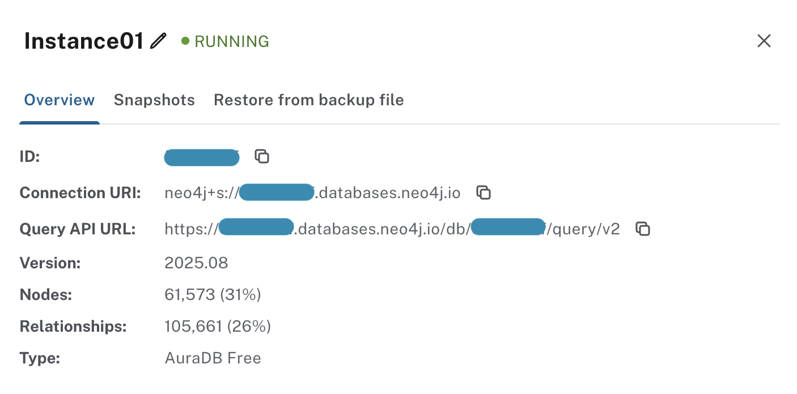
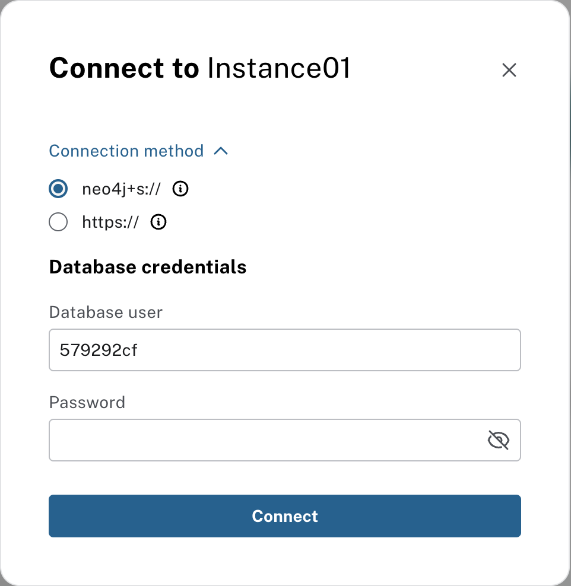

= Connecting to your instance
:type: lesson
:order: 5

In the previous lesson, you learned about different ways to back up and restore your Aura instance, and how to plan your backup strategy.

In this lesson you will learn how to:

* Connect to your Aura instance
* Use different tools to interact with your database
* Ensure connection security

== Connecting to your instance

To connect to your Aura instance, you will need the connection details provided in the **Inspect** section of your instance management options, as well as the credentials file you downloaded when creating the instance, for example:

.Credentials
[cols="1,1"]
|===
|Entry |Value

|NEO4J_URI |neo4j+s://<instanceid>.databases.neo4j.io
|NEO4J_USERNAME |neo4j
|NEO4J_PASSWORD |<your password>
|NEO4J_DATABASE |neo4j
|AURA_INSTANCEID |<instanceid>
|AURA_INSTANCENAME |Instance01
|===

To view the connection details, navigate to your instance in the Aura console and click on the three dots on the right side of the instance card.
Select **Inspect** from the dropdown menu.

// [NOTE]
// ====
// The frequency and retention of snapshots varies by tier. Check your specific tier documentation for exact details.
// ====
The connection details include:

* **ID**: The unique identifier for your database instance.
* **Connection URI**: The connection string used to connect to your database.

Also, you will need the **username** and **password** you set when creating the instance, which are not shown in the inspect panel for security reasons.
To retrieve the connection password, review the document downloaded when you created the instance.

Once you have these details, you can use them to connect through the integrated tools; Query, Explore, or Dashboards, or any external application that supports Neo4j connections.

[credentials_prompt,width=500,align=center]

[.slide]
== Overview of interaction methods

In Aura, there are several ways to interact with your database instance, each suited for different use cases and user preferences. The primary tools include:

* **The integrated Query tool**: A web-based interface within the Aura console that allows you to run Cypher queries directly against your database without needing any external tools.
* **The explore tool**: A graph visualization and exploration tool that provides an intuitive way to interact with your data through visual representations. It is ideal for business users and analysts who prefer a more visual approach, as well as developers who want to quickly prototype queries.
* **Integrated Dashboards**: Enable you to create visual representations of your data, making it accessible to business users and stakeholders without requiring them to write Cypher queries.

[.slide]
== Check your understanding

include::questions/1-snapshot-purpose.adoc[leveloffset=+1]

// include::questions/2-snapshot-actions.adoc[leveloffset=+1]

// include::questions/3-restore-limitations.adoc[leveloffset=+1]

[.summary]
== Summary

In this lesson, you learned how to connect to your instance, including the information you need from your instance in order to connect.
You are also now familiar with the integrated tools you can use to interact with your data.