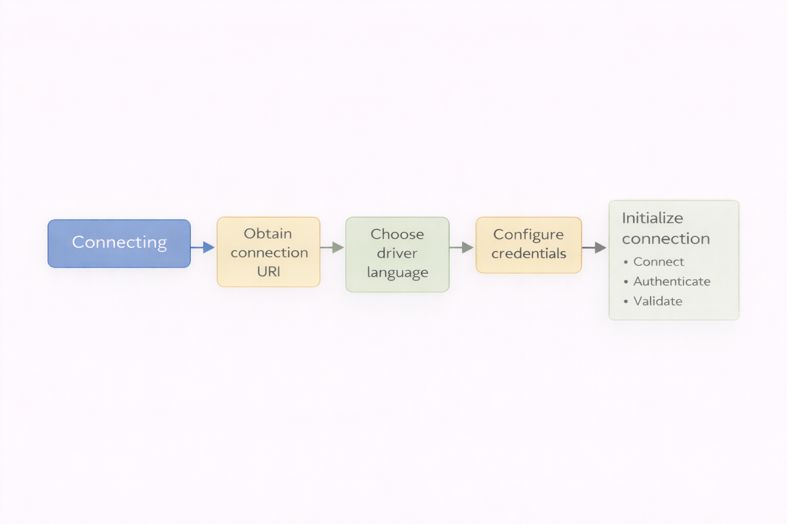

= Connecting to your instance
:type: lesson
:order: 5
:slides: true

[.slide.discrete]
== Connecting to your Aura instance
In the previous lesson, you learned about different ways to back up and restore your Aura instance, and how to plan your backup strategy.

In this lesson you will learn how to:

* Connect to your Aura instance
* Use different tools to interact with your database
* Ensure connection security

[.slide.col-2]

== Connecting to your instance

[.col]
====
To connect to your Aura instance, you will need the connection details provided in the **Inspect** section of your instance management options, as well as the credentials file you downloaded when creating the instance.

The diagram shows the complete connection flow from your application to the Neo4j instance.
====

[.col]
====

====

[.slide]
=== Connection credentials

Your credentials file contains:

// .Credentials
[cols="1,1"]
|===
|Entry |Value

|NEO4J_URI |neo4j+s://<instanceid>.databases.neo4j.io
|NEO4J_USERNAME |neo4j
|NEO4J_PASSWORD |<your password>
|NEO4J_DATABASE |neo4j
|AURA_INSTANCEID |<instanceid>
|AURA_INSTANCENAME |Instance01
|===

[.slide]
== Retrieving connection details
To view the connection details, navigate to your instance in the Aura console and click on the three dots on the right side of the instance card.
Select **Inspect** from the dropdown menu.

image::images/05_inspect_details.png[inspect_connection,width=500,align=center]

[.slide]
== Using connection details

The following video demonstrates connecting to a Professional instance through the Import tool:

video::https://cdn.graphacademy.neo4j.com/courses/aura-fundamentals/connect-professional-instance.mp4["Connect to Aura Professional Instance", role="cdn", width=100%]

[.slide]
== Connection information explained

The connection details include:

* **ID**: The unique identifier for your database instance
* **Connection URI**: The connection string used to connect to your database

The **username** and **password** are not shown in the Inspect panel for security reasons. Retrieve your password from the credentials file downloaded when you created the instance.

[.slide]
== Using credentials to connect

Use these details to connect through the Aura console tools (Query, Explore, Dashboards) or any external application that supports Neo4j connections.

image::images/05_connect_credentials_prompt.png[Connect with Credentials][credentials_prompt,width=500,align=center]

[.slide]
== Overview of interaction methods

Aura provides several tools to interact with your database, each suited for different use cases:

* **Query**: A web-based interface for running Cypher queries directly against your database. Designed for developers and DBAs who work with Cypher syntax.

* **Explore**: A graph visualization tool for exploring data visually without writing Cypher. Ideal for business users, analysts, and developers prototyping queries.

* **Dashboards**: Create visual representations of your data for business users and stakeholders who need insights without writing queries.

For more connection options including drivers and language-specific libraries, see the link:https://neo4j.com/docs/aura/managing-instances/instance-actions/[Neo4j Aura connection documentation^].

[.quiz]
== Check your understanding

include::questions/1-connection.adoc[leveloffset=+1]

[.summary]
== Summary

In this lesson, you learned how to connect to your Aura instance using the connection URI, username, and password from your credentials file.

You also explored the three main tools available in the Aura console: Query, Explore, and Dashboards.

In the next module, you will use these tools to import, query, and explore your data.
