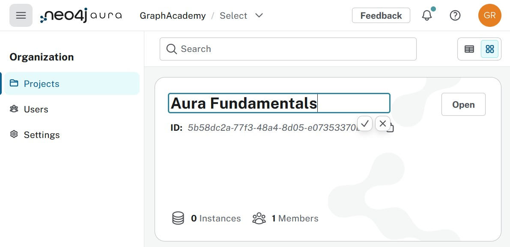

= Layout of the Aura Console
:table-caption!:

image::images/01_aura_console_overview.jpg[layout,width=600,align=center]

You're no doubt aching to create an instance, but before you do a bit of housekeeping is in order. See that **Neo4j / New project** at the top there? Click on the **Neo4j** part of that.

== Organization
image::images/01_aura_console_organization.jpg[organization,width=450,align=center]

The **Organization** menu is somewhat hidden. You're unlikely to visit it a lot once you've got it all set up, but there are a couple of things you need to do here.

Every organization has at least one project. Instances are created under the project. The project is the level at which management control is decided. For example you could have a **Non critical** and a **Critical** project. Or a **Development** and a **Production** project.

[NOTE]
====
By default only **one** project is provisioned. Only in the paid tiers is the option to have multiple projects available (and with strict limits).
====

Before we focus some more on the project, select **Settings**.

image::images/01_aura_console_organization_settings.jpg[settings,width=600,align=center]

There's something that needs to be fixed, isn't there (unless you work for Neo4j)?

image::images/01_aura_console_organization_name.jpg[name,width=450,align=center]

The other settings refer to things that you allow / do not allow at the organization level. Under **Users** you have options to manage who has access to the console for your organization. Here too the paid tiers have more options. 

[NOTE]
====
Access to the Aura Console is **not** the same as access to the database instances. Obviously somebody with full access to the console can create and delete database instances. That is however not related to accessing the data itself!
====

Select **Projects** in the menu because there is one more change we have to make.

With that change made, click the **Open** button. You'll find yourself back where we started, but now it's reflecting your organization!

image::images/01_aura_console_overview_fixed.jpg[layoutfixed,width=600,align=center]

== Project
As you understand by now, the main view is project based. The **Users**, **Billing** and **Settings** options on the bottom-left all refer to that.

image::images/01_aura_console_project_options.jpg[layoutfixed,width=300,align=center]

Almost nothing else we can explore makes sense without an instance though, so that's the next thing to do.

[.quiz]
== Check your understanding
include::questions/1-structure.adoc[leveloffset=+1]

include::questions/2-security.adoc[leveloffset=+1]

[.summary]
== Summary
In this lesson you got familiar with the Aura Console.
