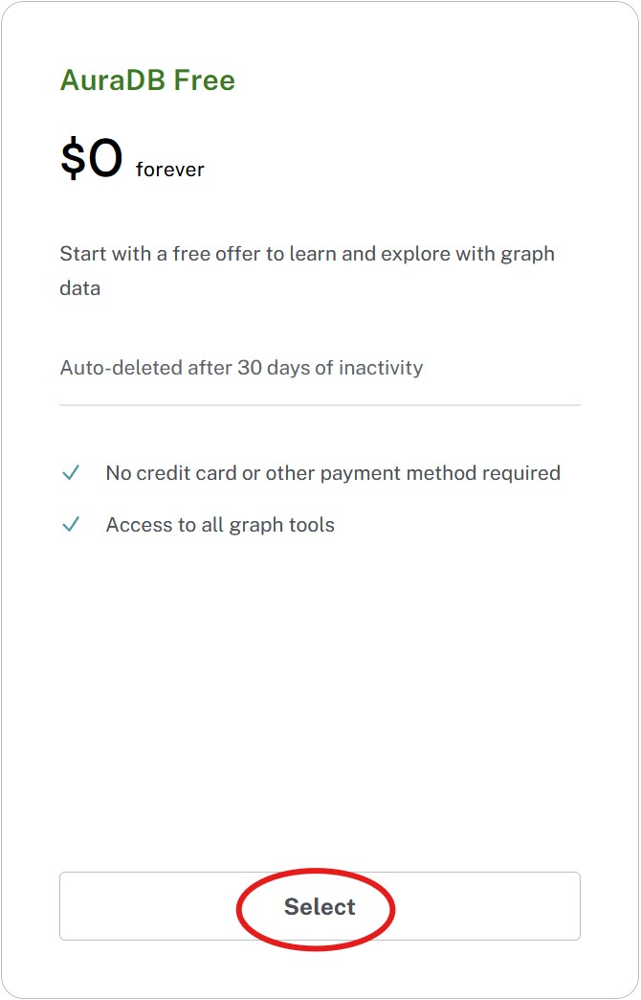

= Create an instance
:table-caption!:

We discussed **tiers** earlier. For the purpose of this training, we are going to create an **Aura Free** instance. This will hide some important choices such as **location** and **size**. And they need explanation.

== Location does matter
A native graph database is awesome. Speed is a key feature. It does however **not** violate the speed of light.

Questions such as

1. Where is my application running / going to run?
2. What cloud provider do / did I pick for my application?
3. Is my choice for 1. and 2. also an option for my database?

need to be answered. Because if you are aiming for **< 100ms** response times (a quite common request currently), you do not want distance to play a role.

image::images/02_location_choice.jpg[location,width=600,align=center]

== So does size
Determining the size of a graph database requires knowing quite a few things. How many nodes? How many relationships? How many properties in the nodes? How many properties in the relationships? Are the properties large? How many indexes are required? Is there a vector index property (embedding) in the nodes and if yes, what size and in how many of the nodes?

Unless all this information is available, the best that one can do is an estimate. This is less of a problem for Aura as database instances can be resized. But if you want to have a cost estimate up front you also need a size estimate!

With **Aura Free** this choice too is hidden from you, but for all the other tiers you have to pick **memory size** (RAM) and **memory / storage ratio (1/2, 1/4, 1/8)**. Everything else flows from that.

As an example. If you pick 2GB memory, then this corresponds to 4GB storage. You can increase the storage to 8GB (1/4) or 16GB (1/8). At a cost! This then allows a bigger database but it might have performance impact.

Hard to just **imagine**, isn't it? Well, if you take the limits of the **Aura Free** database (200000 nodes and 400000 relationships) and add in some reasonable estimates for properties and indexes, you'll need between 3GB and 4GB of storage.

[NOTE]
====
At this time you have no flexibility on CPU. If you need more horsepower, you have to pick a bigger instance.
====

image::images/02_size_choice.jpg[size,width=600,align=center]

== Hammer time

Select **instances** in the menu on the left, click **Create Instance** and go for **Aura Free**.

You will be greeted by something similar to this

image::images/02_create_free_credentials.jpg[credentials,width=300,align=center]

make sure to **Download and continue** and **keep** the file safe. It contains

.Credentials
[cols="1,1"]  
|===
|Entry |Value

|NEO4J_URI |neo4j+s://<instanceid>.databases.neo4j.io
|NEO4J_USERNAME |neo4j
|NEO4J_PASSWORD |<password neo4j>
|NEO4J_DATABASE |neo4j
|AURA_INSTANCEID |<instanceid>
|AURA_INSTANCENAME |Instance01
|===

[NOTE]
====
* The instanceid can not be changed in the lifetime of the instance.
* The neo4j user is the default native user and has admin rights on the database.
* The password can be changed later.
* At this time there is only one database per instance (multidatabase is just around the corner for some tiers) and it's neo4j.
====

Creation then proceeds.

image::images/02_create_free_in_progress.jpg[spinner,width=450,align=center]

And soon after you'll have a running instance.

image::images/02_create_free_running.jpg[running,width=450,align=center]

This has a couple of indicators that are specific to **Aura Free** whereas the other tiers will have indicators w.r.t. size and location, but in essence it is the same, your first instance is **up and running**!

== Check your understanding
include::questions/1-location-matters.adoc[leveloffset=+1]

include::questions/2-size-matters.adoc[leveloffset=+1]

[.summary]
== Summary
In this lesson you created an Aura instance.
