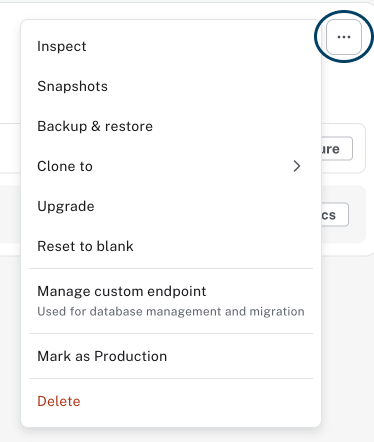

= Manage an instance

There is a difference between **managing the instances**  and **managing the data**. And that is a healthy approach. Your infrastructure team (including DBAs) has great power. Even spiderman had to learn to deal with the responsibility.

== Create
Is obviously an important part of **managing the instances** but we did that in the previous lesson. Let's move on, what can we do with the instance?

== Inspect
image::images/03_inspect_instance.jpg[inspect,width=450,align=center]

**Instance01** is such a *creative* name. In the literal sense. Fix it. Inspection otherwise shows the urls to connect to the database, the current version and some **tier** related information. Let me show you what that looks like on **Aura Professional**.

The point here is that the differences are minimal. The experience is consistent across the tiers.

[NOTE]
====
The **instance id** in the images has been blurred. Even though - by the time you read this - that instance is long gone. The only time **you** should share an instance id with somebody outside your organization is when logging a support call with Neo4j!
====

== Snapshots
The Aura name for **backups**. The tier determines when they are taken and how many are kept available in Aura itself.

image::images/03_snapshot.jpg[snapshot,width=450,align=center]

There are three actions you can take with a snapshot:

image::images/03_snapshot_actions.jpg[snapshotactions,width=300,align=center]

* Export (to your local machine)
* Create a (new) instance from the snapshot
* Restore the snapshot (overwriting the current instance)

== Restore from backup file

image::images/03_restore_from_backup.jpg[restore,width=450,align=center]
If you have a backup or dump on your **local system** (= different from having the snapshot available in Aura), this can be used to overwrite the current instance. 

Couple of caveats:

* The instance you are overwriting must be sufficiently big. In the case of **Aura Free** there is the additional limitation on nodes and relationship counts.
* The backup or dump can not be bigger than 4GB. That's not very big in the current day and age. If the file is bigger, you will have to use the commandline.

The use case for this is somewhat limited. However, it's a **great** way to get started (with smaller databases) if you're going from a self managed setup to an Aura setup!

== Upgrade

image::images/03_upgrade.jpg[update,width=450,align=center]

Upgrade takes an instance to a higher tier. For example from **Aura Free** to **Aura Professional**.

[NOTE]
====
That particular example would require adding payment information. That is not covered in this training. Do it when you need it.
====

== Configure

image::images/03_configure.jpg[configure,width=450,align=center]

**Configure** allows you to resize (in **both** directions) the instance according to your needs.

[NOTE]
====
Whilst **Upgrade** is available on higher tiers, **Configure** is not available on **Aura Free** (hence the use of an image from **Aura Professional** here).
====

== Pause
Pausing an instance is - in all cases - a **cost saving** decision. Who is footing the bill is therefore important.

An **Aura Free** instance **can not** be manually paused. After 72 hours of inactivity the instance is auto-paused. If it is not reactivated within 30 days, it is deleted.

An **Aura Professional** / **Aura Business Critical** / **Aura Virtual Dedicated Cloud** instance **can** be manually paused. It is not auto-paused when there is no activity. After 30 days of pausing it is automatically resumed.

== Clone
Cloning makes a copy of an existing instance into

1. Another existing instance. That overwrites the data that is already there.
2. A new instance.

[NOTE]
====
This can be used to shift a database to a higher tier. The difference with **upgrade** is that the URI of the new instance will be different.
====

== Delete
It seems pretty obvious that a delete removes an instance. Did you check however at what level **snapshots** are kept?

Instance gone = snapshots gone.
You might want to export the last snapshot before you delete!

[.quiz]
== Check your understanding
include::questions/1-inspect.adoc[leveloffset=+1]

include::questions/2-snapshot.adoc[leveloffset=+1]

include::questions/3-restore.adoc[leveloffset=+1]

include::questions/4-configure.adoc[leveloffset=+1]

[.summary]
== Summary
In this lesson you looked at all the management options for an Aura instance.
