= Import data

The data importer is not listed under **Tools** in the Aura console. It is our first port of call though. Quite pointless to look into data retrieval tools if you have no data in your database, right?

[NOTE]
====
The data importer is great to quickly start loading data. Do not confuse it with ETL pipelines.
====

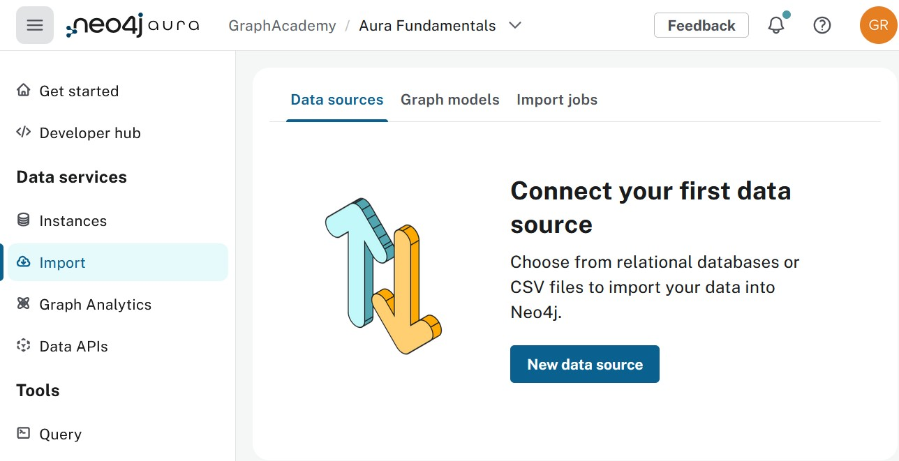

== Data Source
Before you can add a **New data source** we first need to have one. Download link:https://raw.githubusercontent.com/neo4j-contrib/training/refs/heads/master/advanced_cypher/data/movies.csv[movies.csv, movies.csv, download=movies.csv] on your local machine.
Once you have that, you can go ahead and click on **New data source**.

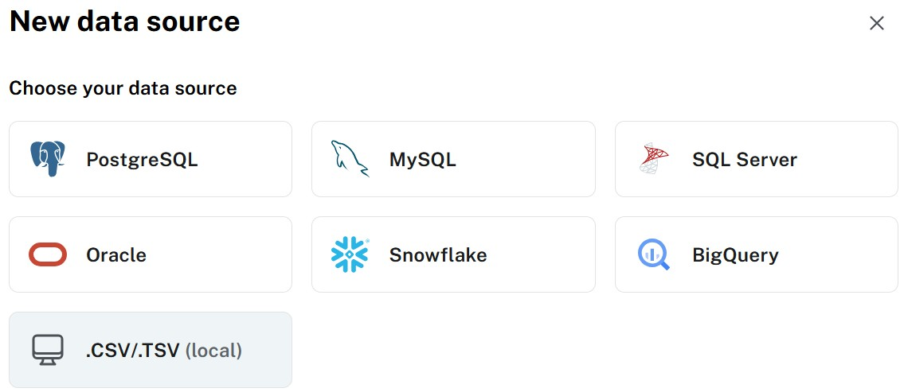

And given that you downloaded a .CSV file the next step is to select **CSV** as the data source type.

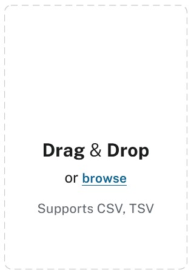

Drop in the **movies.csv** file. This results in

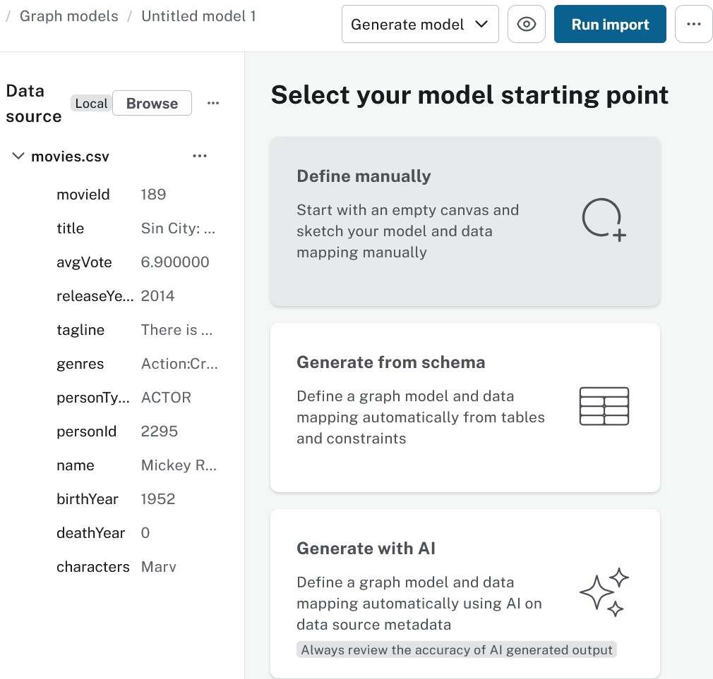

== Model

You will learn how to model data **manually**.

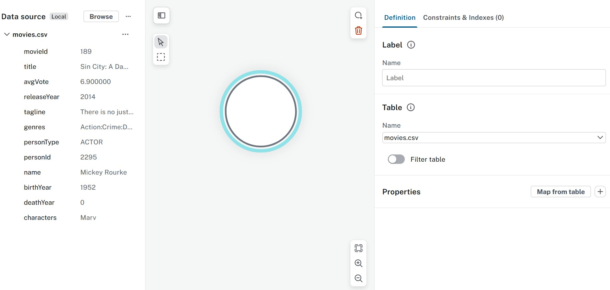

First define the Movie nodes:

* Label **Movie**
* Map from table (csv file in this case), **movieId** and **title**

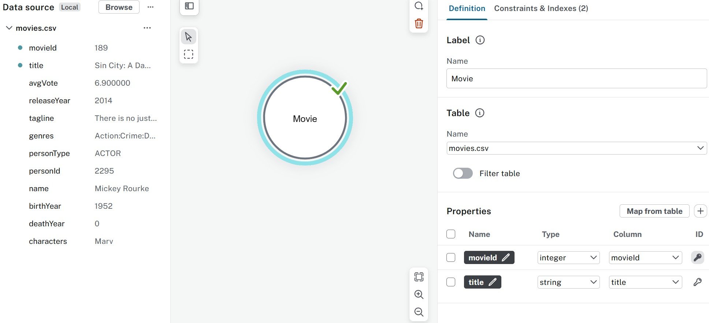

Now define the Person nodes.

* Add a blank node
* Label **Person**
* Map from table (csv file in this case), **personId** and **name**

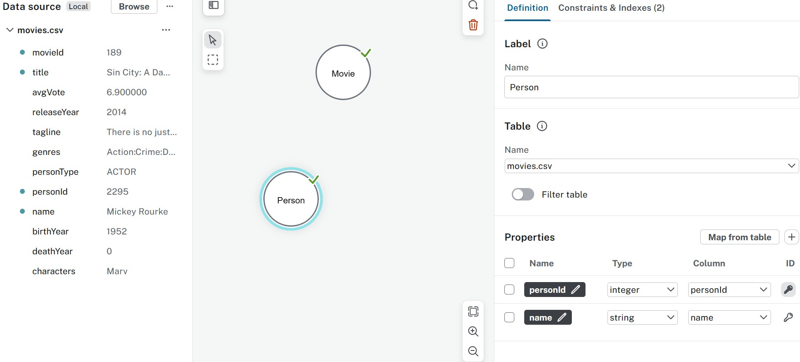

Define the ACTED_IN relationship.

* Pull the relationship from the Person node to the Movie node.
* Relationship type **ACTED_IN**
* Node ID mapping should be automatic.
* Map from table (csv file in this case), **characters**

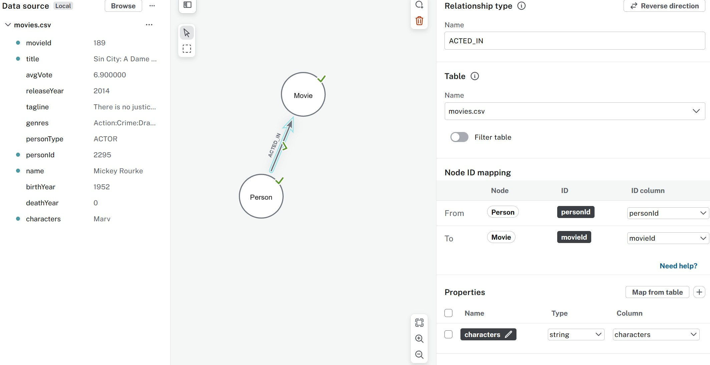

== Import
**Run import** is the next step, and it needs a connection to the database.

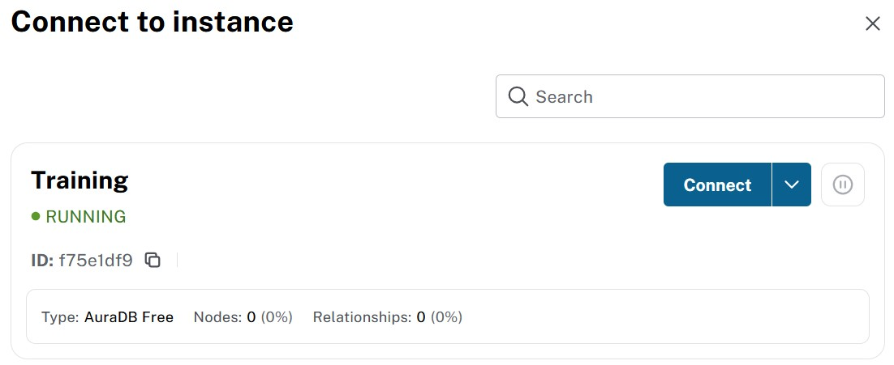

**Connect** and wait until the import is done.

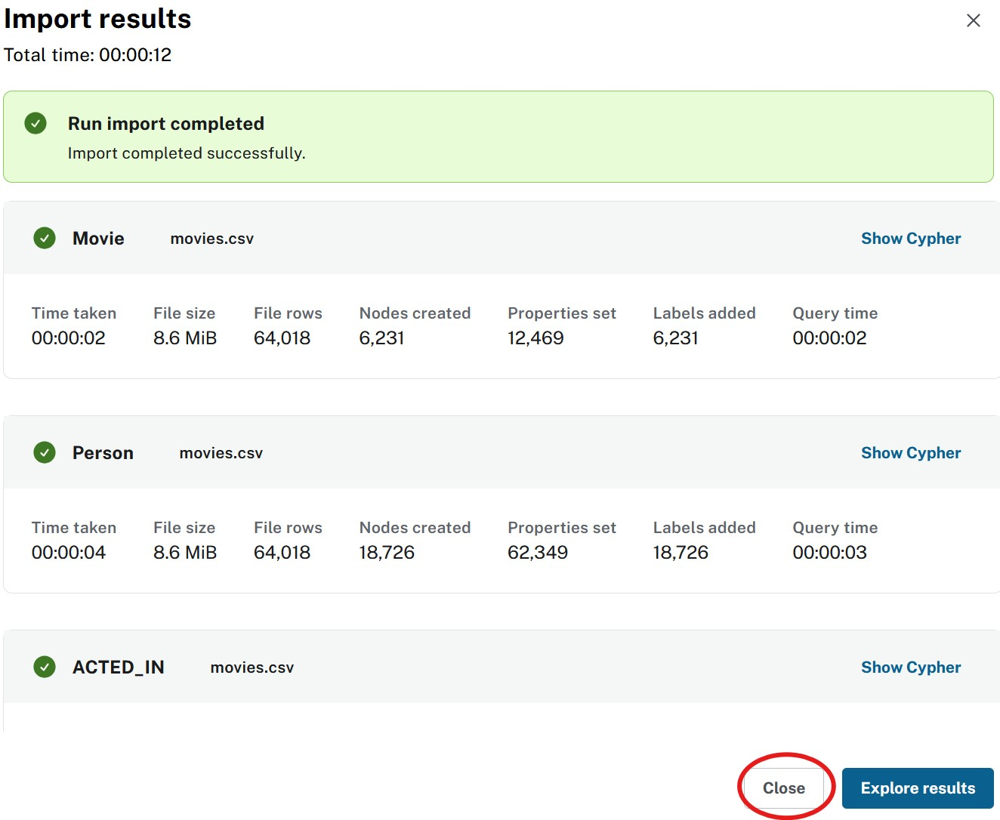

**Close** the result window and you will be back at the main data importer screen.

You can now see the imported data source in the list of data sources.
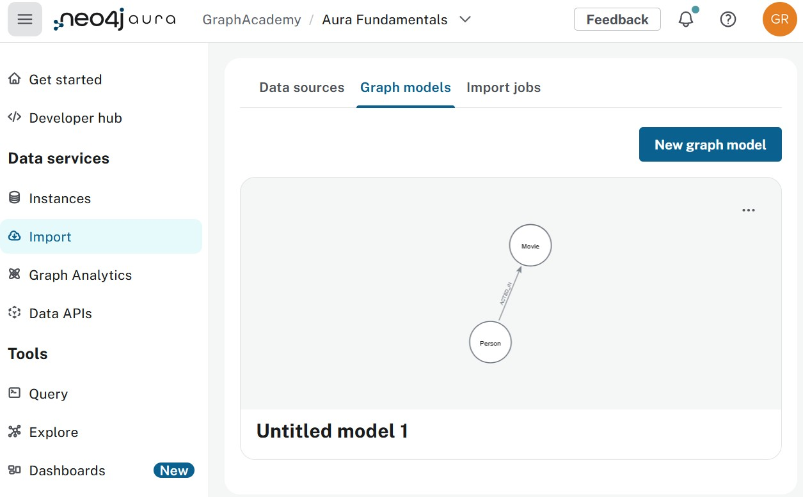

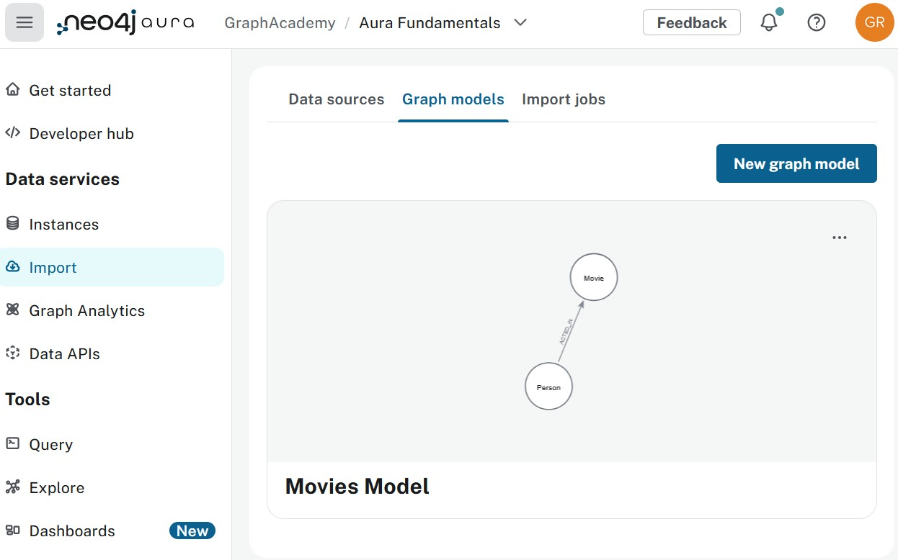

== Check your understanding
include::questions/1-solution.adoc[leveloffset=+1]

include::questions/2-reuse.adoc[leveloffset=+1]

[.summary]
== Summary
In this lesson you imported data in an Aura database.
