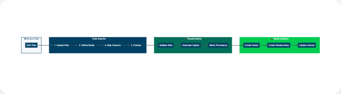

= Import data
:type: lesson
:order: 1
:slides: true

[.slide.discrete]
== Importing data

In the previous lesson, you learned how to connect to your Aura database instance.

In this lesson, you will learn how to:

* Use the Data Importer to load data into your Aura instance
* Create a data model for your import
* Run an import and verify the results

[.slide.col-2]
== Data Importer service

[.col]
====
The Data Importer provides a visual interface for loading CSV data into your Neo4j instance.

The diagram shows the complete import process from source files to your Neo4j database.
====

[.col]
====

====

[.slide]
   
== Data Source

Before adding a **New data source**, prepare a data source file.

For this lesson, download the sample movie data available at link:https://raw.githubusercontent.com/neo4j-contrib/training/refs/heads/master/advanced_cypher/data/movies.csv[movies.csv, movies.csv, download=movies.csv] to your local machine.

After downloading, add it to your Aura instance by clicking **New data source**.

[.slide]
== Adding a data source
image::images/01_data_importer_source.jpg[importer_source,width=450,align=center]

The data file you have downloaded is a .CSV file, so select **CSV** as the data source type.
[.slide]
== Uploading the data file
image::images/01_data_importer_drop.jpg[importer_drop,width=200,align=center]

Click **Upload CSV** to open the file dialog and select the **movies.csv** file from your local machine.

[.slide]
== Data Importer manual
Once the file is uploaded, you will see the Data Importer manual.

image::images/01_data_importer_manual.jpg[importer_manual,width=450,align=center]

      
[.slide]

== Model

**Upload** a data model or create one **manually**. For this example, create one manually.

image::images/01_data_importer_model_blank.jpg[importer_bank,width=600,align=center]

[.slide]
== Defining the data model
First define the Movie nodes in the details panel:

video::https://cdn.graphacademy.neo4j.com/courses/aura-fundamentals/add-node-label.mp4["Add Node Label",role="cdn",  width=100%]

* Use the Label **Movie**
* Click on **Map from table** (csv file in this case), **movieId** and **title**

[.slide]
== Edit data model
video::https://cdn.graphacademy.neo4j.com/courses/aura-fundamentals/edit-data-model.mp4["Edit Data Model",role="cdn",  width=100%]

// image::images/01_data_importer_model_movie.jpg[importer_movie,width=600,align=center]
[.slide]

== Upload CSV file
video::https://cdn.graphacademy.neo4j.com/courses/aura-fundamentals/upload-csv.mp4["Upload CSV",role="cdn",  width=100%]

Now add and define the Person nodes.

* Add a blank node using the **Add node label** button

Upload the CSV file by clicking the **Upload CSV** button to open the file dialog.

[.slide]
== Define Person nodes
video::https://cdn.graphacademy.neo4j.com/courses/aura-fundamentals/add-node-label.mp4["Add Node Label",role="cdn", width=100%]

* Use the label **Person**
* Click **Map from table** (csv file in this case), **personId** and **name**

[.slide]
== Person node properties
image::images/01_data_importer_model_person.jpg[importer_person,width=600,align=center]

[.slide]

== Edit Person properties

Edit the properties of the nodes by clicking the pencil icon next to each property: 

video::https://cdn.graphacademy.neo4j.com/courses/aura-fundamentals/edit-fields.mp4["Edit Fields",role="cdn",  width=100%]

[.slide]
== Define ACTED_IN relationship
Create and define the ACTED_IN relationship.

* Drag the relationship from the Person node to the Movie node using the plus-sign when you hover over the edge of the Person node.
* Name the relationship type as **ACTED_IN**.
* Node ID mapping should be automatic.
* Click on **Map from table** (csv file in this case), **characters**.

[.slide]

== ACTED_IN relationship properties
image::images/01_data_importer_model_actedin.jpg[importer_actedin,width=600,align=center]

Note the green checkmark that indicates that an element has been mapped correctly.

[.slide]

== Analyse and confirm model parameters

Before importing, analyze and edit the model parameters, and confirm the primary key of the nodes. 

video::https://cdn.graphacademy.neo4j.com/courses/aura-fundamentals/load-data-params.mp4["Load Data Parameters",role="cdn",  width=100%]

[.slide]

== Import
Use **Run import** to ingest the data. You will need to connect to the database.

image::images/01_data_importer_connect.jpg[importer_connect,width=450,align=center]

[.slide]
== Connect to database
video::https://cdn.graphacademy.neo4j.com/courses/aura-fundamentals/run-import.mp4["Run Import",role="cdn", width=100%]

Once you have added the database credentials, click on **Connect** and wait until the import is done.

image::images/01_data_importer_result.jpg[importer_result,width=450,align=center]

[.slide]
== Import summary
Once the import in complete, you will see a summary of the import results: 

video::https://cdn.graphacademy.neo4j.com/courses/aura-fundamentals/import-summary.mp4["Import Summary",role="cdn",  width=100%]

[.slide]
== Save data model
**Close** the result window and you will be back at the main data importer screen.

The imported data source now appears in the list of data sources.

image::images/01_data_importer_model_untitled.jpg[importer_untitled,width=450,align=center]

[.slide]
== Name data model
Give your data model a name, "Movies Model", and **Save** it.

image::images/01_data_importer_model_named.jpg[importer_named,width=450,align=center]

[.quiz]
== Check your understanding

include::questions/1-import-steps.adoc[leveloffset=+1]

include::questions/2-reuse.adoc[leveloffset=+1]

[.summary]
== Summary

In this lesson, you imported data into your Aura instance using the Data Importer. You created a data model with Movie and Person nodes connected by ACTED_IN relationships, and ran the import.

Data models are saved at the project level and can be reused across different instances.

For more information on the Data Importer, including supported file formats and advanced mapping options, see the link:https://neo4j.com/docs/aura/import/introduction/[Neo4j Aura Import documentation^].

In the next lesson, you will use the Query tool to interact with your data using Cypher.
