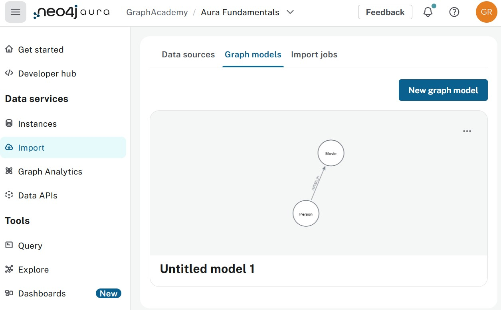
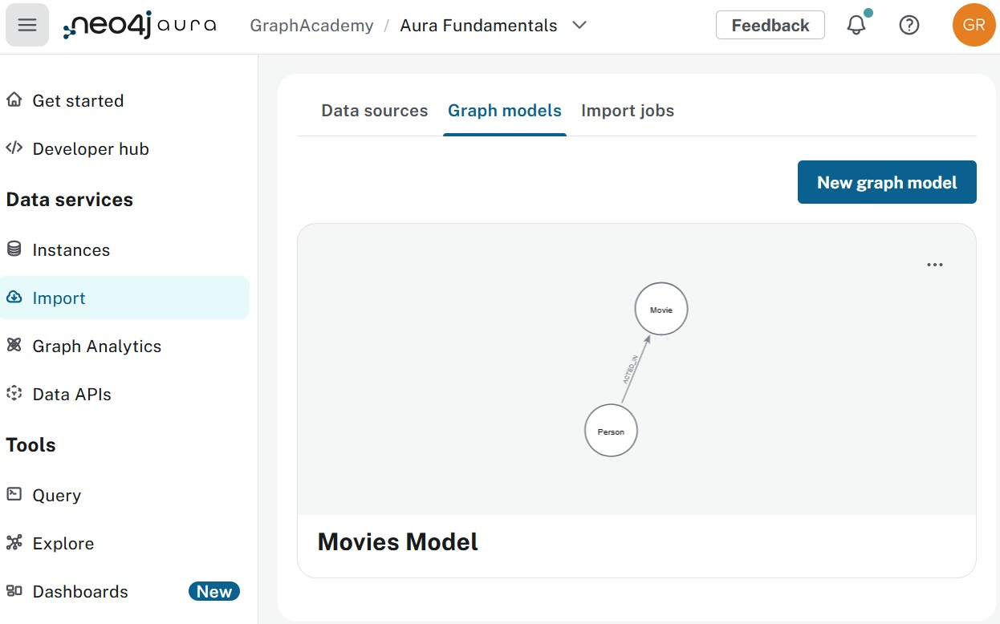

= Run and verify the import
:type: lesson
:order: 3
:slides: true

[.slide.discrete]
== Running and verifying your import

So far in this course, you have learned how to create your graph data model with Movie and Person nodes connected by ACTED_IN relationships.

**In this lesson, you will learn:** How to run the import process to load your data into Aura and verify that everything was imported correctly. You will learn how to check import results and save your data model for future use.

In this lesson, you will learn how to:

* Run the import process
* Verify your import results
* Save your data model for future use

[.slide]
== Step 9: Run the import

**How to do it:**

1. Click **Run import** button
2. You'll be prompted to connect to your database
3. Enter your Aura instance credentials:
   * **URI**: Your instance connection string (e.g., `neo4j+s://xxxxx.databases.neo4j.io`)
   * **Username**: Usually `neo4j` (or your instance ID for Free tier)
   * **Password**: The password you saved when creating the instance
4. Click **Connect**
5. Wait for the import to complete—this may take a minute depending on your dataset size

**How it works in the background:** The Data Importer:
1. Generates optimized Cypher statements from your model
2. Connects to your Aura instance
3. Executes batched inserts (creates nodes first, then relationships)
4. Verifies all data was imported correctly
5. Reports any errors or warnings

image::../1-import/images/01_data_importer_connect.jpg[importer_connect,width=450,align=center]

video::https://cdn.graphacademy.neo4j.com/courses/aura-fundamentals/run-import.mp4["Run Import",role="cdn", width=100%]

The Data Importer processes your CSV data and creates nodes and relationships in your Neo4j instance. After the import completes, you'll see a summary of what was created.

image::../1-import/images/01_data_importer_result.jpg[importer_result,width=450,align=center]

[.slide]
== Step 10: Verify your import results

**What to check:** The import summary shows how many nodes and relationships were created. For the Movies dataset, you should see:
* Multiple Movie nodes (one for each unique movie)
* Multiple Person nodes (one for each unique actor)
* ACTED_IN relationships connecting them

If the counts look correct, your data was imported successfully. If something seems off (e.g., zero relationships), your model mapping might need adjustment.

**Example:** A successful import might show:
* 100 Movie nodes
* 50 Person nodes  
* 200 ACTED_IN relationships

This means you have 200 actor-movie connections to traverse for recommendations.

**How to verify:** After the import completes, you can:
1. Check the import summary for node and relationship counts
2. Use the Query tool to run a simple query like `MATCH (m:Movie) RETURN count(m)`
3. Verify relationships exist with `MATCH ()-[r:ACTED_IN]->() RETURN count(r)`

video::https://cdn.graphacademy.neo4j.com/courses/aura-fundamentals/import-summary.mp4["Import Summary",role="cdn",  width=100%]

[.slide]
== Step 11: Save your data model

If you need to import more movie data later or recreate the structure in another instance, the saved model lets you reuse the same mapping without rebuilding it.

**How to do it:**

1. Close the import summary window
2. You'll return to the Data Importer main screen
3. Your imported data source appears in the list
4. Click on the model name field (it may show "Untitled")
5. Enter a descriptive name like **"Movies Model"** or **"Movie Recommendation Dataset"**
6. Click **Save**

**Reusing the model:** Load this model later and apply it to new CSV files with the same structure, making it easy to import additional data with the same schema.

[.quiz]
== Check your understanding

include::../1-import/questions/1-import-steps.adoc[leveloffset=+1]

include::../1-import/questions/2-reuse.adoc[leveloffset=+1]

[.summary]
== Summary

In this lesson, you completed the import process. You:

* **Ran the import**: Executed the import process and loaded your movie data into Aura
* **Verified your results**: Checked that nodes and relationships were created correctly
* **Saved your model**: Preserved the mapping for future imports

The graph structure you created (Person -[:ACTED_IN]-> Movie) enables queries like:
* Finding movies with the same actors
* Discovering actors who worked together
* Identifying similar movies based on shared cast

**Connecting to fundamentals:**

* **Neo4j Fundamentals**: You created the graph elements (nodes, relationships, properties, labels) you learned about in that course
* **Graph Data Modeling Fundamentals**: You applied modeling principles to design your instance model (Movie and Person nodes with ACTED_IN relationships)
* **Importing Data Fundamentals**: You used the Data Importer tool to transform CSV data into a graph structure, applying import best practices

**Key concepts reinforced:**

* **Nodes** represent entities (Movie, Person) with properties (`title`, `name`)
* **Relationships** represent connections (ACTED_IN) with optional properties (`characters`)
* **Data preparation** ensures clean imports—checking for unique IDs, consistent types, and proper formatting
* **Graph modeling** determines query performance—a well-designed model makes recommendation queries fast

Data models are saved at the project level and can be reused across different instances.

For more information on the Data Importer, including supported file formats and advanced mapping options, see the link:https://neo4j.com/docs/aura/import/introduction/[Neo4j Aura Import documentation^].

In the next lesson, you'll write Cypher queries to find movie recommendations by traversing the relationships you just created.

