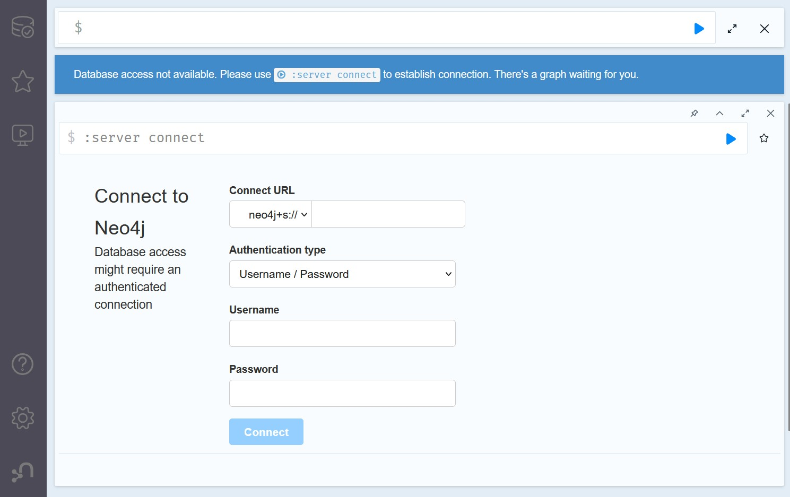
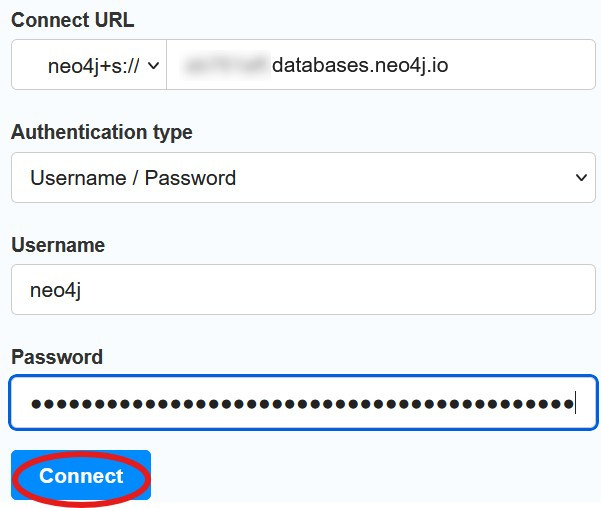
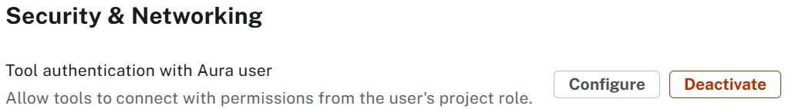

= Query tool

Formerly known as the **Neo4j Browser**.
Currently fully integrated into the Aura console.

== Old way (is better?)
Before diving into the integrated query tool, open a new private window in your browser and go to the link:https://browser.neo4j.io[Neo4j Browser^].

Do you remember where you can find the necessary information to fill that connection pane?

If you have performed all the steps correctly you will be greeted with this:

image::images/02_neo4j_browser_nice.jpg[nice,width=300,align=center]

[NOTE]
====
The **Neo4j Browser** is still available, but it is not the recommended way to connect to Neo4j Aura instances. The integrated query tool in the Aura console provides a more streamlined experience.

You didn't need credentials for the **data importer**. You just had to click **Connect**. The reason is that since May 2025 link:https://neo4j.com/docs/aura/security/tool-auth/[tool authentication^] is activated. Access to the Aura console also gives access to the database instances themselves.

You can find that setting in the organization menu. Note that the option only becomes visible after you've created a paid-for instance. You can not override the setting for **Aura Free**.

It's a very convenient option.
Turn it **OFF** for production instances!
====

== Connecting
Open the Aura console and select the instance you want to connect to.

image::images/02_query_tool_connect.jpg[querytool_connect,width=500,align=center]

Before you click on the **Query** option, check that you've loaded the data from the previous lesson.

image::images/02_query_tool_start.jpg[querytool_start,width=500,align=center]

It's good practice to remove the result-frames you don't want/need. 
== Querying
You could start exploring now. Click on the labels and relationship types under **Database Information** for example.

To query the database, you can use the **Query Tool**. 

Copy the following Cypher query into the query editor:

[source,cypher]
----
MATCH (p:Person)-[r:ACTED_IN]->(m:Movie)
WHERE p.name = 'Tom Hanks'
RETURN p,r,m
----

image::images/02_query_tool_command.jpg[querytool_command,width=600,align=center]

Click the **Run** button or press `Ctrl+Enter` to execute the query.

image::images/02_query_tool_result.jpg[querytool_result,width=600,align=center]

Click on the labels in the **Results overview** and make changes according to your preferences.

image::images/02_query_tool_styling.jpg[querytool_styling,width=600,align=center]

== Conclusion
The **Query Tool** is a powerful interface for interacting with your Neo4j database. It allows you to run Cypher queries, visualize results, and explore your graph data.

The **Query Tool** (aka Neo4j Browser) aims at power users, at those that understand (or are willing to learn) the syntax to:

* Manage schema
* Manage roles and permissions
* Develop, test and troubleshooting queries

In the next lesson we take a look at an alternative way to **explore** the database!

== Check your understanding
include::questions/1-purpose.adoc[leveloffset=+1]

[.summary]
== Summary
In this lesson you queried data in an Aura database.
